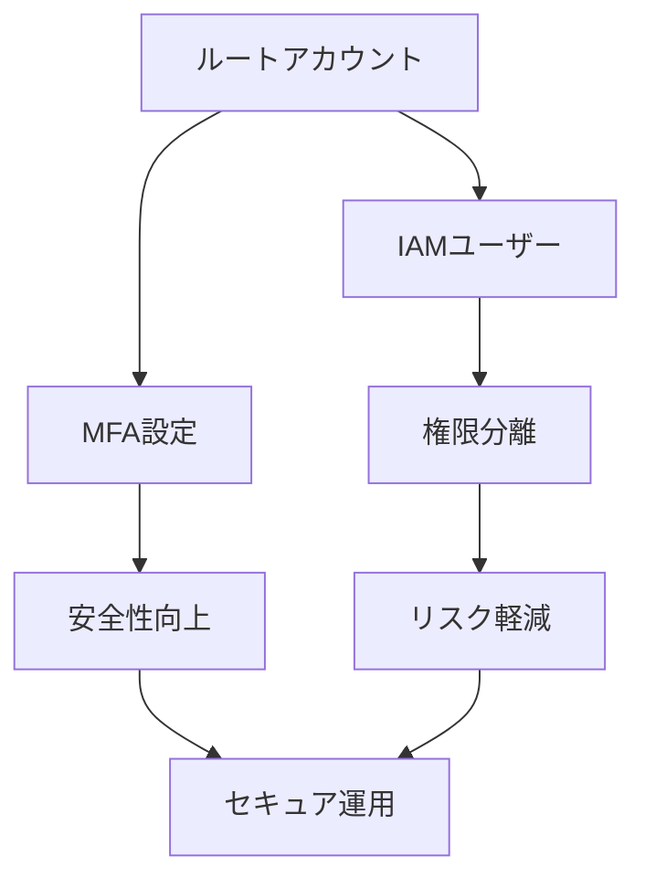

# <span class="highlight">AWS アカウント初期設定ガイド</span>

## 開設後にやるべき必須設定

<div class="pt-12">
  <div @click="$slidev.nav.next" class="card inline-block cursor-pointer">
    <span class="text-xl font-bold">
      セキュリティ・コスト管理・基本設定を学ぼう
      <carbon:arrow-right class="inline ml-2"/>
    </span>
  </div>
</div>

<div class="abs-br m-6 flex gap-2">
  <button @click="$slidev.nav.openInEditor()" title="Open in Editor" class="text-xl slidev-icon-btn opacity-50 !border-none !hover:text-white">
    <carbon:edit />
  </button>
  <a href="https://github.com/slidevjs/slidev" target="_blank" alt="GitHub" title="Open in GitHub" class="text-xl slidev-icon-btn opacity-50 !border-none !hover:text-white">
    <carbon:logo-github />
  </a>
</div>

<!--
AWSアカウントを開設したら、まず最初にやるべき重要な設定について学びます。
セキュリティ設定、コスト管理、基本的なサービス設定を実際のコンソール操作と共に説明します。
-->

---

## transition: fade-out

# <span class="highlight">📋 今日の学習内容</span>

<div class="grid grid-cols-2 gap-8 pt-4">

<div class="space-y-6">

<div class="card animate-in">
  <h2>🔒 セキュリティ設定</h2>
  <ul class="space-y-2">
    <li>ルートアカウントMFA設定</li>
    <li>IAMユーザー作成</li>
    <li>CloudTrail有効化</li>
    <li>AWS Config設定</li>
  </ul>
</div>

<div class="card animate-in">
  <h2>💰 コスト管理</h2>
  <ul class="space-y-2">
    <li>請求アラート設定</li>
    <li>Cost Explorer設定</li>
    <li>Budgets設定</li>
    <li>無料利用枠確認</li>
  </ul>
</div>

</div>

<div class="space-y-6">

<div class="card animate-in">
  <h2>🌐 基本サービス設定</h2>
  <ul class="space-y-2">
    <li>VPC・セキュリティグループ</li>
    <li>S3バケット作成</li>
    <li>EC2キーペア作成</li>
    <li>リージョン選択</li>
  </ul>
</div>

<div class="card animate-in">
  <h2>📊 監視・ログ設定</h2>
  <ul class="space-y-2">
    <li>CloudWatch設定</li>
    <li>SNS通知設定</li>
    <li>ログ収集設定</li>
  </ul>
</div>

</div>

</div>

<div class="pt-4">
  <span class="text-sm opacity-75">
    ⚠️ 実際のAWSコンソールを使用したハンズオン形式で進めます
  </span>
</div>

<!--
本日は4つの主要カテゴリに分けて、AWS初期設定を学習します。
実際のコンソール操作を含むハンズオン形式で進めるため、AWSアカウントをご準備ください。
-->

---

## layout: center

# 🚨 なぜ初期設定が重要なのか？

<div class="text-left space-y-6 max-w-4xl">

<div v-click class="flex items-start space-x-4">
  <div class="text-3xl">💸</div>
  <div>
    <h3 class="text-xl font-bold text-red-400">予期しない高額請求</h3>
    <p>適切な設定なしでは、数万円〜数十万円の請求が来る可能性</p>
  </div>
</div>

<div v-click class="flex items-start space-x-4">
  <div class="text-3xl">🔓</div>
  <div>
    <h3 class="text-xl font-bold text-yellow-400">セキュリティリスク</h3>
    <p>ルートアカウントの不正利用、データ漏洩、リソースの悪用</p>
  </div>
</div>

<div v-click class="flex items-start space-x-4">
  <div class="text-3xl">👻</div>
  <div>
    <h3 class="text-xl font-bold text-blue-400">見えない運用コスト</h3>
    <p>監視・ログ設定不備による障害対応の長期化</p>
  </div>
</div>

</div>

<div v-click class="pt-8 text-center">
  <div class="text-lg font-bold text-green-400">
    ✅ 適切な初期設定で、これらのリスクを回避できます！
  </div>
</div>

<!--
AWS初期設定を怠ると、深刻な問題が発生する可能性があります。
実際に、設定不備による高額請求やセキュリティインシデントは頻繁に報告されています。
-->

---

# 🔒 セキュリティ設定 - 概要

<div class="grid grid-cols-2 gap-8 pt-4">

<div>

## 🎯 設定目標

- ルートアカウントの保護
- 適切なアクセス権限管理
- 操作ログの記録
- コンプライアンス対応

## ⚡ 緊急度

<div class="space-y-2">
  <div class="flex items-center space-x-2">
    <span class="text-red-500">🔴 最優先</span>
    <span>ルートMFA設定</span>
  </div>
  <div class="flex items-center space-x-2">
    <span class="text-orange-500">🟡 高</span>
    <span>IAMユーザー作成</span>
  </div>
  <div class="flex items-center space-x-2">
    <span class="text-yellow-500">🟡 高</span>
    <span>CloudTrail有効化</span>
  </div>
</div>

</div>

<div>

## 📊 設定効果



## 🎯 完了後の状態

- ルートアカウント直接利用なし
- 最小権限の原則適用
- 全操作の監査ログ取得

</div>

</div>

<!--
セキュリティ設定は最も重要で、最初に実施すべき項目です。
特にルートアカウントのMFA設定は、アカウント開設後すぐに実施してください。
-->

---

# 🔐 ハンズオン: ルートアカウントMFA設定

<div class="grid grid-cols-2 gap-6">

<div>

## 📱 手順

1. **AWSコンソールにログイン**
   - ルートアカウントでサインイン

2. **IAMダッシュボードへ移動**
   - 右上のアカウント名をクリック
   - 「セキュリティ認証情報」を選択

3. **MFA設定**
   - 「多要素認証 (MFA)」セクション
   - 「MFAデバイスの割り当て」をクリック

4. **認証アプリ設定**
   - 「認証アプリ」を選択
   - QRコードをスキャン

</div>

<div>

## 📱 推奨MFAアプリ

- **Google Authenticator** (無料)
- **Microsoft Authenticator** (無料)
- **Authy** (無料・バックアップ機能付き)

## ⚠️ 重要な注意点

- **バックアップコードを必ず保存**
- 複数デバイスでの設定推奨
- 物理MFAデバイスも検討

## ✅ 確認方法

```bash
# AWS CLIでMFA状態確認
aws sts get-caller-identity
```

</div>

</div>

<div class="card mt-4 border-l-4 border-yellow-500">
  <strong class="text-yellow-400">⚠️ 注意:</strong> MFAデバイスを紛失すると、アカウントアクセスが困難になります。必ずバックアップ手段を用意してください。
</div>

<!--
実際にMFA設定を行います。スマートフォンに認証アプリをインストールして、QRコードをスキャンしてください。
バックアップコードの保存を忘れずに行ってください。
-->

---

# 👤 ハンズオン: IAMユーザー作成

<div class="grid grid-cols-2 gap-6">

<div>

## 🔧 作成手順

1. **IAMコンソールへ移動**

   ```
   サービス → IAM → ユーザー
   ```

2. **ユーザー作成**
   - 「ユーザーを追加」をクリック
   - ユーザー名: `admin-user`
   - アクセスタイプ: 両方選択

3. **権限設定**
   - 「既存のポリシーを直接アタッチ」
   - `AdministratorAccess` を選択

4. **アクセスキー取得**
   - CSVファイルをダウンロード
   - 安全な場所に保存

</div>

<div>

## 🛡️ セキュリティベストプラクティス

### ✅ 推奨設定

- 強力なパスワード (12文字以上)
- MFA有効化
- アクセスキーローテーション
- 最小権限の原則

### ❌ 避けるべき設定

- ルートアカウントの日常利用
- 過度な権限付与
- アクセスキーの平文保存
- パスワード共有

## 📋 作成後のチェックリスト

- [ ] パスワードポリシー確認
- [ ] MFA設定
- [ ] アクセスキー安全保存
- [ ] 初回ログイン確認

</div>

</div>

<!--
IAMユーザーを作成して、日常的な作業はこのユーザーで行うようにします。
ルートアカウントは緊急時以外は使用しないのがベストプラクティスです。
-->

---

# 📊 ハンズオン: CloudTrail設定

<div class="grid grid-cols-2 gap-6">

<div>

## 🔍 CloudTrail設定手順

1. **CloudTrailコンソールへ移動**

   ```
   サービス → CloudTrail
   ```

2. **証跡の作成**
   - 「証跡の作成」をクリック
   - 証跡名: `management-events-trail`
   - S3バケット: 新規作成

3. **ログ設定**
   - 管理イベント: 有効
   - データイベント: 必要に応じて
   - Insightイベント: 無効 (コスト考慮)

4. **暗号化設定**
   - KMS暗号化: 有効推奨

</div>

<div>

## 📈 監視対象イベント

### 🎯 重要な管理イベント

- IAMユーザー・ロール作成/削除
- セキュリティグループ変更
- S3バケット設定変更
- EC2インスタンス起動/停止

### 💰 コスト考慮事項

```
無料利用枠:
- 管理イベント: 最初の証跡は無料
- データイベント: 有料
- S3ストレージ: 標準料金
```

### 🔍 ログ分析方法

- CloudWatch Logs連携
- AWS Config Rules
- 外部SIEM連携

</div>

</div>

<div class="card mt-4 border-l-4 border-blue-500">
  <strong class="text-blue-400">💡 ヒント:</strong> CloudTrailは全リージョンのイベントを記録するよう設定することを推奨します。
</div>

<!--
CloudTrailを設定することで、AWSアカウント内のすべての操作を記録できます。
セキュリティインシデント発生時の調査に必須の機能です。
-->

---

# 💰 コスト管理 - 概要

<div class="grid grid-cols-2 gap-8 pt-4">

<div>

## 🎯 設定目標

- 予期しない課金の防止
- リアルタイム使用量監視
- 予算超過時の自動通知
- コスト最適化の基盤構築

## 📊 設定項目

- 請求アラート
- Cost Explorer
- AWS Budgets
- 無料利用枠監視

</div>

<div>

## 💸 よくある課金トラブル

<div class="space-y-3">
  <div class="bg-red-50 dark:bg-red-900/20 p-3 rounded">
    <strong>EC2インスタンス放置</strong><br>
    月額: $50〜$500+
  </div>
  <div class="bg-orange-50 dark:bg-orange-900/20 p-3 rounded">
    <strong>RDS稼働し続け</strong><br>
    月額: $30〜$300+
  </div>
  <div class="bg-yellow-50 dark:bg-yellow-900/20 p-3 rounded">
    <strong>S3ストレージ蓄積</strong><br>
    月額: $10〜$100+
  </div>
</div>

## ✅ 対策効果

- 95%の課金トラブル防止
- 平均30%のコスト削減

</div>

</div>

<!--
コスト管理は、AWSを安全に利用するために必須の設定です。
適切な監視設定により、予期しない高額請求を防ぐことができます。
-->

---

# 🚨 ハンズオン: 請求アラート設定

<div class="grid grid-cols-2 gap-6">

<div>

## 📧 請求アラート設定手順

1. **Billingコンソールへ移動**

   ```
   右上アカウント名 → 請求とコスト管理
   ```

2. **請求設定の有効化**
   - 「請求設定」→「請求アラートの受信」
   - チェックボックスを有効化

3. **CloudWatchアラーム作成**
   - CloudWatchコンソールへ移動
   - 「アラーム」→「アラームの作成」
   - メトリクス: `EstimatedCharges`

4. **通知設定**
   - SNSトピック作成
   - メールアドレス登録

</div>

<div>

## 💡 推奨アラート設定

### 🎯 アラート閾値例

```yaml
アラートレベル:
  注意: $10 (無料枠超過警告)
  警告: $50 (要確認レベル)
  緊急: $100 (即座に対応必要)
```

### 📱 通知方法

- **Email**: 基本通知
- **SMS**: 緊急時通知
- **Slack**: チーム共有

### ⚙️ 自動化オプション

- Lambda関数でリソース自動停止
- AWS Configルールで予防的制御

</div>

</div>

<div class="card mt-4 border-l-4 border-green-500">
  <strong class="text-green-400">💡 プロのコツ:</strong> 複数の閾値でアラートを設定し、段階的に対応できるようにしましょう。
</div>

<!--
請求アラートの設定を実際に行います。
複数の閾値を設定することで、段階的に対応できるようになります。
-->

---

# 📊 ハンズオン: Cost Explorer & Budgets設定

<div class="grid grid-cols-2 gap-6">

<div>

## 📈 Cost Explorer設定

1. **Cost Explorerの有効化**

   ```
   請求とコスト管理 → Cost Explorer
   ```

2. **レポート作成**
   - 「新しいレポート」をクリック
   - 期間: 過去12ヶ月
   - グループ化: サービス別

3. **カスタムレポート**
   - 日別コスト推移
   - サービス別使用量
   - リージョン別分析

## 💰 Budgets設定

1. **予算作成**
   - 「予算の作成」をクリック
   - 予算タイプ: コスト予算

2. **予算額設定**
   - 月次予算: $20
   - 四半期予算: $60

</div>

<div>

## 📊 監視ダッシュボード例

### 📈 重要メトリクス

- **日次コスト**: $0.50〜$2.00
- **月次累計**: 予算の80%以下
- **サービス別TOP3**: EC2, S3, RDS
- **リージョン別**: 使用リージョン確認

### 🎯 アクション設定

```yaml
予算の50%到達:
  - メール通知
  - 使用量レビュー

予算の80%到達:
  - 緊急通知
  - リソース確認

予算の100%到達:
  - 即座に対応
  - 不要リソース停止
```

</div>

</div>

<!--
Cost ExplorerとBudgetsを設定して、コストを可視化し、予算管理を行います。
定期的にレポートを確認する習慣をつけることが重要です。
-->

---

# 🌐 基本サービス設定 - ネットワーク

<div class="grid grid-cols-2 gap-6">

<div>

## 🏗️ VPC基本理解

- **Virtual Private Cloud**
- プライベートネットワーク空間
- セキュリティの基盤

## 🔧 デフォルトVPC確認手順

1. **VPCコンソールへ移動**

   ```
   サービス → VPC
   ```

2. **デフォルトVPC確認**
   - VPC一覧で「Default」を確認
   - CIDR: 172.31.0.0/16
   - サブネット: 各AZに1つずつ

3. **セキュリティグループ確認**
   - デフォルトSG: 同一SG内通信のみ許可
   - 必要に応じてルール追加

</div>

<div>

## 🛡️ セキュリティグループ設定例

### 🌐 Web サーバー用

```yaml
インバウンドルール:
  - HTTP (80): 0.0.0.0/0
  - HTTPS (443): 0.0.0.0/0
  - SSH (22): 自分のIPのみ

アウトバウンドルール:
  - All Traffic: 0.0.0.0/0
```

### 💾 データベース用

```yaml
インバウンドルール:
  - MySQL (3306): WebサーバーSGのみ
  - PostgreSQL (5432): WebサーバーSGのみ

アウトバウンドルール:
  - 制限的に設定
```

  </div>

  </div>

<div class="pt-4 bg-blue-50 dark:bg-blue-900/20 p-4 rounded">
  <strong>🔒 セキュリティ原則:</strong> 最小権限の原則に従い、必要最小限のアクセスのみ許可してください。
</div>

<!--
ネットワーク設定はAWSセキュリティの基盤となります。
デフォルトVPCの理解と、適切なセキュリティグループ設定が重要です。
-->

---

# 📦 ハンズオン: S3バケット作成

<div class="grid grid-cols-2 gap-6">

<div>

## 🪣 S3バケット作成手順

1. **S3コンソールへ移動**

   ```
   サービス → S3
   ```

2. **バケット作成**
   - 「バケットを作成」をクリック
   - バケット名: `my-first-bucket-[ランダム文字列]`
   - リージョン: Asia Pacific (Tokyo)

3. **セキュリティ設定**
   - パブリックアクセスブロック: 有効
   - バケット暗号化: 有効 (SSE-S3)

4. **バージョニング設定**
   - バージョニング: 有効 (推奨)

</div>

<div>

## 🔒 セキュリティベストプラクティス

### ✅ 推奨設定

- **パブリックアクセスブロック**: 有効
- **暗号化**: SSE-S3またはSSE-KMS
- **バージョニング**: 有効
- **MFA削除**: 重要データは有効

### 📋 バケットポリシー例

```json
{
  "Version": "2012-10-17",
  "Statement": [
    {
      "Sid": "DenyInsecureConnections",
      "Effect": "Deny",
      "Principal": "*",
      "Action": "s3:*",
      "Resource": ["arn:aws:s3:::my-bucket/*", "arn:aws:s3:::my-bucket"],
      "Condition": {
        "Bool": {
          "aws:SecureTransport": "false"
        }
      }
    }
  ]
}
```

</div>

</div>

<!--
S3バケットを作成します。セキュリティ設定を適切に行うことで、データ漏洩を防ぐことができます。
バケット名はグローバルで一意である必要があります。
-->

---

# 🔑 ハンズオン: EC2キーペア作成

<div class="grid grid-cols-2 gap-6">

<div>

## 🔐 キーペア作成手順

1. **EC2コンソールへ移動**

   ```
   サービス → EC2
   ```

2. **キーペア作成**
   - 左メニュー「キーペア」をクリック
   - 「キーペアを作成」をクリック
   - 名前: `my-ec2-keypair`
   - タイプ: RSA
   - 形式: .pem (Linux/Mac) または .ppk (Windows)

3. **秘密鍵ダウンロード**
   - 自動でダウンロード開始
   - 安全な場所に保存

4. **権限設定 (Linux/Mac)**
   ```bash
   chmod 400 my-ec2-keypair.pem
   ```

</div>

<div>

## 🛡️ キーペア管理のベストプラクティス

### 🔒 セキュリティ対策

- **秘密鍵の安全な保存**
- **適切なファイル権限設定**
- **定期的なローテーション**
- **バックアップ作成**

### 📁 推奨保存場所

```bash
# Linux/Mac
~/.ssh/aws-keys/
chmod 700 ~/.ssh/aws-keys/
chmod 400 ~/.ssh/aws-keys/*.pem

# Windows
C:\Users\[username]\.ssh\aws-keys\
```

### ⚠️ 注意事項

- 秘密鍵を紛失すると、インスタンスにアクセス不可
- GitやSlackなどに誤ってアップロードしない
- 複数人での共有は避ける

</div>

</div>

<div class="card mt-4 border-l-4 border-red-500">
  <strong class="text-red-400">⚠️ 重要:</strong> 秘密鍵は再ダウンロードできません。安全な場所に必ず保存してください。
</div>

<!--
EC2インスタンスにSSH接続するためのキーペアを作成します。
秘密鍵の管理は非常に重要で、紛失すると大きな問題となります。
-->

---

# 📊 監視・ログ設定 - CloudWatch基本設定

<div class="grid grid-cols-2 gap-6">

<div>

## 📈 CloudWatch設定手順

1. **CloudWatchコンソールへ移動**

   ```
   サービス → CloudWatch
   ```

2. **ダッシュボード作成**
   - 「ダッシュボード」→「ダッシュボードの作成」
   - 名前: `AWS-Overview-Dashboard`

3. **基本メトリクス追加**
   - EC2インスタンス数
   - S3バケット数
   - 請求額 (EstimatedCharges)

4. **アラーム設定**
   - CPU使用率 > 80%
   - ディスク使用率 > 90%
   - ネットワークエラー率

</div>

<div>

## 🎯 監視すべき重要メトリクス

### 💻 EC2関連

- **CPUUtilization**: CPU使用率
- **NetworkIn/Out**: ネットワーク使用量
- **DiskReadOps/WriteOps**: ディスクI/O

### 💾 S3関連

- **BucketSizeBytes**: バケットサイズ
- **NumberOfObjects**: オブジェクト数

### 💰 コスト関連

- **EstimatedCharges**: 推定請求額

### 🔍 ログ設定

```bash
# CloudWatch Logsエージェント設定例
/opt/aws/amazon-cloudwatch-agent/bin/config.json
```

</div>

</div>

<!--
CloudWatchを設定して、AWSリソースの監視を行います。
適切な監視により、問題の早期発見と対応が可能になります。
-->

---

# 📱 ハンズオン: SNS通知設定

<div class="grid grid-cols-2 gap-6">

<div>

## 📧 SNS設定手順

1. **SNSコンソールへ移動**

   ```
   サービス → Simple Notification Service
   ```

2. **トピック作成**
   - 「トピックの作成」をクリック
   - タイプ: Standard
   - 名前: `aws-alerts-topic`

3. **サブスクリプション作成**
   - プロトコル: Email
   - エンドポイント: 自分のメールアドレス

4. **確認メール対応**
   - 受信メールの「Confirm subscription」をクリック

</div>

<div>

## 🔔 通知設定例

### 📊 アラート種別

```yaml
緊急度高:
  - EC2インスタンス停止
  - RDS接続エラー
  - 請求額閾値超過

緊急度中:
  - CPU使用率高
  - ディスク容量不足
  - ネットワーク異常

緊急度低:
  - 定期レポート
  - バックアップ完了通知
```

### 📱 通知チャネル

- **Email**: 基本通知
- **SMS**: 緊急時のみ
- **Slack**: チーム共有
- **Lambda**: 自動対応

</div>

</div>

<div class="card mt-4 border-l-4 border-green-500">
  <strong class="text-green-400">💡 ヒント:</strong> 通知の頻度と重要度を適切に設定し、アラート疲れを防ぎましょう。
</div>

<!--
SNSを設定して、各種アラートをメールやSMSで受信できるようにします。
適切な通知設定により、問題の早期発見が可能になります。
-->

---

# 🎯 リージョン選択の重要性

<div class="grid grid-cols-2 gap-6">

<div>

## 🌏 リージョン選択基準

### 📍 地理的要因

- **レイテンシ**: ユーザーとの距離
- **データ主権**: 法的要件
- **災害対策**: 地理的分散

### 💰 コスト要因

- **料金差**: リージョン間で最大30%差
- **データ転送料**: リージョン間通信コスト
- **為替影響**: USD建て料金

### 🛠️ サービス可用性

- **新サービス**: 通常us-east-1から開始
- **機能差**: リージョンごとの機能差
- **SLA**: サービスレベル保証

</div>

<div>

## 🇯🇵 日本での推奨リージョン

### 🎯 主要選択肢

1. **ap-northeast-1 (東京)**
   - 最低レイテンシ
   - 全サービス利用可能
   - 日本語サポート充実

2. **ap-northeast-3 (大阪)**
   - DR (災害復旧) 用途
   - 一部サービス制限あり

### 📊 パフォーマンス比較

```
東京リージョン:
- レイテンシ: 10-20ms
- 可用性: 99.99%
- サービス数: 200+

大阪リージョン:
- レイテンシ: 15-25ms
- 可用性: 99.99%
- サービス数: 150+
```

</div>

</div>

<!--
リージョン選択は、パフォーマンス、コスト、コンプライアンスに大きく影響します。
日本のユーザーには東京リージョンが最適です。
-->

---

# ✅ 設定完了チェックリスト

<div class="grid grid-cols-2 gap-6">

<div>

## 🔒 セキュリティ設定

- [ ] ルートアカウントMFA設定完了
- [ ] IAMユーザー作成・MFA設定
- [ ] CloudTrail有効化
- [ ] AWS Config設定 (オプション)
- [ ] セキュリティグループ確認

## 💰 コスト管理

- [ ] 請求アラート設定
- [ ] Cost Explorer有効化
- [ ] Budgets設定
- [ ] 無料利用枠監視設定

</div>

<div>

## 🌐 基本サービス

- [ ] デフォルトVPC確認
- [ ] S3バケット作成・セキュリティ設定
- [ ] EC2キーペア作成・安全保存
- [ ] リージョン選択確認

## 📊 監視・ログ

- [ ] CloudWatchダッシュボード作成
- [ ] SNS通知設定
- [ ] 基本アラーム設定
- [ ] ログ収集設定 (オプション)

</div>

</div>

<div class="pt-6 text-center">
  <div class="card inline-block border-l-4 border-green-500">
    <div class="text-2xl font-bold text-green-400">
      🎉 すべて完了したら、安全なAWS運用の準備完了です！
    </div>
  </div>
</div>

<!--
設定完了後は、このチェックリストで漏れがないか確認してください。
すべて完了すれば、安全にAWSを利用する準備が整います。
-->

---

# 🚀 次のステップ

<div class="grid grid-cols-2 gap-8 pt-4">

<div>

## 📚 学習推奨順序

1. **EC2基礎**
   - インスタンス起動・停止
   - セキュリティグループ設定
   - EBS・スナップショット

2. **S3活用**
   - 静的ウェブサイトホスティング
   - ライフサイクルポリシー
   - Cross-Region Replication

3. **RDS基礎**
   - データベース作成
   - バックアップ・復元
   - Multi-AZ設定

</div>

<div>

## 🛠️ 実践プロジェクト案

- **Webアプリケーション構築**
  - EC2 + RDS + S3
  - Load Balancer設定
  - Auto Scaling設定

- **サーバーレス構築**
  - Lambda + API Gateway
  - DynamoDB連携
  - CloudFront配信

- **データ分析基盤**
  - S3 + Athena + QuickSight
  - Glue ETL処理
  - Redshift分析

</div>

</div>

<div class="card border-l-4 border-blue-500">
  <strong class="text-blue-400">💡 継続学習のコツ:</strong> 実際にサービスを使いながら学習し、定期的にコスト確認を行いましょう。
</div>

<!--
初期設定が完了したら、実際のサービス構築に進みましょう。
小さなプロジェクトから始めて、徐々に複雑な構成に挑戦してください。
-->

---

# 📞 サポート・リソース

<div class="grid grid-cols-2 gap-8 pt-4">

<div>

## 🆘 困った時のサポート

- **AWS公式ドキュメント**
  - 最新・正確な情報
  - 多言語対応

- **AWS Support**
  - Basic: 無料
  - Developer: $29/月
  - Business: $100/月〜

- **コミュニティ**
  - AWS re:Post
  - Stack Overflow
  - Qiita (日本語)

</div>

<div>

## 📖 学習リソース

- **AWS公式トレーニング**
  - AWS Skill Builder (無料)
  - AWS認定試験対策

- **ハンズオンラボ**
  - AWS Hands-on Tutorials
  - Qwiklabs
  - A Cloud Guru

- **書籍・動画**
  - AWS公式ガイド
  - Udemy講座
  - YouTube AWS公式チャンネル

</div>

</div>

<div class="pt-6 text-center">
  <div class="text-lg">
    🎯 <strong>今日学んだことを実践して、AWSマスターへの第一歩を踏み出しましょう！</strong>
  </div>
</div>

<!--
学習を継続するためのリソースを活用して、AWSスキルを向上させてください。
実際に手を動かすことが最も効果的な学習方法です。
-->

---

layout: center
class: text-center

---

# <span class="highlight">🎉 お疲れ様でした！</span>

<div class="pt-12 text-center">
  <div class="card inline-block max-w-2xl">
    <div class="text-6xl pb-6 animate-in">
      🚀
    </div>
    <div class="text-3xl pb-4 font-bold">
      <span class="highlight">AWS初期設定完了</span>
    </div>
    <div class="text-xl opacity-75">
      安全で効率的なクラウド運用の始まりです
    </div>
  </div>
</div>

<div class="pt-12 text-center">
  <div class="card inline-block">
    <div class="text-lg">
      質問・フィードバックをお待ちしています
    </div>
  </div>
</div>

<!--
AWS初期設定のハンズオンは以上です。
今日学んだ設定を基に、安全にAWSを活用してください。
-->
