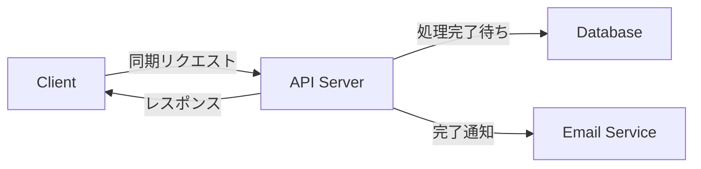
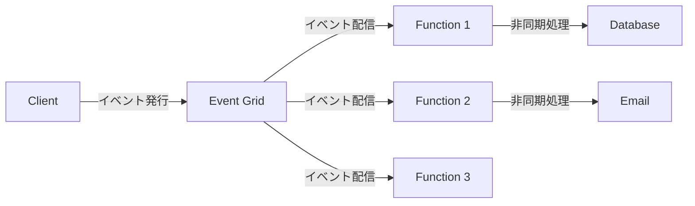
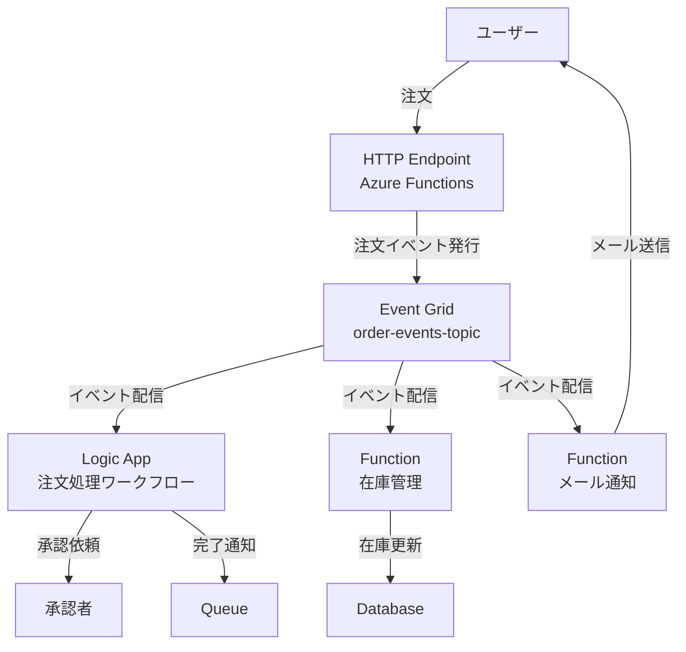

## Azure サーバーレス &<br>イベント駆動ハンズオン

実践で学ぶモダンアーキテクチャ

<div class="pt-12">
  <span @click="$slidev.nav.next" class="px-2 py-1 rounded cursor-pointer" hover="bg-white bg-opacity-10">
    Press Space for next page <carbon:arrow-right class="inline"/>
  </span>
</div>

---

## 本日のアジェンダ

サーバーレスとイベント駆動アーキテクチャを実践的に学び、モダンなクラウドアプリケーション開発の基礎を理解します。

<div class="grid grid-cols-2 gap-x-6 pt-6 text-sm">
<div>

### 基礎知識

- ⚡ **サーバーレスとは？**
- 🔄 **イベント駆動アーキテクチャ**
- 📋 **前提条件**

</div>
<div>

### 実践ハンズオン（3つ）

- ⚡ **① Azure Functions**
  - HTTPトリガーでREST API構築
  - Timerトリガーで定期実行
  - Blob/Queueトリガーでイベント処理

- 🔄 **② Event Grid**
  - イベント発行とサブスクリプション
  - カスタムトピックの作成
  - 複数サービスの連携

- 🔧 **③ Logic Apps**
  - ノーコードでワークフロー自動化
  - コネクターを使った外部サービス統合
  - 条件分岐と並列処理

</div>
</div>

---
layout: center
---

# サーバーレスとは？

<br>

**サーバー管理が不要で、実行時のみ課金される<br>イベント駆動型のコンピューティングモデル**

---

## サーバーレスの魅力

サーバーレスは、インフラストラクチャ管理から解放され、ビジネスロジックに集中できる**次世代のアプリケーション実行環境**です。

<div class="grid grid-cols-2 gap-x-8 gap-y-4 pt-6">

<div class="bg-gray-500/10 p-4 rounded">

#### ⚡ 従量課金

実行した分だけ課金。アイドル時間のコストはゼロ。トラフィックが少ないアプリやバッチ処理に最適。

</div>

<div class="bg-gray-500/10 p-4 rounded">

#### 🚀 自動スケーリング

需要に応じて自動的にスケールイン/アウト。急激なトラフィック増加にも対応可能。

</div>

<div class="bg-gray-500/10 p-4 rounded">

#### 🔧 インフラ管理不要

サーバーのプロビジョニング、OSの更新、セキュリティパッチの適用など、すべて自動化。

</div>

<div class="bg-gray-500/10 p-4 rounded">

#### 🎯 イベント駆動

HTTPリクエスト、タイマー、ストレージイベントなど、さまざまなトリガーに応答可能。

</div>

</div>

---

## イベント駆動アーキテクチャとは？

イベント駆動アーキテクチャは、**イベントの発生に応答してアクションを実行する設計パターン**です。

<div class="grid grid-cols-2 gap-8 pt-6">
<div>

### 🔄 従来のアーキテクチャ



**特徴:**

- 同期処理で待ち時間が発生
- サービス間が密結合
- スケーリングが困難

</div>
<div>

### ⚡ イベント駆動アーキテクチャ



**特徴:**

- 非同期処理でレスポンス高速化
- サービス間が疎結合
- 独立してスケール可能

</div>
</div>

---

## Azure サーバーレス サービス概要

Azure が提供する主要なサーバーレスサービスを理解し、用途に応じた使い分けを学びます。

<div class="grid grid-cols-3 gap-4 pt-6 text-xs">

<div class="bg-blue-500/10 p-3 rounded">

#### ⚡ Azure Functions（ハンズオン）

<div class="mt-2">
<strong>用途：</strong>イベント駆動のコード実行<br>
<strong>特徴：</strong>複数言語対応、豊富なトリガー、従量課金
</div>
</div>

<div class="bg-green-500/10 p-3 rounded">

#### 🔄 Event Grid（ハンズオン）

<div class="mt-2">
<strong>用途：</strong>イベントルーティングとメッセージング<br>
<strong>特徴：</strong>99.99%配信保証、フィルタリング、大規模スケール
</div>
</div>

<div class="bg-purple-500/10 p-3 rounded">

#### 🔧 Logic Apps（ハンズオン）

<div class="mt-2">
<strong>用途：</strong>ノーコードワークフロー自動化<br>
<strong>特徴：</strong>GUIデザイナー、400+コネクター、エンタープライズ統合
</div>
</div>

<div class="bg-yellow-500/10 p-3 rounded">

#### 📨 Event Hubs（参考）

<div class="mt-2">
<strong>用途：</strong>大規模ストリーミングデータ取り込み<br>
<strong>特徴：</strong>毎秒数百万イベント、Kafka互換
</div>
</div>

<div class="bg-orange-500/10 p-3 rounded">

#### 📦 Service Bus（参考）

<div class="mt-2">
<strong>用途：</strong>エンタープライズメッセージング<br>
<strong>特徴：</strong>トランザクション対応、メッセージセッション
</div>
</div>

<div class="bg-red-500/10 p-3 rounded">

#### ⏱️ Durable Functions（参考）

<div class="mt-2">
<strong>用途：</strong>ステートフルなオーケストレーション<br>
<strong>特徴：</strong>長時間実行ワークフロー、状態管理
</div>
</div>

</div>

---

## 各サービスの詳細説明（1/3）

### ⚡ Azure Functions

**どういうサービス？**

- サーバーレスで関数（コード）を実行するコンピューティングサービス
- イベントドリブンで自動的にスケールする

**主な特徴：**

- 複数言語サポート（C#, Java, JavaScript, Python, PowerShell）
- 豊富なトリガー（HTTP, Timer, Blob, Queue, Event Grid等）
- 従量課金プランと専有プラン（Premium/App Service Plan）

**何のため？**

- REST APIの構築
- 定期バッチ処理（毎時・毎日の集計など）
- ファイルアップロード時の自動処理（画像リサイズ、ウイルススキャン）
- IoTデバイスからのデータ処理

**比較：**

- **vs AWS Lambda**: 同等の機能だが、Azure統合が強力
- **vs App Service**: 常時稼働不要な処理に最適、コスト効率的
- **vs Logic Apps**: コードベース、より柔軟な制御

---

## 各サービスの詳細説明（2/3）

### 🔄 Event Grid

**どういうサービス？**

- イベントベースのメッセージングサービス
- パブリッシュ-サブスクライブモデルでイベントを配信

**主な特徴：**

- 99.99%の配信保証とat-least-once配信
- イベントフィルタリング（サブジェクト、データフィールド）
- カスタムトピックとシステムトピック
- デッドレター処理と再試行ポリシー

**何のため？**

- サービス間の疎結合な連携
- マイクロサービスアーキテクチャのイベント基盤
- リアクティブなアプリケーション構築
- システム全体のイベント監視と通知

**比較：**

- **vs Service Bus**: よりシンプル、イベントルーティングに特化
- **vs Event Hubs**: 大量ストリーミングデータには Event Hubs
- **vs Azure Relay**: リアルタイム双方向通信には Relay

---

## 各サービスの詳細説明（3/3）

### 🔧 Logic Apps

**どういうサービス？**

- ノーコード/ローコードでワークフローを自動化するサービス
- GUIデザイナーでビジネスプロセスを視覚的に構築

**主な特徴：**

- 400以上のコネクター（Office 365, Salesforce, SAP, Twitter等）
- 条件分岐、ループ、並列処理などの制御構造
- エンタープライズ統合パック（XML変換、AS2等）

**何のため？**

- ビジネスプロセスの自動化（承認フロー、通知など）
- 複数システムの統合（SaaS連携、オンプレミス連携）
- データ変換とマッピング
- スケジュール実行（定期レポート作成など）

**比較：**

- **vs Power Automate**: Logic Appsは開発者向け、より高度な制御
- **vs Azure Functions**: コード不要、GUIで直感的に構築
- **vs Durable Functions**: 複雑な状態管理にはDurable Functions

---
layout: center
---

# 前提条件

ハンズオンを始める前に必要なものを準備しましょう

---

## 必要なアカウントとツール

ハンズオンをスムーズに進めるために、以下の準備をお願いします。

<div class="grid grid-cols-2 gap-8 pt-8">
<div>

### 1. Azure アカウント

Azure の各種サービスを利用するためのアカウントです。
<br>

- [Azure Portal](https://portal.azure.com) からサインアップ
- 無料アカウント作成可能（クレジットカード登録が必要ですが、12ヶ月の無料利用枠とクレジットが付与されます）
- 学生の方は [Azure for Students](https://azure.microsoft.com/ja-jp/free/students/) が利用できます

</div>
<div>

### 2. Azure CLI

コマンドラインから Azure リソースを操作するためのツールです。
GUI 操作よりも効率的で、スクリプトによる自動化も可能です。
<br>

```bash
# macOS (Homebrew)
brew update && brew install azure-cli

# Windows (Winget)
winget install -e --id Microsoft.AzureCLI

# インストール確認
az --version
```

</div>
</div>

---

## Azure へのログイン

Azure CLI を使って、Azure アカウントへログインします。

### CLI からのログイン

```bash
# ブラウザが起動し、ログインが求められます
az login

# 複数のサブスクリプションがある場合、一覧を確認
az account list --output table

# 使用するサブスクリプションを設定
az account set --subscription "YOUR_SUBSCRIPTION_ID"
```

---

<div class="flex items-center gap-x-4">

## リソースグループの作成

<div class="text-sm bg-blue-500/20 px-2 py-1 rounded mb-3">👥 共有可能</div>
</div>

**リソースグループ**は、関連する Azure リソースをまとめて管理するための論理的なコンテナ（フォルダのようなもの）です。

このハンズオンで使用するリソースグループを作成します。

```bash
# このハンズオン用のリソースグループを作成
az group create \
  --name serverless-hands-on-rg \
  --location japaneast

# 作成されたことを確認
az group list --output table
```

**💡 重要:** リソースグループの`--location`は、メタデータの保存場所を指定します。<br>
その中に作成される各リソース（Functions、Event Grid等）は、それぞれ個別に`--location`を指定する必要があります。<br>
このハンズオンでは、すべてのリソースを`japaneast`に統一します。

---

## リソースプロバイダーの登録

初めて Azure Functions や Event Grid を使用する場合、リソースプロバイダーの登録が必要です。

```bash
# Microsoft.Webリソースプロバイダーを登録（Azure Functions用）
az provider register --namespace Microsoft.Web

# Microsoft.EventGridリソースプロバイダーを登録
az provider register --namespace Microsoft.EventGrid

# Microsoft.Logicリソースプロバイダーを登録（Logic Apps用）
az provider register --namespace Microsoft.Logic

# 登録状況を確認（Registeredになれば完了）
az provider show --namespace Microsoft.Web --query "registrationState" -o tsv
az provider show --namespace Microsoft.EventGrid --query "registrationState" -o tsv
az provider show --namespace Microsoft.Logic --query "registrationState" -o tsv
```

**💡 Tip:** 登録には数分かかる場合があります。`Registered`と表示されるまで待ちましょう。

---

## その他の必要ツール

サーバーレスアプリケーションの開発とデプロイに必要なツールを準備します。

<div class="grid grid-cols-2 gap-8 pt-4">
<div>

### Azure Functions Core Tools

ローカルでFunctionsを開発・テストするためのツールです。
<br>

```bash
# macOS (Homebrew)
brew tap azure/functions
brew install azure-functions-core-tools@4

# Windows (Winget)
winget install Microsoft.Azure.FunctionsCoreTools

# インストール確認
func --version
```

</div>
<div>

### Python

サンプルアプリケーションの実行や依存関係の管理に使用します。
<br>

```bash
# Python バージョン確認（3.9以上推奨、3.11推奨）
python3 --version

# pipバージョン確認
pip3 --version

# 仮想環境の作成（推奨）
python3 -m venv venv
source venv/bin/activate  # macOS/Linux
# または
venv\Scripts\activate  # Windows
```

<p class="text-xs">
※ このハンズオンでは Python を使用しますが、Azure Functions は C#, Java, Node.js, PowerShell など他の言語もサポートしています。
</p>
</div>
</div>

---
layout: center
---

# ハンズオン ① Azure Functions

サーバーレス関数で REST API と自動処理を構築

---

## Azure Functions / Function Apps の用語整理

まず、よく混同される2つの用語を整理しましょう。

<div class="grid grid-cols-2 gap-8 pt-6">
<div class="bg-blue-500/10 p-4 rounded">

### 🔧 Azure Functions

**= プログラミングモデル / ランタイム**

- 実際のコード（関数）を書く仕組み
- トリガー、バインディングなどの機能を提供
- コードの実行エンジン

**例:** Python、Node.js、C# で書いた関数

</div>
<div class="bg-green-500/10 p-4 rounded">

### 📦 Function App

**= ホスティング環境 / リソース管理単位**

- Azure Functions を実行する「コンテナ」
- ストレージアカウントや設定を管理
- スケーリング、デプロイの単位

**例:** `func-app-20251016`（Azure リソース）

</div>
</div>

<div class="mt-6 bg-yellow-500/10 p-3 rounded text-sm">
<strong>📝 わかりやすい例え：</strong>
<ul class="mt-2">
<li><strong>Function App</strong> = アパート（建物）</li>
<li><strong>Azure Functions</strong> = 各部屋（実際に住む場所）</li>
</ul>
1つのアパート（Function App）に複数の部屋（個別の関数）が入っています。
</div>

---

## Function Apps ハンズオン概要

**目的:** サーバーレス関数（Azure Functions）を作成し、イベント駆動処理を実装する

<div class="grid grid-cols-2 gap-8 pt-6">
<div>

### 📚 学べるポイント

- **サーバーレスの概念**
  - イベント駆動アーキテクチャ
- **Trigger/Binding**
  - Blob Trigger、HTTP Trigger
- **Storage Account 連携**
  - Blob Storage の使用
- **ログ監視**
  - Application Insights でのログ確認

</div>
<div>

### 🎯 ハンズオン内容

1. **Storage Account の作成**
2. **Function App の作成**
3. **HTTP Trigger 関数の作成とデプロイ**
4. **Timer Trigger 関数の作成**
5. **Blob Trigger 関数の作成**
6. **Queue Trigger 関数の作成**
7. **ローカル開発とデバッグ**
8. **Application Insights でのモニタリング**

</div>
</div>

---

## Storage Account とは？

**Azure Storage Account** は、クラウド上でデータを保存するための統合ストレージサービスです。

<div class="grid grid-cols-2 gap-8 pt-6">
<div>

### 🗄️ 主な機能

- **Blob Storage:** ファイル・画像・動画などの非構造化データ
- **Queue Storage:** メッセージキュー（非同期処理）
- **Table Storage:** NoSQL データストア
- **File Storage:** SMB ファイル共有

<br>

**💡 今回のハンズオンでは Blob Storage を使用**

画像ファイルを保存し、Function App から自動的にサムネイルを生成します。

</div>
<div>

### ✨ 特徴

- **高い可用性:** データは自動的に複製される
- **スケーラブル:** 容量制限なく拡張可能
- **低コスト:** 使った分だけ課金、GB 単位で安価
- **セキュア:** 暗号化、アクセス制御が標準装備

### 📦 料金体系

- ストレージ容量（GB/月）
- データ転送量（アップロード・ダウンロード）
- 操作回数（読み取り・書き込み）

</div>
</div>

---

## Blob Storage の「コンテナ」とは？

**コンテナ（Container）**は、Blob（ファイル）を格納するための**論理的なフォルダ**です。

<div class="grid grid-cols-2 gap-8 pt-6">
<div>

### 🗂️ 概念の理解

```
Storage Account (ストレージアカウント)
 └── Container (コンテナ) = フォルダ
      └── Blob (ファイル) = 実際のデータ
```

**例：写真管理アプリの場合**

```
mystorageacct
 ├── images/          ← 元画像を保存
 │    ├── photo1.jpg
 │    └── photo2.png
 └── thumbnails/      ← サムネイルを保存
      ├── photo1.jpg
      └── photo2.png
```

</div>
<div>

### 🔑 コンテナの役割

- **データの整理:** 用途別にファイルを分類
- **アクセス制御:** コンテナ単位で権限設定
- **バックアップ:** コンテナ単位で管理しやすい

### 📝 アクセスレベル

- **Private（既定）:** 認証が必要
- **Blob:** Blob への匿名読み取り可
- **Container:** コンテナと Blob の一覧も取得可

**💡 セキュリティのため、通常は Private を推奨**

</div>
</div>

---

## 接続文字列とは？

**接続文字列（Connection String）**は、Storage Account にアクセスするための**認証情報が含まれた文字列**です。

<div class="grid grid-cols-2 gap-8 pt-6">
<div>

### 🔐 接続文字列の構造

```
DefaultEndpointsProtocol=https;
AccountName=mystorageacct20251007;
AccountKey=abc123xyz...;
EndpointSuffix=core.windows.net
```

**含まれる情報:**

- **AccountName:** ストレージアカウント名
- **AccountKey:** アクセスキー（パスワードのようなもの）
- **Endpoint:** 接続先 URL

**⚠️ 重要:** AccountKey は機密情報です！

</div>
<div>

### 🔑 なぜ必要？

アプリケーションが Storage Account にアクセスするには、**誰がアクセスしているか**を証明する必要があります。

**接続文字列の用途:**

1. **Function App の設定**
   - Blob Trigger で画像を監視
   - サムネイルを自動保存
2. **アプリケーションコード**
   - SDK から Storage 操作
3. **Azure CLI/SDK**
   - コマンドラインからの操作

</div>
</div>

---

## 接続文字列の安全な管理

接続文字列は機密情報のため、適切に管理する必要があります。

**1. 環境変数を使用**

```javascript
// アプリケーションコード
const connectionString = process.env.AZURE_STORAGE_CONNECTION_STRING;
```

**2. App Service の環境変数に設定**

```bash
az webapp config appsettings set \
  --name my-function-app \
  --settings \
    AzureWebJobsStorage="<接続文字列>"
```

**3. Azure Key Vault を使用（本番推奨）**

- より高度なシークレット管理
- アクセスログ・監査機能

---

<div class="flex items-center gap-x-4">

## ステップ 1: Storage Account の作成

<div class="text-sm bg-blue-500/20 px-2 py-1 rounded mb-3">👥 共有可能</div>
</div>

それでは実際に Storage Account を作成し、コンテナと接続文字列を取得します。

```bash
# Storage Account作成（名前は世界で一意である必要があります）
az storage account create \
  --name mystorageacct20251007 \
  --resource-group serverless-hands-on-rg \
  --location japaneast \
  --sku Standard_LRS

# コンテナ作成（元画像用）
az storage container create \
  --name images \
  --account-name mystorageacct20251007

# コンテナ作成（サムネイル用）
az storage container create \
  --name thumbnails \
  --account-name mystorageacct20251007

# 接続文字列取得（後で使用するのでメモしておく）
az storage account show-connection-string \
  --name mystorageacct20251007 \
  --resource-group serverless-hands-on-rg \
  --query "connectionString" -o tsv
```

**💡 Tip:** 取得した接続文字列は後のステップで使用します。安全な場所に保存してください。

---

## ステップ2: Function App の作成

**Function App**（Azure Functions を実行する環境）を作成します。

<div class="bg-orange-500/10 p-3 rounded mb-4 text-sm">
<strong>👤 複数人での実施:</strong> Function Appの名前も世界で一意である必要があります（例: <code>func-app-tanaka-20251016</code>）
</div>

<div class="grid grid-cols-2 gap-8">
<div>

```bash
# Function App作成（Python 3.12）
az functionapp create \
  --name func-app-20251016 \
  --resource-group serverless-hands-on-rg \
  --consumption-plan-location japaneast \
  --runtime python \
  --runtime-version 3.12 \
  --functions-version 4 \
  --storage-account mystorageacct20251007 \
  --os-type Linux

# 作成確認
az functionapp list --output table
```

</div>
<div>

**プランの選択:**

- **Consumption Plan（従量課金）**: 実行時のみ課金、自動スケール（推奨）
- **Premium Plan**: 常時稼働、VNet統合、より高性能
- **Dedicated Plan（App Service Plan）**: 予測可能な価格、既存のApp Service Plan利用
</div>
</div>

<div class="bg-blue-500/10 p-3 rounded mt-4 text-sm">
<strong>💡 補足:</strong> このコマンドで作成されるのは <strong>Function App</strong>（実行環境）です。この後、<code>func new</code> コマンドで個別の <strong>Azure Functions</strong>（関数コード）を作成していきます。
</div>

---

## ステップ3-1: HTTP Trigger 関数の作成

ローカル開発環境で **Azure Functions**（個別の関数コード）を作成します。

```bash
# プロジェクトディレクトリの作成と初期化
mkdir my-functions-app && cd my-functions-app

# Functionsプロジェクトの初期化（Python v2モデル）
func init --worker-runtime python --model V2

# HTTP Trigger関数を作成
func new --name HttpTriggerDemo --template "HTTP trigger"

# プロンプトが表示されるので以下を入力:
# Authorization level: anonymous
```

<div class="bg-blue-500/10 p-3 rounded mt-4 text-sm">
<strong>💡 ポイント:</strong>
<ul class="mt-2 mb-0">
<li><code>func init</code>: Function App プロジェクト（複数の関数をまとめる単位）を初期化</li>
<li><code>func new</code>: 個別の Azure Functions（関数）を作成</li>
<li>1つのプロジェクトに複数の関数を含めることができます</li>
</ul>
</div>

---

## ステップ3-2: HTTP Trigger 関数の作成

**`function_app.py` を編集:**

```python
import azure.functions as func
import logging
import json
from datetime import datetime

app = func.FunctionApp()

@app.function_name(name="HttpTriggerDemo")
@app.route(route="HttpTriggerDemo", methods=["GET", "POST"], auth_level=func.AuthLevel.ANONYMOUS)
def http_trigger_demo(req: func.HttpRequest) -> func.HttpResponse:
    logging.info('HTTP trigger function processed a request.')

    name = req.params.get('name')
    if not name:
        try:
            req_body = req.get_json()
            name = req_body.get('name')
        except ValueError:
            name = req.get_body().decode('utf-8') if req.get_body() else None

    if not name:
        name = "World"

    response_data = {
        "message": f"Hello, {name}!",
        "timestamp": datetime.utcnow().isoformat() + "Z"
    }

    return func.HttpResponse(
        json.dumps(response_data),
        status_code=200,
        mimetype="application/json"
    )
```

---

## ステップ4: ローカルでのテスト

ローカル環境で関数を実行してテストします。

```bash
# ローカルで関数を起動
func start

# 別のターミナルでテスト
curl "http://localhost:7071/api/HttpTriggerDemo?name=Azure"

# POSTリクエストのテスト
curl -X POST http://localhost:7071/api/HttpTriggerDemo \
  -H "Content-Type: application/json" \
  -d '{"name": "Serverless"}'
```

**期待されるレスポンス:**

```json
{
  "message": "Hello, Azure!",
  "timestamp": "2025-10-16T12:34:56.789Z"
}
```

**💡 Tip:** `Ctrl + C` でローカルサーバーを停止できます。

---

## ステップ5: Azure へのデプロイ

ローカルで作成した **Azure Functions**（関数コード）を Azure の **Function App**（実行環境）にデプロイします。

```bash
# Azureにデプロイ（ローカルの関数 → Azure Function App）
func azure functionapp publish func-app-20251016

# デプロイ完了後、URLを確認
echo "Function URL:"
az functionapp function show \
  --name func-app-20251016 \
  --resource-group serverless-hands-on-rg \
  --function-name HttpTriggerDemo \
  --query "invokeUrlTemplate" -o tsv

# ブラウザまたはcurlでテスト
curl "https://func-app-20251016.azurewebsites.net/api/HttpTriggerDemo?name=Production"
```

<div class="bg-blue-500/10 p-3 rounded mt-4 text-sm">
<strong>💡 理解ポイント:</strong>
<ul class="mt-2 mb-0">
<li><code>func azure functionapp publish</code>: ローカルのプロジェクト全体を Azure にデプロイ</li>
<li>デプロイ先は、ステップ2で作成した <strong>Function App</strong>（func-app-20251016）</li>
<li>1つの Function App に複数の関数をまとめてデプロイできます</li>
</ul>
</div>

**💡 Tip:** デプロイには数分かかる場合があります。完了するまで待ちましょう。

---

## ステップ6-1: Timer Trigger 関数の作成

定期実行される関数を作成します。

```bash
# Timer Trigger関数を作成
func new --name TimerTriggerDemo --template "Timer trigger"

# プロンプトが表示されるので以下を入力:
# Schedule (Cron式): 0 0 0 * * *
```

**Cron式の例:**

- `0 */5 * * * *` - 5分ごと
- `0 0 * * * *` - 1時間ごと
- `0 0 9 * * *` - 毎日午前9時
- `0 0 0 * * MON` - 毎週月曜日の午前0時

---

## ステップ6-2: Timer Trigger 関数の作成

**`function_app.py` にTimer Trigger関数を追加:**

```python
@app.function_name(name="TimerTriggerDemo")
@app.schedule(
    schedule="0 */5 * * * *",  # ← 5分おきに実行
    arg_name="myTimer",
    run_on_startup=False,
    use_monitor=False
)
def timer_trigger_demo(myTimer: func.TimerRequest) -> None:
    logging.info('Timer trigger function executed at: %s', datetime.utcnow().isoformat())

    # 定期実行したい処理を書く
    logging.info('Periodic task executed')

    if myTimer.past_due:
        logging.info('The timer is past due!')
```

---

## ステップ7-1: Blob Trigger 関数の作成

ローカルで Function App プロジェクトを作成します。

```bash
# Blob Trigger関数を追加（対話形式）
func new --name ThumbnailGenerator --template "Blob trigger"
```

**対話形式で以下を入力:**

- **Container Path:** `images/{name}` （監視するコンテナとファイルパターン）
- **Storage Account Connection String:** `AzureWebJobsStorage` （環境変数名）

**💡 Tip:** Azure Functions Python v2 プログラミングモデルでは、デコレーターベースの簡潔な構文を使用します。

---

## ローカル開発用の接続文字列設定

`local.settings.json` に接続文字列を設定します。

```json
{
  "IsEncrypted": false,
  "Values": {
    "AzureWebJobsStorage": "<ステップ1で取得した接続文字列をここに貼り付け>",
    "FUNCTIONS_WORKER_RUNTIME": "python"
  }
}
```

**接続文字列の取得コマンド（再掲）:**

```bash
az storage account show-connection-string \
  --name mystorageacct20251007 \
  --resource-group serverless-hands-on-rg \
  --query "connectionString" -o tsv
```

**⚠️ 重要:**

- `local.settings.json` はローカル開発専用で、Azure にはデプロイされません
- `.gitignore` に含まれているため、Git にコミットされません（セキュリティのため）
- 本番環境では、Function App の環境変数として自動設定されます

---

## ステップ7-2: Blob Trigger 関数の作成

まず、Pillow ライブラリを`requirements.txt`に追加します。

```txt
# requirements.txt
azure-functions
Pillow
```

```bash
# 依存関係をインストール
pip install -r requirements.txt
```

---

## ステップ7-3: Blob Trigger 関数の作成

次に、関数のコードを実装します（Python v2 プログラミングモデル）。

```python
# function_app.py
import azure.functions as func
import logging
from PIL import Image
from io import BytesIO

app = func.FunctionApp()

@app.blob_trigger(
    arg_name="inputblob",
    path="images/{name}",
    connection="AzureWebJobsStorage"
)
@app.blob_output(
    arg_name="outputblob",
    path="thumbnails/{name}",
    connection="AzureWebJobsStorage"
)
def ThumbnailGenerator(inputblob: func.InputStream, outputblob: func.Out[bytes]):
    logging.info(f'Blob trigger processing: {inputblob.name}')

    try:
        # 画像を読み込み
        image = Image.open(inputblob)

        # サムネイル生成（幅200pxに縮小、アスペクト比維持）
        image.thumbnail((200, 200), Image.Resampling.LANCZOS)

        # BytesIOに保存
        output = BytesIO()
        image.save(output, format=image.format or 'JPEG')

        # Output Bindingに設定
        outputblob.set(output.getvalue())

        logging.info('Thumbnail generated successfully')
    except Exception as e:
        logging.error(f'Error generating thumbnail: {e}')
        raise
```

**💡 重要:** Python v2 プログラミングモデルでは、デコレーターを使ってトリガーと出力バインディングを定義します。

---

## ステップ8-1: Queue Trigger 関数の作成

Queue からメッセージを受け取って処理する関数を作成します。

```bash
# Queueを作成
az storage queue create \
  --name tasks \
  --account-name mystorageacct20251007

# Queue Trigger関数を作成
func new --name QueueTriggerDemo --template "Queue trigger"

# プロンプトが表示されるので以下を入力:
# Queue Name: tasks
# Storage Connection String: AzureWebJobsStorage
```

---

## ステップ8-2: Queue Trigger 関数の作成

**`function_app.py` にQueue Trigger関数を追加:**

```python
@app.function_name(name="QueueTriggerDemo")
@app.queue_trigger(
    arg_name="msg",
    queue_name="tasks",
    connection="AzureWebJobsStorage"
)
def queue_trigger_demo(msg: func.QueueMessage):
    try:
        # メッセージの取得
        message_body = msg.get_body().decode('utf-8')
        logging.info('Queue trigger function received message: %s', message_body)

        # JSON 解析
        try:
            task = json.loads(message_body)
        except json.JSONDecodeError as e:
            logging.error('Failed to decode JSON: %s', e)
            # JSON 解析失敗は Poison に入れないよう処理を終了
            return

        logging.info('Task ID: %s', task.get('id'))
        logging.info('Task Type: %s', task.get('type'))
        logging.info('Task Data: %s', task.get('data'))

        # ここで非同期タスク処理を実装
        # 例: メール送信、データベース更新など
        # 必要に応じて try/except で個別に保護

    except Exception as error:
        # 全体例外はログに残すだけで Poison に入れない
        logging.error('Unexpected error processing queue message: %s', error)
```

---

## ステップ9: すべての関数をデプロイ

作成したすべての **Azure Functions** を 1 つの **Function App** にデプロイします。

```bash
# Azureに再デプロイ（プロジェクト内のすべての関数をデプロイ）
func azure functionapp publish func-app-20251016

# 関数一覧を確認
az functionapp function list \
  --name func-app-20251016 \
  --resource-group serverless-hands-on-rg \
  --output table
```

<strong>💡 アーキテクチャの整理:</strong>

```
Function App（func-app-20251016）← 実行環境
 ├── HttpTriggerDemo     ← Azure Functions（個別の関数）- REST API（HTTP リクエストで実行）
 ├── TimerTriggerDemo    ← Azure Functions（個別の関数）- 定期実行（スケジュールで実行）
 ├── BlobTriggerDemo     ← Azure Functions（個別の関数）- ファイルアップロード時の処理（Blob イベントで実行）
 └── QueueTriggerDemo    ← Azure Functions（個別の関数）- キューメッセージ処理（Queue メッセージで実行）
```

---

## ステップ10-1: 各関数のテスト

デプロイした関数をテストします。

**1. HTTP Trigger のテスト:**

```bash
curl "https://func-app-20251016.azurewebsites.net/api/HttpTriggerDemo?name=Test"
```

**2. Timer Trigger のテスト:**

Timer Trigger は自動的に定期実行されます。Azure Portal でログを確認できます。

**3. Blob Trigger のテスト:**

```bash
# 画像をアップロードしてテスト（imagesコンテナに保存すると自動的にサムネイルが生成される）
az storage blob upload \
  --account-name mystorageacct20251007 \
  --container-name images \
  --name test.jpg \
  --file ./test.jpg

# サムネイルが生成されたか確認
az storage blob list \
  --account-name mystorageacct20251007 \
  --container-name thumbnails \
  --output table

# Azure Portalのログで実行確認
```

---

## ステップ10-2: 各関数のテスト

**4. Queue Trigger のテスト:**

```bash
# キューにメッセージを送信（base64エンコード）
az storage message put \
  --account-name mystorageacct20251007 \
  --queue-name tasks \
  --content $(echo -n '{"id":"task-001","type":"email","data":{"to":"user@example.com"}}' | base64)

# Azure Portalのログで実行確認
```

---

## ステップ11: Application Insights でのモニタリング

Application Insights で関数の実行状況を監視します。

**Application Insights の有効化:**

```bash
# Application Insightsを作成
az monitor app-insights component create \
  --app func-insights \
  --location japaneast \
  --resource-group serverless-hands-on-rg \
  --application-type web

# Instrumentation Keyを取得
INSTRUMENTATION_KEY=$(az monitor app-insights component show \
  --app func-insights \
  --resource-group serverless-hands-on-rg \
  --query "instrumentationKey" -o tsv)

# Function AppにInstrumentation Keyを設定
az functionapp config appsettings set \
  --name func-app-20251016 \
  --resource-group serverless-hands-on-rg \
  --settings APPINSIGHTS_INSTRUMENTATIONKEY="$INSTRUMENTATION_KEY"
```

---
layout: center
---

# ハンズオン② Event Grid

イベント駆動アーキテクチャでサービス間連携

---

## Event Grid ハンズオン概要

**目的:** Event Grid を使ってイベント駆動アーキテクチャを構築し、疎結合なサービス連携を実装する

<div class="grid grid-cols-2 gap-8 pt-6">
<div>

### 📚 学べるポイント

- **カスタムトピックの作成**
  - イベントの発行基盤構築
- **イベントサブスクリプション**
  - Function App へのイベント配信
- **イベントフィルタリング**
  - サブジェクトとデータによるフィルタ
- **システムトピック**
  - Azure サービスからのイベント受信
- **デッドレター処理**
  - 配信失敗時の対応

</div>
<div>

### 🎯 ハンズオン内容

1. **Event Grid カスタムトピックの作成**
2. **イベントサブスクリプションの作成**
3. **Function App でイベントを受信**
4. **イベントの発行とテスト**
5. **複数サブスクライバーの設定**
6. **イベントフィルタリングの実装**
7. **システムトピックの活用**
8. **エラーハンドリングとリトライ**

</div>
</div>

---

<div class="flex items-center gap-x-4">

## ステップ1: Event Grid カスタムトピックの作成

<div class="text-sm bg-blue-500/20 px-2 py-1 rounded mb-3">👥 共有可能</div>
</div>

イベントを発行するための Event Grid トピックを作成します。

```bash
# Event Gridカスタムトピックを作成
az eventgrid topic create \
  --name order-events-topic \
  --resource-group serverless-hands-on-rg \
  --location japaneast

# 作成確認
az eventgrid topic list --output table

# エンドポイントURLを取得
TOPIC_ENDPOINT=$(az eventgrid topic show \
  --name order-events-topic \
  --resource-group serverless-hands-on-rg \
  --query "endpoint" -o tsv)

# アクセスキーを取得
TOPIC_KEY=$(az eventgrid topic key list \
  --name order-events-topic \
  --resource-group serverless-hands-on-rg \
  --query "key1" -o tsv)

echo "Topic Endpoint: $TOPIC_ENDPOINT"
echo "Topic Key: $TOPIC_KEY"
```

**💡 Tip:** エンドポイントとキーはイベント発行時に使用します。メモしておいてください。

---

## ステップ2-1: イベント受信用 Function の作成

Event Grid からイベントを受信する Function を作成します。

```bash
cd my-functions-app

# Event Grid Trigger関数を作成
func new --name EventGridTriggerDemo --template "Event Grid trigger"
```

---

## ステップ2-2: イベント受信用 Function の作成

**`function_app.py` にEvent Grid Trigger関数を追加:**

```python
@app.function_name(name="EventGridTriggerDemo")
@app.event_grid_trigger(arg_name="event")
def event_grid_trigger_demo(event: func.EventGridEvent):
    logging.info('Event Grid trigger function processed an event')
    logging.info('Event Type: %s', event.event_type)
    logging.info('Event Subject: %s', event.subject)
    logging.info('Event Data: %s', json.dumps(event.get_json()))
    logging.info('Event Time: %s', event.event_time)

    # イベントタイプに応じた処理
    event_data = event.get_json()

    if event.event_type == "OrderCreated":
        logging.info('Processing new order: %s', event_data.get('orderId'))
        # 注文処理ロジック
    elif event.event_type == "OrderCancelled":
        logging.info('Processing order cancellation: %s', event_data.get('orderId'))
        # キャンセル処理ロジック
    elif event.event_type == "OrderShipped":
        logging.info('Processing order shipment: %s', event_data.get('orderId'))
        # 発送処理ロジック
    else:
        logging.info('Unknown event type')
```

---

## ステップ3: Function を Azure にデプロイ

Event Grid Trigger 関数をデプロイします。

```bash
# Azureにデプロイ
func azure functionapp publish func-app-20251016

# デプロイ確認
az functionapp function list \
  --name func-app-20251016 \
  --resource-group serverless-hands-on-rg \
  --query "[?name=='EventGridTriggerDemo']" \
  --output table
```

---

## ステップ4: イベントサブスクリプションの作成

Event Grid トピックから Function へイベントを配信するサブスクリプションを作成します。

```bash
# Function AppのリソースIDを取得
FUNCTION_APP_ID=$(az functionapp show \
  --name func-app-20251016 \
  --resource-group serverless-hands-on-rg \
  --query "id" -o tsv)

# イベントサブスクリプションを作成
az eventgrid event-subscription create \
  --name order-processing-sub \
  --source-resource-id "/subscriptions/$(az account show --query id -o tsv)/resourceGroups/serverless-hands-on-rg/providers/Microsoft.EventGrid/topics/order-events-topic" \
  --endpoint "${FUNCTION_APP_ID}/functions/EventGridTriggerDemo" \
  --endpoint-type azurefunction

# サブスクリプション確認
az eventgrid event-subscription list \
  --source-resource-id "/subscriptions/$(az account show --query id -o tsv)/resourceGroups/serverless-hands-on-rg/providers/Microsoft.EventGrid/topics/order-events-topic" \
  --output table
```

**💡 Tip:** サブスクリプション作成時に Event Grid が Function のエンドポイントを検証します。

---

## ステップ5: イベントの発行

Event Grid トピックにイベントを発行します。

**イベント発行スクリプト `publish-event.sh` を作成:**

```bash
#!/bin/bash

TOPIC_ENDPOINT="<ステップ1で取得したエンドポイント>"
TOPIC_KEY="<ステップ1で取得したキー>"

# イベントデータを定義
EVENT_DATA='[
  {
    "id": "event-001",
    "eventType": "OrderCreated",
    "subject": "orders/12345",
    "eventTime": "'$(date -u +"%Y-%m-%dT%H:%M:%SZ")'",
    "data": {
      "orderId": "12345",
      "customerId": "customer-001",
      "amount": 15000,
      "items": [
        {"productId": "prod-001", "quantity": 2},
        {"productId": "prod-002", "quantity": 1}
      ]
    },
    "dataVersion": "1.0"
  }
]'

# イベントを発行
curl -X POST "$TOPIC_ENDPOINT/api/events?api-version=2018-01-01" \
  -H "aeg-sas-key: $TOPIC_KEY" \
  -H "Content-Type: application/json" \
  -d "$EVENT_DATA"
```

---

## ステップ6: イベント発行の実行とログ確認

イベントを発行して、Function で受信できることを確認します。


```bash
# スクリプトに実行権限を付与
chmod +x publish-event.sh

# イベントを発行
./publish-event.sh

# Azure Portalでログを確認
# Function App → Functions → EventGridTriggerDemo → Monitor
# または Application Insightsでログを確認
```

<div class="grid grid-cols-2 gap-8 pt-4">
<div>

**Application Insights でのログ確認（KQL）:**

```kusto
traces
| where timestamp > ago(10m)
| where operation_Name == "EventGridTriggerDemo"
| project timestamp, message
| order by timestamp desc
```
</div>
<div>

**期待されるログ出力:**

```
Event Grid trigger function processed an event
Event Type: OrderCreated
Event Subject: orders/12345
Event Data: {"orderId":"12345","customerId":"customer-001","amount":15000,...}
Processing new order: 12345
```

</div>
</div>

---

## ステップ7: 複数サブスクライバーの設定

同じイベントを複数の Function で処理します。

**新しい Function を作成（通知用）:**

```bash
cd my-functions-app

# 通知用Event Grid Trigger関数を作成
func new --name EventGridNotificationDemo --template "Event Grid trigger"
```

**`function_app.py` にEvent Grid Notification関数を追加:**

```python
@app.function_name(name="EventGridNotificationDemo")
@app.event_grid_trigger(arg_name="event")
def event_grid_notification_demo(event: func.EventGridEvent):
    logging.info('Notification function processed an event')

    # 通知ロジック
    if event.event_type == "OrderCreated":
        logging.info('Sending confirmation email to customer')
        # メール送信処理
    elif event.event_type == "OrderShipped":
        logging.info('Sending shipment notification')
        # 発送通知送信処理
```

---

## ステップ8: 2つ目のサブスクリプション作成

通知用 Function へのサブスクリプションを作成します。

```bash
# Functionを再デプロイ
func azure functionapp publish func-app-20251016

# 2つ目のサブスクリプションを作成
az eventgrid event-subscription create \
  --name order-notification-sub \
  --source-resource-id "/subscriptions/$(az account show --query id -o tsv)/resourceGroups/serverless-hands-on-rg/providers/Microsoft.EventGrid/topics/order-events-topic" \
  --endpoint "${FUNCTION_APP_ID}/functions/EventGridNotificationDemo" \
  --endpoint-type azurefunction

# サブスクリプション一覧を確認
az eventgrid event-subscription list \
  --source-resource-id "/subscriptions/$(az account show --query id -o tsv)/resourceGroups/serverless-hands-on-rg/providers/Microsoft.EventGrid/topics/order-events-topic" \
  --output table
```

**💡 ポイント:** 1つのイベントが複数のサブスクライバーに配信されます（パブリッシュ-サブスクライブパターン）

---

## ステップ9-1: イベントフィルタリングの実装

特定のイベントタイプやサブジェクトのみを受信するようにフィルタリングします。

```bash
# OrderCreatedイベントのみを受信するサブスクリプション
az eventgrid event-subscription create \
  --name order-created-only-sub \
  --source-resource-id "/subscriptions/$(az account show --query id -o tsv)/resourceGroups/serverless-hands-on-rg/providers/Microsoft.EventGrid/topics/order-events-topic" \
  --endpoint "${FUNCTION_APP_ID}/functions/EventGridTriggerDemo" \
  --endpoint-type azurefunction \
  --included-event-types OrderCreated

# サブジェクトフィルタリング（特定の注文のみ）
az eventgrid event-subscription create \
  --name vip-orders-sub \
  --source-resource-id "/subscriptions/$(az account show --query id -o tsv)/resourceGroups/serverless-hands-on-rg/providers/Microsoft.EventGrid/topics/order-events-topic" \
  --endpoint "${FUNCTION_APP_ID}/functions/EventGridTriggerDemo" \
  --endpoint-type azurefunction \
  --subject-begins-with "orders/vip/"
```

---

## ステップ9-2: イベントフィルタリングの実装

**高度なフィルタリング（データフィールド）:**

```bash
# 金額が10000以上の注文のみ
az eventgrid event-subscription create \
  --name high-value-orders-sub \
  --source-resource-id "/subscriptions/$(az account show --query id -o tsv)/resourceGroups/serverless-hands-on-rg/providers/Microsoft.EventGrid/topics/order-events-topic" \
  --endpoint "${FUNCTION_APP_ID}/functions/EventGridTriggerDemo" \
  --endpoint-type azurefunction \
  --advanced-filter data.amount NumberGreaterThanOrEquals 10000
```

---

## ステップ10: システムトピックの活用

Azure サービスからのイベントを受信します（例: Blob Storage）。

```bash
# Blob StorageのシステムトピックにサブスクリプションBlobを作成
az eventgrid event-subscription create \
  --name blob-created-sub \
  --source-resource-id "/subscriptions/$(az account show --query id -o tsv)/resourceGroups/serverless-hands-on-rg/providers/Microsoft.Storage/storageAccounts/mystorageacct20251007" \
  --endpoint "${FUNCTION_APP_ID}/functions/EventGridTriggerDemo" \
  --endpoint-type azurefunction \
  --included-event-types Microsoft.Storage.BlobCreated

# テストファイルをアップロードしてイベントを発生させる
echo "Test content" > test-eventgrid.txt
az storage blob upload \
  --account-name mystorageacct20251007 \
  --container-name images \
  --name test-eventgrid.txt \
  --file test-eventgrid.txt

# Function のログで受信を確認
```

**💡 ポイント:** システムトピックを使うと、Azure リソースのイベントを簡単に取得できます。

---

## ステップ11: デッドレター処理の設定

イベント配信に失敗した場合の処理を設定します。

```bash
# デッドレター用のBlobコンテナを作成
az storage container create \
  --name deadletter \
  --account-name mystorageacct20251007

# デッドレター設定付きサブスクリプション
az eventgrid event-subscription create \
  --name order-processing-with-dl \
  --source-resource-id "/subscriptions/$(az account show --query id -o tsv)/resourceGroups/serverless-hands-on-rg/providers/Microsoft.EventGrid/topics/order-events-topic" \
  --endpoint "${FUNCTION_APP_ID}/functions/EventGridTriggerDemo" \
  --endpoint-type azurefunction \
  --deadletter-endpoint "/subscriptions/$(az account show --query id -o tsv)/resourceGroups/serverless-hands-on-rg/providers/Microsoft.Storage/storageAccounts/mystorageacct20251007/blobServices/default/containers/deadletter" \
  --max-delivery-attempts 3 \
  --event-ttl 1440
```

**設定内容:**

- **max-delivery-attempts**: 最大配信試行回数（デフォルト: 30）
- **event-ttl**: イベントの有効期限（分単位、デフォルト: 1440分=24時間）
- **deadletter-endpoint**: 配信失敗したイベントの保存先

---

## Event Grid のベストプラクティス

Event Grid を本番環境で使用する際のベストプラクティスです。

<div class="grid grid-cols-2 gap-8 pt-4">
<div>

### 🎯 設計のポイント

**イベントスキーマの設計:**

- バージョニングを考慮
- 後方互換性を維持
- 必要最小限のデータのみ含める

**べき等性の確保:**

- 同じイベントが複数回配信される可能性
- 処理の冪等性を実装
- イベントIDで重複チェック

**エラーハンドリング:**

- 適切なリトライ設定
- デッドレター処理の実装
- 監視とアラート設定

</div>
<div>

### 🔒 セキュリティ

**アクセス制御:**

- Managed Identity の使用
- アクセスキーの定期的なローテーション
- 最小権限の原則

**データ保護:**

- 機密データの暗号化
- Private Endpoint の使用
- ネットワーク制限

**監視:**

- 配信成功率の監視
- レイテンシの追跡
- 異常検知とアラート

</div>
</div>

---
layout: center
---

# ハンズオン③ Logic Apps

ノーコードでワークフロー自動化

---

## Logic Apps ハンズオン概要

**目的:** Logic Apps を使ってビジネスプロセスを自動化し、複数サービスを統合するワークフローを構築する

<div class="grid grid-cols-2 gap-8 pt-6">
<div>

### 📚 学べるポイント

- **ワークフローの設計**
  - トリガーとアクションの構成
- **コネクターの活用**
  - 400以上のサービス統合
- **制御構造**
  - 条件分岐、ループ、並列処理
- **データ変換**
  - JSON操作、XMLパース
- **エラーハンドリング**
  - Try-Catch、リトライポリシー

</div>
<div>

### 🎯 ハンズオン内容

1. **Logic App の作成（HTTP トリガー）**
2. **Event Grid トリガーでの自動実行**
3. **条件分岐とアクション**
4. **外部サービス連携（メール送信）**
5. **データ変換と変数操作**
6. **並列処理の実装**
7. **エラーハンドリングとリトライ**
8. **ワークフローのモニタリング**

</div>
</div>

---

<div class="flex items-center gap-x-4">

## ステップ1: Logic App の作成（HTTP トリガー）

<div class="text-sm bg-blue-500/20 px-2 py-1 rounded mb-3">👥 共有可能</div>
</div>

HTTP リクエストで起動する Logic App を作成します。

```bash
# Logic App（Consumption）を作成
az logic workflow create \
  --name order-processing-workflow \
  --resource-group serverless-hands-on-rg \
  --location japaneast \
  --definition '{
    "definition": {
      "$schema": "https://schema.management.azure.com/providers/Microsoft.Logic/schemas/2016-06-01/workflowdefinition.json#",
      "triggers": {
        "manual": {
          "type": "Request",
          "kind": "Http",
          "inputs": {
            "schema": {
              "type": "object",
              "properties": {
                "orderId": {"type": "string"},
                "customerId": {"type": "string"},
                "amount": {"type": "number"}
              }
            }
          }
        }
      },
      "actions": {},
      "outputs": {}
    }
  }'

# 作成確認
az logic workflow list --output table
```

**💡 Tip:** 実際には Azure Portal の Logic Apps デザイナーで視覚的に作成する方が簡単です。

---

## ステップ2-1: Azure Portal でのワークフロー構築

Azure Portal で Logic App を編集します。

**手順:**

1. **Azure Portal → Logic Apps → order-processing-workflow**
2. **「Logic app designer」を選択**
3. **トリガーの設定:**
   - 「When a HTTP request is received」を選択
   - サンプルペイロードを使用してスキーマを生成:

   ```json
   {
     "orderId": "12345",
     "customerId": "customer-001",
     "amount": 15000,
     "items": [{ "productId": "prod-001", "quantity": 2 }]
   }
   ```

---

## ステップ2-1: Azure Portal でのワークフロー構築

4. **アクションの追加:**
   - 「+ New step」をクリック
   - 「Response」アクションを追加
   - ステータスコード: `200`
   - ボディ:

   ```json
   {
     "status": "success",
     "message": "Order received",
     "orderId": "@{triggerBody()?['orderId']}"
   }
   ```

5. **保存**

---

## ステップ3: HTTP トリガーのテスト

作成した Logic App をテストします。

<div class="grid grid-cols-2 gap-8 pt-4">
<div>

```bash
# Logic AppのHTTPエンドポイントを取得
HTTP_URL=$(az logic workflow show \
  --name order-processing-workflow \
  --resource-group serverless-hands-on-rg \
  --query "accessEndpoint" -o tsv)

echo "HTTP Endpoint: $HTTP_URL"

# curlでテスト
curl -X POST "$HTTP_URL" \
  -H "Content-Type: application/json" \
  -d '{
    "orderId": "12345",
    "customerId": "customer-001",
    "amount": 15000,
    "items": [{"productId": "prod-001", "quantity": 2}]
  }'
```
</div>

<div>

**期待されるレスポンス:**

```json
{
  "status": "success",
  "message": "Order received",
  "orderId": "12345"
}
```
</div>
</div>

**💡 Tip:** Azure Portal の「Run History」で実行履歴を確認できます。

---

## ステップ4: Event Grid トリガーの追加

Event Grid からのイベントで Logic App を起動します。

**Azure Portal での設定:**

1. **Logic Apps デザイナーで新しい Logic App を作成**
2. **トリガー: 「When a Event Grid event occurs」を選択**
3. **Event Grid の設定:**
   - Subscription: 自分のサブスクリプション
   - Resource Type: `Microsoft.EventGrid.Topics`
   - Resource Name: `order-events-topic`
   - Event Type Item - 1: `OrderCreated`

4. **アクションの追加: 「Compose」**
   - Inputs:

   ```json
   {
     "eventType": "@{triggerBody()?['eventType']}",
     "orderId": "@{triggerBody()?['data']?['orderId']}",
     "timestamp": "@{utcNow()}"
   }
   ```

5. **保存**

---

## ステップ5-1: 条件分岐の実装

注文金額に応じて処理を分岐します。

**Azure Portal での設定:**

1. **Logic Apps デザイナーで order-processing-workflow を開く**
2. **Response アクションの前に「+ Insert a new step」**
3. **「Condition」アクションを追加**
4. **条件の設定:**
   - Choose a value: `@triggerBody()?['amount']`
   - Operator: `is greater than or equal to`
   - Value: `10000`

---

## ステップ5-2: 条件分岐の実装

5. **True の場合のアクション:**
   - 「Compose」を追加
   - Inputs:

   ```json
   {
     "priority": "high",
     "requiresApproval": true,
     "message": "High value order requires approval"
   }
   ```

6. **False の場合のアクション:**
   - 「Compose」を追加
   - Inputs:

   ```json
   {
     "priority": "normal",
     "requiresApproval": false,
     "message": "Standard order processing"
   }
   ```

7. **保存**

---

## ステップ6-1: 変数の操作

ワークフロー内で変数を使用します。

**Azure Portal での設定:**

1. **トリガーの直後に「Initialize variable」アクションを追加**
   - Name: `totalAmount`
   - Type: `Float`
   - Value: `0`

2. **「Initialize variable」を追加（2つ目）**
   - Name: `taxRate`
   - Type: `Float`
   - Value: `0.1` (10%)

3. **「Set variable」アクションを追加**
   - Name: `totalAmount`
   - Value: `@mul(triggerBody()?['amount'], add(1, variables('taxRate')))`

---

## ステップ6-2: 変数の操作

4. **「Compose」アクションで結果を確認**
   - Inputs:

   ```json
   {
     "originalAmount": "@{triggerBody()?['amount']}",
     "tax": "@{mul(triggerBody()?['amount'], variables('taxRate'))}",
     "totalAmount": "@{variables('totalAmount')}"
   }
   ```

5. **保存**

---

## ステップ7: 並列処理の実装

複数の処理を並列実行します。

**Azure Portal での設定:**

<div class="grid grid-cols-2 gap-8 pt-4">
<div>

1. **条件分岐の後に「Parallel branch」を追加**

2. **ブランチ1: データベース記録（シミュレーション）**
   - 「Compose」アクションを追加
   - Inputs:

   ```json
   {
     "action": "saveToDatabase",
     "orderId": "@{triggerBody()?['orderId']}"
   }
   ```

3. **ブランチ2: 在庫確認（シミュレーション）**
   - 「Compose」アクションを追加
   - Inputs:

   ```json
   {
     "action": "checkInventory",
     "items": "@{triggerBody()?['items']}"
   }
   ```

</div>
<div>

4. **ブランチ3: 顧客通知（シミュレーション）**
   - 「Compose」アクションを追加
   - Inputs:

   ```json
   {
     "action": "sendNotification",
     "customerId": "@{triggerBody()?['customerId']}"
   }
   ```

5. **保存**

**💡 ポイント:** 並列処理により、処理時間を短縮できます。

</div>
</div>

---

## ステップ8: For Each ループの実装

注文アイテムをループ処理します。

**Azure Portal での設定:**

1. **「For each」アクションを追加**
2. **Select an output from previous steps:**
   - `@triggerBody()?['items']`

3. **ループ内のアクション: 「Compose」を追加**
   - Inputs:

   ```json
   {
     "processing": "item",
     "productId": "@{items('For_each')?['productId']}",
     "quantity": "@{items('For_each')?['quantity']}"
   }
   ```

4. **保存**

**高度な設定:**

- 並列度: デフォルトは1（順次処理）、最大50まで設定可能
- タイムアウト: デフォルトは PT1H（1時間）

---

## ステップ9: エラーハンドリングの実装

エラーが発生した場合の処理を追加します。

**Azure Portal での設定:**

1. **任意のアクションで「...」メニューを開く**
2. **「Configure run after」を選択**
3. **エラー処理アクションを追加:**
   - Run after: `has failed`, `has timed out`, `is skipped`

4. **「Compose」アクションを追加（エラーログ）**
   - Inputs:

   ```json
   {
     "error": "Action failed",
     "action": "@{actions('Previous_Action_Name')}",
     "timestamp": "@{utcNow()}"
   }
   ```

5. **「Terminate」アクションを追加**
   - Status: `Failed`
   - Code: `500`
   - Message: `Workflow failed due to an error`

6. **保存**

---

## ステップ10: 外部サービス連携（オプション）

メール送信やSlack通知などの外部サービスと連携します。

**メール送信の設定（Office 365 Outlook）:**

1. **「Send an email (V2)」アクションを追加**
2. **接続の作成:**
   - Office 365 アカウントでサインイン

3. **メール設定:**
   - To: `your-email@example.com`
   - Subject: `New Order: @{triggerBody()?['orderId']}`
   - Body:

   ```
   Order Details:
   - Order ID: @{triggerBody()?['orderId']}
   - Customer: @{triggerBody()?['customerId']}
   - Amount: @{triggerBody()?['amount']}
   ```

4. **保存**

**その他の人気コネクター:**

- Slack - チャンネルにメッセージ投稿
- Microsoft Teams - チームに通知
- Twilio - SMS送信
- SendGrid - メール送信
- Azure Blob Storage - ファイル操作

---

## ステップ11-1: ワークフローのモニタリング

Logic App の実行状況を監視します。

**Azure Portal での確認:**

1. **Logic App → Overview**
   - 実行回数、成功/失敗数、平均実行時間

2. **Run History**
   - 各実行の詳細（入力、出力、実行時間）
   - エラーが発生した場合の詳細情報

---

## ステップ11-2: ワークフローのモニタリング

3. **Trigger History**
   - トリガーの実行履歴

**診断ログの有効化:**

```bash
# Log Analyticsワークスペースを作成
az monitor log-analytics workspace create \
  --name logicapp-logs \
  --resource-group serverless-hands-on-rg \
  --location japaneast

# 診断設定を追加
az monitor diagnostic-settings create \
  --name logic-app-diagnostics \
  --resource "/subscriptions/$(az account show --query id -o tsv)/resourceGroups/serverless-hands-on-rg/providers/Microsoft.Logic/workflows/order-processing-workflow" \
  --logs '[{"category":"WorkflowRuntime","enabled":true}]' \
  --workspace "/subscriptions/$(az account show --query id -o tsv)/resourceGroups/serverless-hands-on-rg/providers/Microsoft.OperationalInsights/workspaces/logicapp-logs"
```

---

## Logic Apps のベストプラクティス

Logic Apps を本番環境で使用する際のベストプラクティスです。

<div class="grid grid-cols-2 gap-8 pt-4">
<div>

### 🎯 設計のポイント

**モジュール化:**

- 再利用可能なロジックは子ワークフローとして分離
- 複雑な処理は Function で実装

**パフォーマンス:**

- 並列処理の活用
- 不要なアクションの削減
- 適切なタイムアウト設定

**テスト:**

- 単体テストとして個別アクションを検証
- 統合テストでエンドツーエンドを確認

</div>
<div>

### 🔒 セキュリティと運用

**セキュリティ:**

- Managed Identity の使用
- 接続情報の暗号化
- API Management 経由のアクセス

**監視とアラート:**

- Application Insights との統合
- 失敗時のアラート設定
- 実行時間の監視

**コスト管理:**

- アクション実行回数の最適化
- 不要なポーリングの削減

</div>
</div>

---
layout: center
---

# 実践: エンドツーエンドシナリオ

3つのサービスを組み合わせた実践的なシステム構築

---

## シナリオ: 注文処理システム

3つのサービスを組み合わせて、実践的な注文処理システムを構築します。

**システム構成:**



**処理フロー:**

1. ユーザーが HTTP Endpoint に注文を送信
2. Function が注文を受け取り、Event Grid にイベント発行
3. Event Grid が複数のサブスクライバーにイベント配信
4. Logic App がワークフロー実行（金額に応じて承認フロー）
5. 在庫管理 Function が在庫を確認・更新
6. メール通知 Function が顧客に確認メール送信

---

## ステップ1-1: 注文受付 Function の作成

HTTP で注文を受け付け、Event Grid にイベントを発行する Function を作成します。

```bash
cd my-functions-app
func new --name OrderSubmission --template "HTTP trigger"

# プロンプトが表示されるので以下を入力:
# Authorization level: anonymous
```

---

## ステップ1-2: 注文受付 Function の作成

**`function_app.py` にOrder Submission関数を追加:**

```python
import os
import requests
import time

@app.function_name(name="OrderSubmission")
@app.route(route="OrderSubmission", methods=["POST"], auth_level=func.AuthLevel.ANONYMOUS)
def order_submission(req: func.HttpRequest) -> func.HttpResponse:
    logging.info('Order submission received')

    try:
        order = req.get_json()

        # バリデーション
        if not order.get('customerId') or not order.get('items') or not order.get('amount'):
            return func.HttpResponse(
                json.dumps({"error": "Invalid order data"}),
                status_code=400,
                mimetype="application/json"
            )

        # 注文IDを生成
        order_id = f"order-{int(time.time() * 1000)}"
        order['orderId'] = order_id

        # Event Gridにイベントを発行
        event_grid_endpoint = os.environ.get('EVENT_GRID_ENDPOINT')
        event_grid_key = os.environ.get('EVENT_GRID_KEY')

        event = [{
            "id": order_id,
            "eventType": "OrderCreated",
            "subject": f"orders/{order_id}",
            "eventTime": datetime.utcnow().isoformat() + "Z",
            "data": order,
            "dataVersion": "1.0"
        }]

        response = requests.post(
            f"{event_grid_endpoint}/api/events?api-version=2018-01-01",
            json=event,
            headers={
                "aeg-sas-key": event_grid_key,
                "Content-Type": "application/json"
            }
        )
        response.raise_for_status()

        logging.info('Event published to Event Grid')

        return func.HttpResponse(
            json.dumps({
                "status": "accepted",
                "orderId": order_id,
                "message": "Order is being processed"
            }),
            status_code=202,
            mimetype="application/json"
        )
    except Exception as error:
        logging.error('Error: %s', error)
        return func.HttpResponse(
            json.dumps({"error": "Failed to process order"}),
            status_code=500,
            mimetype="application/json"
        )
```

---

## ステップ2-1: requests のインストールと設定

HTTP リクエストに必要な requests をインストールします。

<div class="grid grid-cols-2 gap-8 pt-4">
<div>

```bash
# requirements.txtに追加
echo "requests" >> requirements.txt

# インストール
pip install -r requirements.txt

# local.settings.jsonに環境変数を追加
cat > local.settings.json << EOF
{
  "IsEncrypted": false,
  "Values": {
    "AzureWebJobsStorage": "<Storage Accountの接続文字列>",
    "FUNCTIONS_WORKER_RUNTIME": "python",
    "EVENT_GRID_ENDPOINT": "<Event Gridのエンドポイント>",
    "EVENT_GRID_KEY": "<Event Gridのキー>"
  }
}
EOF
```
</div>

<div>

**Azure にも環境変数を設定:**

```bash
az functionapp config appsettings set \
  --name func-app-20251016 \
  --resource-group serverless-hands-on-rg \
  --settings \
    EVENT_GRID_ENDPOINT="<Event Gridのエンドポイント>" \
    EVENT_GRID_KEY="<Event Gridのキー>"
```
</div>
</div>

---

## ステップ3-1: 在庫管理 Function の作成

在庫を確認・更新する Function を作成します。

```bash
func new --name InventoryManagement --template "Event Grid trigger"
```

---

## ステップ3-2: 在庫管理 Function の作成

**`function_app.py` にInventory Management関数を追加:**

```python
import random

@app.function_name(name="InventoryManagement")
@app.event_grid_trigger(arg_name="event")
def inventory_management(event: func.EventGridEvent):
    logging.info('Inventory management triggered')

    if event.event_type == "OrderCreated":
        order = event.get_json()
        logging.info('Checking inventory for order: %s', order.get('orderId'))

        # 在庫確認（シミュレーション）
        all_in_stock = True
        inventory_results = []

        for item in order.get('items', []):
            # 実際の実装ではデータベースから在庫を確認
            stock_level = random.randint(0, 100)
            in_stock = stock_level >= item.get('quantity', 0)

            inventory_results.append({
                'productId': item.get('productId'),
                'requested': item.get('quantity'),
                'available': stock_level,
                'inStock': in_stock
            })

            if not in_stock:
                all_in_stock = False

        logging.info('Inventory check result: %s', json.dumps({
            'orderId': order.get('orderId'),
            'allInStock': all_in_stock,
            'details': inventory_results
        }))

        # 実際の実装では:
        # - 在庫データベースを更新
        # - 在庫不足の場合は発注
        # - Event Gridに在庫確認結果イベントを発行
```

---

## ステップ4-1: メール通知 Function の作成

顧客にメールを送信する Function を作成します。

```bash
func new --name EmailNotification --template "Event Grid trigger"
```

---

## ステップ4-2: メール通知 Function の作成

**`function_app.py` にEmail Notification関数を追加:**

```python
@app.function_name(name="EmailNotification")
@app.event_grid_trigger(arg_name="event")
def email_notification(event: func.EventGridEvent):
    logging.info('Email notification triggered')

    if event.event_type == "OrderCreated":
        order = event.get_json()

        # メール送信（シミュレーション）
        items_text = '\n'.join([
            f"- {item.get('productId')} x {item.get('quantity')}"
            for item in order.get('items', [])
        ])

        email_content = {
            'to': order.get('customerEmail', f"customer-{order.get('customerId')}@example.com"),
            'subject': f"注文確認 - {order.get('orderId')}",
            'body': f"""
                    ご注文ありがとうございます。

                    注文番号: {order.get('orderId')}
                    注文日時: {event.event_time}
                    金額: ¥{order.get('amount', 0):,}

                    商品:
                    {items_text}

                    ご不明点がございましたら、お気軽にお問い合わせください。
                """
        }

        logging.info('Sending email: %s', json.dumps(email_content, ensure_ascii=False))

        # 実際の実装では:
        # - SendGrid, AWS SES, または Azure Communication Services を使用
        # - HTMLメールテンプレートを使用
        # - 送信結果をログに記録
```

---

## ステップ5-1: すべてのコンポーネントをデプロイ

すべての Function をデプロイし、システムを稼働させます。

```bash
# すべてのFunctionをデプロイ
func azure functionapp publish func-app-20251016

# デプロイ確認
az functionapp function list \
  --name func-app-20251016 \
  --resource-group serverless-hands-on-rg \
  --output table
```

**Event Grid サブスクリプションを確認:**

```bash
# 既存のサブスクリプション一覧
az eventgrid event-subscription list \
  --source-resource-id "/subscriptions/$(az account show --query id -o tsv)/resourceGroups/serverless-hands-on-rg/providers/Microsoft.EventGrid/topics/order-events-topic" \
  --output table
```

---

## ステップ5-2: すべてのコンポーネントをデプロイ

**必要に応じてサブスクリプションを追加:**

```bash
# InventoryManagement用
az eventgrid event-subscription create \
  --name inventory-management-sub \
  --source-resource-id "/subscriptions/$(az account show --query id -o tsv)/resourceGroups/serverless-hands-on-rg/providers/Microsoft.EventGrid/topics/order-events-topic" \
  --endpoint "${FUNCTION_APP_ID}/functions/InventoryManagement" \
  --endpoint-type azurefunction

# EmailNotification用
az eventgrid event-subscription create \
  --name email-notification-sub \
  --source-resource-id "/subscriptions/$(az account show --query id -o tsv)/resourceGroups/serverless-hands-on-rg/providers/Microsoft.EventGrid/topics/order-events-topic" \
  --endpoint "${FUNCTION_APP_ID}/functions/EmailNotification" \
  --endpoint-type azurefunction
```

---

## ステップ6: エンドツーエンドテスト

完成したシステムをテストします。

<div class="grid grid-cols-2 gap-8 pt-4">
<div>

```bash
# 注文APIのURLを取得
ORDER_API_URL=$(az functionapp function show \
  --name func-app-20251016 \
  --resource-group serverless-hands-on-rg \
  --function-name OrderSubmission \
  --query "invokeUrlTemplate" -o tsv)

# テスト注文を送信
curl -X POST "$ORDER_API_URL" \
  -H "Content-Type: application/json" \
  -d '{
    "customerId": "customer-001",
    "customerEmail": "customer@example.com",
    "amount": 25000,
    "items": [
      {"productId": "laptop-001", "quantity": 1},
      {"productId": "mouse-002", "quantity": 2}
    ]
  }'
```
</div>
<div>

**期待されるレスポンス:**

```json
{
  "status": "accepted",
  "orderId": "order-1697461234567",
  "message": "Order is being processed"
}
```
</div>
</div>

---

## ステップ7: 実行結果の確認

各コンポーネントの実行状況を確認します。

<div class="grid grid-cols-2 gap-8 pt-4">
<div>

**1. Function App のログ確認:**

```bash
# リアルタイムログストリーム
az functionapp log tail \
  --name func-app-20251016 \
  --resource-group serverless-hands-on-rg
```

**2. Event Grid のメトリクス確認:**

```bash
# 配信成功/失敗のメトリクス
az monitor metrics list \
  --resource "/subscriptions/$(az account show --query id -o tsv)/resourceGroups/serverless-hands-on-rg/providers/Microsoft.EventGrid/topics/order-events-topic" \
  --metric-names PublishSuccessCount PublishFailCount DeliverySuccessCount DeliveryFailCount
```

**3. Logic App の実行履歴:**

- Azure Portal → Logic Apps → order-processing-workflow → Run History
</div>
<div>

**4. Application Insights でのログ分析:**

```kusto
// 注文処理の全体フロー
union traces, requests
| where timestamp > ago(1h)
| where cloud_RoleName == "func-app-20251016"
| project timestamp, severityLevel, message, operation_Name
| order by timestamp asc
```
</div>
</div>

---

## システムアーキテクチャのメリット

構築したシステムのメリットを確認します。

<div class="grid grid-cols-2 gap-8 pt-4">
<div>

### ⚡ スケーラビリティ

**自動スケール:**

- 各コンポーネントが独立してスケール
- 急激なトラフィック増加にも対応
- ボトルネックの局所化

**コスト効率:**

- 使用した分だけ課金
- アイドル時のコストゼロ
- リソースの無駄がない

</div>
<div>

### 🔄 柔軟性と保守性

**疎結合:**

- サービス間が独立
- 一部の変更が全体に影響しない
- 新機能の追加が容易

**モニタリング:**

- 各コンポーネントの監視が可能
- ボトルネックの特定が容易
- 問題の早期発見

</div>
</div>

**追加できる機能例:**

- 承認ワークフロー（高額注文）
- 不正検知（異常な注文パターン）
- 在庫自動発注（在庫不足時）
- 配送状況追跡（配送業者API連携）

---
layout: center
---

# まとめ

Azure サーバーレス & イベント駆動アーキテクチャ完全攻略

---

## 本日学んだこと

<div class="grid grid-cols-2 gap-8 pt-6">
<div>

### ✅ ハンズオンで実践したサービス

- **Azure Functions:** さまざまなトリガーでサーバーレス処理
- **Event Grid:** イベント駆動アーキテクチャの基盤
- **Logic Apps:** ノーコードワークフロー自動化

### ✅ 共通の概念

- **サーバーレスのメリット:** 従量課金、自動スケール、管理不要
- **イベント駆動:** 疎結合、非同期処理、スケーラビリティ
- **統合:** 複数サービスの連携で強力なシステム構築

</div>
<div>

### ✅ 実践的なスキル

- HTTP、Timer、Blob、Queue、Event Grid トリガー
- イベントの発行とサブスクリプション
- フィルタリングとルーティング
- 条件分岐、ループ、並列処理
- エラーハンドリングとリトライ
- モニタリングとデバッグ

### ✅ エンドツーエンドシナリオ

- 注文処理システムの構築
- 複数サービスの連携
- 実践的なアーキテクチャ設計

</div>
</div>

---

## ベストプラクティス

<div class="grid grid-cols-2 gap-8 pt-6">
<div>

### 🎯 設計

**アーキテクチャ:**

- イベント駆動で疎結合に設計
- 単一責任の原則に従う
- べき等性を確保

**パフォーマンス:**

- 適切なトリガーの選択
- 並列処理の活用
- コールドスタートの考慮

**スケーラビリティ:**

- ステートレスな設計
- 適切なパーティショニング
- リトライとデッドレター処理

</div>
<div>

### 🔒 セキュリティと運用

**セキュリティ:**

- Managed Identity の使用
- 最小権限の原則
- シークレットの適切な管理

**監視:**

- Application Insights 統合
- メトリクスとログの収集
- アラート設定

**コスト管理:**

- 適切なプランの選択
- 実行回数の最適化
- 定期的なコストレビュー

</div>
</div>

---

## サービスの使い分け

用途に応じて最適なサービスを選択しましょう。

| ユースケース                       | 推奨サービス      | 理由                                         |
| ---------------------------------- | ----------------- | -------------------------------------------- |
| **REST API 構築**                  | Azure Functions   | HTTP トリガー、柔軟な実装、低コスト          |
| **定期バッチ処理**                 | Azure Functions   | Timer トリガー、Cron 式、従量課金            |
| **イベントルーティング**           | Event Grid        | 大規模スケール、フィルタリング、低レイテンシ |
| **ビジネスプロセス自動化**         | Logic Apps        | ノーコード、400+コネクター、視覚的設計       |
| **複数サービス統合**               | Logic Apps        | 簡単な統合、エラーハンドリング、リトライ     |
| **大量ストリーミングデータ**       | Event Hubs        | 毎秒数百万イベント、Kafka 互換               |
| **エンタープライズメッセージング** | Service Bus       | トランザクション、メッセージセッション       |
| **長時間ワークフロー**             | Durable Functions | ステートフル、オーケストレーション           |

---

## アーキテクチャパターン

実践的なアーキテクチャパターンを紹介します。

<div class="grid grid-cols-2 gap-6 text-xs">
<div>

### 📊 パターン1: イベントソーシング

**構成:**

- Event Grid でイベントを発行
- Functions でイベントを処理
- Cosmos DB に状態を保存

**メリット:**

- 完全な監査ログ
- イベントの再生が可能
- 時系列データの分析

**ユースケース:**

- 金融取引システム
- 注文処理システム
- ユーザー行動分析

</div>
<div>

### 🔄 パターン2: ファンアウト/ファンイン

**構成:**

- 1つのイベントを複数の Functions で処理
- 結果を集約して次の処理へ

**メリット:**

- 並列処理でスループット向上
- 各処理が独立
- スケーラビリティ

**ユースケース:**

- 大量データの並列処理
- マルチステップワークフロー
- データ変換パイプライン

</div>

<div>

### ⚡ パターン3: CQRS

**構成:**

- コマンド用 Function（書き込み）
- クエリ用 Function（読み取り）
- Event Grid でデータ同期

**メリット:**

- 読み書きの最適化
- 独立したスケーリング
- パフォーマンス向上

**ユースケース:**

- 高トラフィックアプリ
- 複雑な検索要件
- レポーティングシステム

</div>
<div>

### 🌐 パターン4: API Gateway

**構成:**

- API Management
- Functions によるバックエンド
- Event Grid でイベント通知

**メリット:**

- 統一されたAPI
- 認証・認可の集中管理
- レート制限とキャッシング

**ユースケース:**

- マイクロサービスAPI
- パートナー向けAPI
- モバイルアプリバックエンド

</div>
</div>

---

## 次のステップ

さらに学習を深めるためのリソースとトピックです。

<div class="grid grid-cols-2 gap-8 pt-6">
<div>

### 🚀 さらに学ぶ

- **Durable Functions**
  - ステートフルなオーケストレーション
  - 長時間実行ワークフロー
- **Azure API Management**
  - API ゲートウェイ、ポリシー
- **Azure Service Bus**
  - エンタープライズメッセージング
- **Azure Event Hubs**
  - 大規模ストリーミングデータ
- **Azure Monitor と Application Insights**
  - 高度な監視とログ分析

</div>
<div>

### 📚 参考リンク

- [Azure Functions ドキュメント](https://learn.microsoft.com/ja-jp/azure/azure-functions/)
- [Azure Event Grid ドキュメント](https://learn.microsoft.com/ja-jp/azure/event-grid/)
- [Azure Logic Apps ドキュメント](https://learn.microsoft.com/ja-jp/azure/logic-apps/)
- [サーバーレスアーキテクチャガイド](https://learn.microsoft.com/ja-jp/azure/architecture/serverless/)
- [Azure 料金計算ツール](https://azure.microsoft.com/ja-jp/pricing/calculator/)

</div>
</div>

---

## リソースのクリーンアップ

ハンズオン終了後、リソースグループを削除してコストを抑えましょう。

```bash
# リソースグループの削除（すべてのリソースが削除されます）
az group delete \
  --name serverless-hands-on-rg \
  --yes \
  --no-wait

# 削除の確認
az group list --output table
```

<br>

**💡 重要:**

- リソースグループを削除すると、含まれるすべてのリソースが削除されます
- 削除は元に戻せません。本番環境では特に注意してください
- 継続して使用する場合は、不要なリソースのみを個別に削除

<br>

**個別リソースの削除:**

```bash
# Function Appのみ削除
az functionapp delete --name func-app-20251016 --resource-group serverless-hands-on-rg

# Event Gridトピックのみ削除
az eventgrid topic delete --name order-events-topic --resource-group serverless-hands-on-rg

# Logic Appのみ削除
az logic workflow delete --name order-processing-workflow --resource-group serverless-hands-on-rg
```

---
layout: center
---

# ありがとうございました！

## 質疑応答
