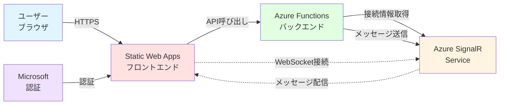

## Azure SignalR Service チャットアプリハンズオン

リアルタイム通信とサーバーレスアーキテクチャを学ぶ

  
    Press Space for next page <carbon:arrow-right class="inline"/>
  

---

## 本日のアジェンダ

Azure のサーバーレスサービスを使用して、認証機能付きリアルタイムチャットアプリを構築します。

### 基礎知識

- 💬 **Azure SignalR Service とは**
- 📋 **前提条件**
- 🏗️ **アーキテクチャ概要**

### 実践ハンズオン

- ⚡ **① Azure SignalR Service**
  - サービスの作成と設定
- 🔧 **② Azure Functions（Python）**
  - Python でのバックエンド API 開発とデプロイ
- 🌐 **③ Static Web Apps（Next.js）**
  - Next.js + TypeScript でフロントエンド開発
  - Microsoft 認証の有効化
  - プロフィールページの作成
  - Static Web Apps へのデプロイ
- ✅ **④ 動作確認**
  - チャット機能のテスト

### まとめ

- 📚 学んだこと・次のステップ

---

## layout: center

# Azure SignalR Service とは？

 

**リアルタイム Web 機能を簡単に追加できる フルマネージドサービス**

---

## Azure SignalR Service の魅力

Azure SignalR Service は、アプリケーションにリアルタイム通信機能を追加するためのフルマネージドサービスです。
WebSocket や Server-Sent Events などの複雑な技術を抽象化し、簡単にリアルタイム機能を実装できます。

#### 💬 リアルタイム通信

WebSocket ベースの双方向通信により、チャット、通知、ライブダッシュボードなどを実現できます。

#### 🚀 スケーラブル

自動スケーリングにより、数千〜数百万の同時接続を処理できます。インフラ管理は不要です。

#### 🔌 簡単な統合

Azure Functions、App Service、ASP.NET Core などと簡単に統合できます。

#### 🛡️ セキュア

認証・認可機能を統合し、Azure AD、OAuth プロバイダーとシームレスに連携できます。

---

## Azure SignalR Service の主要な機能

#### 💬 リアルタイムメッセージング

<strong>用途：</strong>チャット、通知、協調作業 
<strong>特徴：</strong>双方向通信、ブロードキャスト、グループ管理

#### 🔄 自動スケーリング

<strong>用途：</strong>トラフィック変動に対応 
<strong>特徴：</strong>動的スケーリング、高可用性、負荷分散

#### 🌐 複数プロトコル対応

<strong>用途：</strong>様々なクライアント対応 
<strong>特徴：</strong>WebSocket、SSE、Long Polling

#### 🔐 認証・認可

<strong>用途：</strong>セキュアな通信 
<strong>特徴：</strong>Azure AD 統合、JWT トークン、ユーザー認証

  

#### ⚡ サーバーレスモード

<strong>用途：</strong>Azure Functions との統合 
<strong>特徴：</strong>イベント駆動、従量課金、インフラ不要
  

#### 📊 監視・診断

<strong>用途：</strong>パフォーマンス監視 
<strong>特徴：</strong>Azure Monitor 統合、メトリクス、ログ

---

## 今回構築するアーキテクチャ

リアルタイムチャットアプリケーションの全体構成を理解します。

**フロー:**

1. ユーザーが Static Web Apps でホストされたフロントエンドにアクセス
2. Microsoft 認証でサインイン
3. Azure Functions から SignalR の接続情報を取得
4. ブラウザと SignalR Service が WebSocket で接続
5. メッセージは Functions 経由で SignalR に送信され、全クライアントに配信

---

## 前提条件

このハンズオンを進めるために必要な環境とツールを確認します。

### Azure アカウント

- ✅ **Azure サブスクリプション**
- ✅ **リソースグループ作成権限**

### 必要なツール

- ✅ **Azure Portal アクセス**
  - [https://portal.azure.com](https://portal.azure.com)
- ✅ **Azure CLI（推奨）**
  - バージョン 2.40 以降
- ✅ **Python**
  - バージョン 3.11
- ✅ **Node.js**
  - バージョン 20.x（Next.js 用）
- ✅ **Azure Functions Core Tools**
  - バージョン 4

### 開発環境

- ✅ **テキストエディタ**
  - VS Code 推奨
  - Azure Functions 拡張機能
  - Python 拡張機能
- ✅ **Git（任意）**
  - バージョン管理用

### 知識要件

- ✅ **Azure の基礎**
  - リソースグループの概念
  - 基本的なポータル操作

---

## 料金について

このハンズオンで発生する料金の概算です。

### 💰 推定料金

**ハンズオン全体：約 ¥100〜300 / 月**

- Azure SignalR Service（Free tier）：無料（20 同時接続まで）
- Azure Functions（従量課金プラン）：約 ¥50/月
  - Python Functions でも同じ料金体系
- Static Web Apps（Free tier）：無料（100GB 帯域まで）
- Storage Account：約 ¥50/月

※ 料金は 2025 年 10 月時点の東日本リージョン価格

  

### 💡 コスト削減のヒント

1. **Free tier を活用**
   - SignalR Service の Free tier で開始
   - Static Web Apps の Free プランで十分
2. **ハンズオン終了後は削除**
   - リソースグループごと削除が簡単
3. **従量課金を理解**
   - Functions は実行時のみ課金
4. **モニタリング**
   - コストアラートを設定

※ Free tier の制限を超えると課金が発生します

---
src: ./pages/01-intro.md
---
---
src: ./pages/02-signalr-service.md
---
---
src: ./pages/03-function-app.md
---
---
src: ./pages/04-static-web-app.md
---
---
src: ./pages/06-test.md
---
---
src: ./pages/99-summary.md
---
