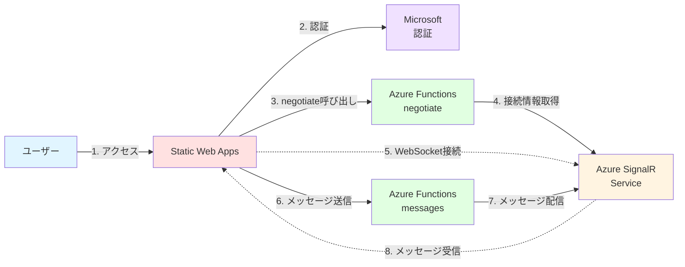

# ✅ ハンズオン ⑤

動作確認とテスト

---

## ハンズオン ⑤ の概要

このハンズオンでは、構築したチャットアプリの全機能をテストします。

<div class="pt-6">

### 🎯 学習目標

- エンドツーエンドの動作確認方法を理解する
- デバッグとトラブルシューティングの手法を学ぶ
- パフォーマンスと可用性の確認方法を習得する
- 本番環境への移行準備を理解する

### 📋 実施内容

1. **基本機能のテスト** - メッセージ送受信の確認
2. **認証機能のテスト** - ログイン/ログアウトの確認
3. **複数ユーザーでのテスト** - リアルタイム通信の確認
4. **パフォーマンステスト** - 応答時間の測定
5. **エラーハンドリングの確認** - 異常系のテスト

</div>

---

## STEP 5-1: 完成したアーキテクチャの確認

構築したシステムの全体像を確認します。



<div class="mt-4 text-sm">

**コンポーネント:**

- **Static Web Apps**: フロントエンドホスティング + 認証
- **Azure Functions**: negotiate + messages API
- **Azure SignalR Service**: リアルタイム通信
- **Microsoft 認証**: ユーザー認証

</div>

---

## STEP 5-2: デプロイ状態の確認

すべてのリソースが正しくデプロイされているか確認します。

### Portal での確認

1. **リソースグループを開く**
   - `rg-chat-app-handson` を開く
   - 以下のリソースが存在することを確認

| リソースタイプ  | 名前（例）           | 状態      |
| --------------- | -------------------- | --------- |
| SignalR Service | signalr-chat-taro123 | Running   |
| Function App    | func-chat-taro123    | Running   |
| Storage Account | stchattaro123        | Available |
| Static Web Apps | swa-chat-taro123     | Ready     |

### CLI での確認

```bash
# リソース一覧の取得
az resource list \
  --resource-group rg-chat-app-handson \
  --output table
```

---

## STEP 5-3: 基本機能テスト - 接続確認

チャットアプリの基本的な接続をテストします。

### テスト手順

1. **アプリケーションにアクセス**

   ```bash
   # URLを取得
   az staticwebapp show \
     --name swa-chat-taro123 \
     --resource-group rg-chat-app-handson \
     --query defaultHostname \
     --output tsv
   ```

2. **接続状態の確認**

   - ブラウザでアクセス
   - 画面下部のステータスが「接続中...」→「接続済み」に変わることを確認

3. **開発者ツールでの確認**
   - F12 キーで開発者ツールを開く
   - Console タブで「SignalR 接続成功」のログを確認
   - Network タブで WebSocket 接続を確認

<div class="mt-4 bg-green-500/10 p-3 rounded text-sm">
✅ <strong>期待される結果:</strong>「接続済み」と表示され、メッセージ入力欄が有効になる
</div>

---

## STEP 5-4: 基本機能テスト - メッセージ送受信

メッセージの送受信機能をテストします。

### テスト手順

1. **メッセージ送信**

   - メッセージ入力欄に「テストメッセージ」と入力
   - 「送信」ボタンをクリック

2. **メッセージ表示の確認**

   - 送信したメッセージがチャットエリアに表示されることを確認
   - 送信者名、メッセージ内容、タイムスタンプが正しく表示されることを確認

3. **複数メッセージの送信**
   - 複数のメッセージを連続して送信
   - すべてのメッセージが順番通りに表示されることを確認

<div class="mt-4 bg-blue-500/10 p-3 rounded text-sm">
💡 <strong>デバッグのヒント:</strong>メッセージが表示されない場合は、開発者ツールのNetworkタブで `/api/messages` へのリクエストが成功しているか確認してください。
</div>

---

## STEP 5-5: 認証機能テスト - ログイン

Microsoft 認証機能をテストします。

### テスト手順（ログイン前）

1. **初期状態の確認**

   - ユーザー名: 「Anonymous」と表示
   - 「ログイン」ボタンが表示されている

2. **ログイン実行**

   - 「ログイン」ボタンをクリック
   - Microsoft アカウントのログイン画面にリダイレクト
   - 認証情報を入力してサインイン
   - 権限の同意画面が表示された場合は「承諾」

3. **リダイレクト後の確認**
   - チャットアプリに戻る
   - ユーザー名が Microsoft アカウント名に変更されていることを確認
   - 「ログアウト」ボタンが表示されていることを確認

---

## STEP 5-6: 認証機能テスト - ログイン後のメッセージ

認証後のメッセージ送信をテストします。

### テスト手順（ログイン後）

1. **メッセージ送信**

   - メッセージを送信
   - 送信者名が認証されたユーザー名になることを確認

2. **ユーザー情報の確認**

   - 開発者ツールの Console で実行:

   ```javascript
   fetch("/.auth/me")
     .then((res) => res.json())
     .then((data) => console.log(data));
   ```

   - `clientPrincipal.userDetails` に正しいユーザー名が設定されていることを確認

3. **ログアウト**
   - 「ログアウト」ボタンをクリック
   - ユーザー名が「Anonymous」に戻ることを確認
   - 「ログイン」ボタンが再表示されることを確認

---

## STEP 5-7: 複数ユーザーテスト - リアルタイム通信

複数のクライアントでリアルタイム通信をテストします。

### テスト手順

1. **複数ブラウザでアクセス**

   - 別のブラウザ（または シークレットウィンドウ）で同じ URL を開く
   - 両方のブラウザで接続が確立されることを確認

2. **一方向メッセージ送信**

   - ブラウザ A でメッセージを送信
   - ブラウザ B で同じメッセージが**即座に**表示されることを確認

3. **双方向メッセージ送信**

   - ブラウザ A とブラウザ B の両方からメッセージを送信
   - 両方のブラウザで全メッセージが表示されることを確認
   - メッセージの順序が正しいことを確認

4. **タイミングテスト**
   - 両方のブラウザから同時にメッセージを送信
   - 両方のメッセージがすべてのクライアントに配信されることを確認

<div class="mt-4 bg-green-500/10 p-3 rounded text-sm">
✅ <strong>期待される結果:</strong>すべてのクライアントで、すべてのメッセージがリアルタイムに表示される
</div>

---

## STEP 5-13: SignalR Service のメトリクス

SignalR Service の使用状況を確認します。

### 確認手順

1. **SignalR Service を開く**

   - Azure Portal で SignalR Service を開く

2. **メトリクス**
   - 「監視」→「メトリクス」
   - 以下のメトリクスを確認

| メトリクス       | 説明                     | 正常値               |
| ---------------- | ------------------------ | -------------------- |
| **接続数**       | 現在の接続数             | Free tier: 0〜20     |
| **メッセージ数** | 送受信されたメッセージ数 | 実際の使用量に応じて |
| **エラー数**     | エラーの発生回数         | 0 が理想             |
| **トラフィック** | データ転送量             | 実際の使用量に応じて |

3. **ログの確認**
   - 「監視」→「診断設定」
   - ログを有効化して詳細を確認（任意）

---

## ハンズオン ⑤ のまとめ

動作確認とテストが完了しました。

<div class="grid grid-cols-2 gap-6 pt-4 text-sm">

<div>

### ✅ 達成したこと

- ✅ 基本機能の動作確認
- ✅ 認証機能のテスト
- ✅ 複数ユーザーでのリアルタイム通信確認
- ✅ パフォーマンステスト
- ✅ エラーハンドリングの確認
- ✅ Application Insights での監視
- ✅ セキュリティチェック

</div>

<div>

### 🔑 重要なポイント

- **エンドツーエンドテスト**: すべての機能を確認
- **複数クライアント**: リアルタイム通信の検証
- **パフォーマンス**: 応答時間の測定
- **エラーハンドリング**: 異常系の確認
- **監視**: Application Insights の活用
- **本番移行**: チェックリストの実施

</div>
</div>
