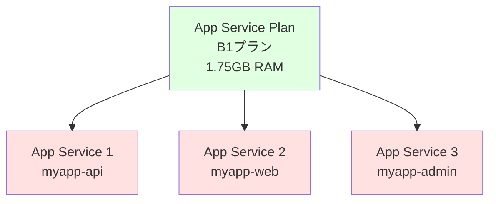
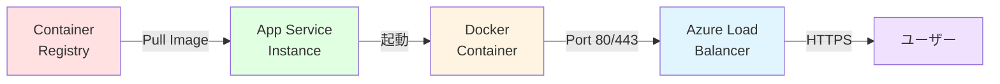

# 📦 深掘り

App Service for Containers の理解を深める

---

## App Service とは

Azure App Service は、Web アプリケーションをホストするためのフルマネージド PaaS サービスです。

<div class="grid grid-cols-2 gap-6 pt-4 text-sm">

<div>

### 通常の App Service

**コード直接デプロイ型**

- .NET、Java、Node.js、Python、PHP など
- ランタイムは Azure が管理
- シンプルな構成

```bash
# コードをそのままデプロイ
az webapp up --name myapp \
  --runtime "NODE:20-lts"
```

</div>

<div>

### App Service for Containers

**コンテナイメージ型**

- 任意の Docker イメージ
- ランタイム・ライブラリを自由に選択
- より柔軟な構成

```bash
# コンテナイメージをデプロイ
az webapp create --name myapp \
  --deployment-container-image-name \
  myregistry.azurecr.io/myapp:latest
```

</div>

</div>

<div class="mt-4 bg-blue-500/10 p-3 rounded text-sm">
💡 <strong>使い分け:</strong> 標準的なランタイムで十分なら通常の App Service、カスタムな環境が必要なら Containers を選択します。
</div>

---

## App Service Plan とは

App Service Plan は、Web アプリが実行される物理的なリソース（VM）を定義します。



<div class="grid grid-cols-2 gap-6 pt-4 text-sm">

<div>

- **リソースを共有**
  - 複数の App Service が同じ Plan 上で動く
  - CPU・メモリを共有
- **スケーリング単位**
  - Plan 単位でスケールアップ/アウト
- **課金単位**
  - Plan ごとに課金（App Service 自体は無料）

</div>

<div>

| Tier     | 用途         | 価格目安   |
| -------- | ------------ | ---------- |
| **F1**   | 開発・テスト | 無料       |
| **B1**   | 小規模本番   | ¥1,400/月  |
| **S1**   | 本番環境     | ¥8,500/月  |
| **P1v3** | 高性能本番   | ¥16,000/月 |

</div>

</div>

---

## コンテナ実行環境の仕組み

App Service for Containers でコンテナがどのように実行されるかを理解します。

<div class="pt-4">



</div>

<div class="grid grid-cols-2 gap-6 pt-4 text-sm">

<div>

### 起動フロー

1. **イメージ取得**
   - ACR または Docker Hub からプル
2. **コンテナ起動**
   - App Service が Docker コンテナを起動
3. **ヘルスチェック**
   - HTTP リクエストで正常性確認
4. **トラフィック受付**
   - ロードバランサー経由でリクエスト受信

</div>

<div>

### 重要な制約

- **ポート固定**
  - コンテナは特定のポートをリッスン
  - `WEBSITES_PORT` 環境変数で指定
- **永続化ストレージ**
  - コンテナは Ephemeral（一時的）
  - `/home` ディレクトリのみ永続化可能
- **起動タイムアウト**
  - 230 秒以内に起動する必要あり

</div>

</div>

---

## Web App for Containers が選ばれるケース

どのような場合に App Service for Containers を選択すべきかを整理します。

<div class="grid grid-cols-2 gap-6 pt-4 text-sm">

<div class="bg-green-500/10 p-4 rounded">

### ✅ 適しているケース

1. **既存 Docker イメージがある**
   - 開発環境と同じイメージを使いたい
2. **カスタムランタイム**
   - Azure が提供していない言語・バージョン
3. **複雑な依存関係**
   - システムパッケージが多数必要
4. **シンプルな構成**
   - 単一または少数のコンテナ
   - マイクロサービスほど複雑でない
5. **PaaS のメリットが欲しい**
   - インフラ管理を最小化
   - スケーリングを簡単に

</div>

<div class="bg-red-500/10 p-4 rounded">

### ❌ 不向きなケース

1. **複雑なマイクロサービス**
   - 多数のコンテナ間連携
   - → Container Apps や AKS が適切
2. **Kubernetes 機能が必要**
   - カスタムコントローラー
   - → AKS を選択
3. **短時間実行ジョブ**
   - バッチ処理、CI/CD エージェント
   - → Container Instances が適切
4. **イベント駆動が中心**
   - キューベースの処理
   - → Container Apps + KEDA

</div>

</div>

---

## Container Apps や AKS との比較

Azure でコンテナを動かすサービスの詳細比較です。

<div class="text-xs pt-4">

| 観点                  | **App Service for Containers**    | **Azure Container Apps**               | **Azure Kubernetes Service (AKS)**   |
| --------------------- | --------------------------------- | -------------------------------------- | ------------------------------------ |
| **管理の複雑さ**      | ⭐ 最もシンプル                   | ⭐⭐ 中程度                            | ⭐⭐⭐⭐ 高度な知識が必要            |
| **ユースケース**      | Web アプリ、API                   | マイクロサービス、バッチ、イベント駆動 | 本格的なコンテナオーケストレーション |
| **スケーリング**      | 手動/自動（CPU・メモリベース）    | イベント駆動（KEDA 統合）              | HPA、VPA、Cluster Autoscaler         |
| **ネットワーク**      | VNet 統合、Private Endpoint       | VNet 統合、内部イングレス              | 完全なネットワーク制御               |
| **マルチコンテナ**    | Docker Compose（シンプル）        | Dapr、サイドカー対応                   | フル Kubernetes Pod                  |
| **永続化ストレージ**  | `/home` のみ、Azure Files 統合    | Azure Files、NFS                       | PVC、CSI ドライバー                  |
| **価格モデル**        | App Service Plan 単位（常時起動） | 従量課金 + 予約容量                    | VM ノード単位                        |
| **Kubernetes 互換性** | なし                              | Kubernetes ベース（一部互換）          | フル Kubernetes                      |
| **CI/CD 統合**        | GitHub Actions、Azure DevOps      | GitHub Actions、Azure DevOps           | Helm、ArgoCD、FluxCD など            |
| **学習コスト**        | 低い（Web 開発者向け）            | 中程度（コンテナ中級者向け）           | 高い（Kubernetes 知識必須）          |

</div>

<div class="mt-4 bg-blue-500/10 p-3 rounded text-sm">
💡 <strong>選択基準:</strong> まずは App Service for Containers で始めて、要件が複雑になったら Container Apps や AKS に移行するのが賢明です。
</div>

---

## まとめ: App Service for Containers の立ち位置

<div class="grid grid-cols-2 gap-6 text-sm">

<div>

### 🎯 強み

- **シンプルさ**
  - インフラ管理不要
  - 学習コストが低い
- **PaaS の恩恵**
  - 自動スケーリング
  - 組み込み監視
  - SSL 証明書管理
- **柔軟性**
  - 任意の Docker イメージ
  - カスタムランタイム
- **コスト効率**
  - App Service Plan 共有可能
  - 予測可能な料金

</div>

<div>

### ⚠️ 制約

- **単一コンテナ向け**
  - 複雑なマイクロサービスには不向き
- **Kubernetes 非互換**
  - K8s マニフェストは使えない
- **永続化制限**
  - `/home` のみ永続化
- **起動時間制限**
  - 230 秒以内に起動必要
- **ポート制約**
  - カスタムポート設定が必要

</div>

</div>

<div class="bg-green-500/10 p-4 rounded text-sm">
✅ App Service for Containers は、既存の Docker イメージをシンプルに Azure で動かしたい場合に最適です。Web アプリや API の PaaS 運用に向いており、複雑なオーケストレーションが不要なプロジェクトに適しています。
</div>
