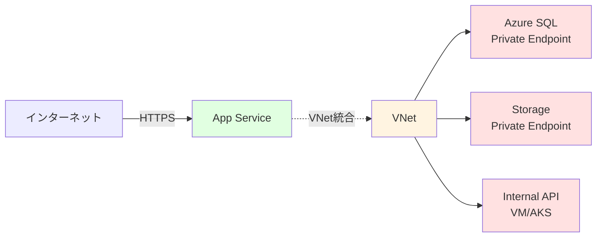

# 🔐 ハンズオン ⑤

セキュリティ構成

---

## ハンズオン ⑤ の概要

App Service のセキュリティ機能を設定します。

<div class="pt-6">

### 🎯 学習目標

- HTTPS とカスタムドメインの設定を理解する
- IP 制限とアクセス制御を学ぶ
- Managed Identity の活用方法を習得する
- VNet 統合の仕組みを理解する

### 📋 実施内容

1. **HTTPS 設定** - TLS/SSL 証明書の管理
2. **カスタムドメイン** - 独自ドメインの設定
3. **IP 制限** - アクセス元の制限
4. **Managed Identity** - パスワードレス認証
5. **VNet 統合** - プライベートネットワーク接続

</div>

---

## STEP 5-1: HTTPS の強制

HTTP アクセスを自動的に HTTPS にリダイレクトします。

<div class="grid grid-cols-2 gap-6">
<div>

### Portal での設定

1. **App Service を開く**

2. **TLS/SSL 設定を開く**

   - 左メニューの「設定」→「TLS/SSL 設定」

3. **HTTPS のみ を有効化**
   - 「HTTPS のみ」を `オン` に切り替え
   - 保存

**効果:**

- `http://` でアクセスしても自動的に `https://` にリダイレクト

<div class="mt-4 bg-green-500/10 p-3 rounded text-xs">
✅ <strong>ベストプラクティス:</strong> 本番環境では必ず HTTPS のみを有効にしてください。
</div>
</div>
<div>

### CLI での設定

```bash
# HTTPS のみを有効化
az webapp update \
  --name $APP_NAME \
  --resource-group $RESOURCE_GROUP \
  --https-only true

# 設定確認
az webapp show \
  --name $APP_NAME \
  --resource-group $RESOURCE_GROUP \
  --query httpsOnly \
  --output tsv
# 期待される出力
# true

# 動作確認
curl -I http://$APP_NAME.azurewebsites.net
# Location: https://$APP_NAME.azurewebsites.net
```

</div>
</div>

---

## TLS バージョンの設定（参考）

最小 TLS バージョンを設定して、古いプロトコルを拒否します。

```bash
# 最小 TLS バージョンを 1.2 に設定
az webapp config set \
  --name $APP_NAME \
  --resource-group $RESOURCE_GROUP \
  --min-tls-version 1.2

# 設定確認
az webapp config show \
  --name $APP_NAME \
  --resource-group $RESOURCE_GROUP \
  --query minTlsVersion \
  --output tsv

# 期待される出力
1.2
```

<div class="mt-4 bg-blue-500/10 p-3 rounded text-xs">
💡 <strong>推奨:</strong> TLS 1.0/1.1 は非推奨です。TLS 1.2 以上を設定しましょう。PCI DSS コンプライアンスでも必須です。
</div>

---

## カスタムドメインの追加（参考）

独自ドメインを App Service に設定します。

<div class="grid grid-cols-2 gap-6">
<div>

### 前提条件

- 独自ドメインを所有していること
- DNS レコードを編集できること

</div>
<div>

### 設定手順の概要

1. **DNS レコードの追加**

   ```
   # CNAME レコード
   www.example.com  CNAME  app-container-taro.azurewebsites.net

   # または A レコード + TXT レコード
   example.com      A      <App ServiceのIPアドレス>
   asuid.example.com TXT   <検証ID>
   ```

2. **App Service にドメインを追加**

   ```bash
   az webapp config hostname add \
     --webapp-name $APP_NAME \
     --resource-group $RESOURCE_GROUP \
     --hostname www.example.com
   ```

3. **SSL 証明書のバインド**
   - App Service Managed Certificate（無料）
   - または Let's Encrypt、カスタム証明書

</div>
</div>

---

## STEP 5-2: IP 制限の設定

特定の IP アドレスからのアクセスのみ許可します。

<div class="grid grid-cols-2 gap-6">
<div>

### Portal での設定

1. **App Service を開く**

2. **ネットワーク設定を開く**

   - 左メニューの「設定」→「ネットワーク」

3. **アクセス制限を構成**

   - 「アクセス制限」を選択
   - 「+ ルールの追加」をクリック

4. **IP 範囲を追加**
   - **名前**: `Office IP`
   - **アクション**: `許可`
   - **優先度**: `100`
   - **IP アドレス**: `203.0.113.0/24`

</div>

<div>

### CLI での設定

```bash
# 特定のIPアドレスを許可
az webapp config access-restriction add \
  --name $APP_NAME \
  --resource-group $RESOURCE_GROUP \
  --rule-name "Office IP" \
  --action Allow \
  --ip-address 203.0.113.0/24 \
  --priority 100
# アクセスすると繋がらない

# 自分のIPアドレスを許可
MY_IP=$(curl -s ifconfig.me)
az webapp config access-restriction add \
  --name $APP_NAME \
  --resource-group $RESOURCE_GROUP \
  --rule-name "My IP" \
  --action Allow \
  --ip-address $MY_IP/32 \
  --priority 110

# 設定確認
az webapp config access-restriction show \
  --name $APP_NAME \
  --resource-group $RESOURCE_GROUP
```

</div>

</div>

---

## STEP 5-3: Key Vault の作成と権限付与

機密情報を Key Vault で管理します。

```bash
# Key Vault の作成
export KEYVAULT_NAME="kv-container-taro-$(date +%s)"  # ユニークな名前

az keyvault create \
  --name $KEYVAULT_NAME \
  --resource-group $RESOURCE_GROUP \
  --location $LOCATION

# principalIdの取得
IDENTITY_PRINCIPAL_ID=$(az webapp identity show \
  --name $APP_NAME \
  --resource-group $RESOURCE_GROUP \
  --query principalId -o tsv)

# Web App の Managed Identity に Key Vault Secret 読み取り権限を付与
az role assignment create \
  --assignee $IDENTITY_PRINCIPAL_ID \
  --role "Key Vault Secrets User" \
  --scope $(az keyvault show --name $KEYVAULT_NAME --query id -o tsv)

# 確認
az role assignment list \
  --assignee $IDENTITY_PRINCIPAL_ID \
  --scope $(az keyvault show --name $KEYVAULT_NAME --query id -o tsv) \
  --output table

# シークレットを保存
az keyvault secret set \
  --vault-name $KEYVAULT_NAME \
  --name DatabasePassword \
  --value SuperSecretPassword123!

az keyvault secret set \
  --vault-name $KEYVAULT_NAME \
  --name "ApiKey" \
  --value "api-key-xyz789"

# シークレット一覧を確認
az keyvault secret list \
  --vault-name $KEYVAULT_NAME \
  --output table
```

---

## STEP 5-4: Key Vault 参照の設定

App Settings で Key Vault のシークレットを参照します。

```bash
# シークレットの URI を取得
export DB_PASSWORD_URI=$(az keyvault secret show \
  --vault-name $KEYVAULT_NAME \
  --name "DatabasePassword" \
  --query id \
  --output tsv)

export API_KEY_URI=$(az keyvault secret show \
  --vault-name $KEYVAULT_NAME \
  --name "ApiKey" \
  --query id \
  --output tsv)

# App Settings で Key Vault を参照
az webapp config appsettings set \
  --name $APP_NAME \
  --resource-group $RESOURCE_GROUP \
  --settings \
    DATABASE_PASSWORD="@Microsoft.KeyVault(SecretUri=$DB_PASSWORD_URI)" \
    API_KEY="@Microsoft.KeyVault(SecretUri=$API_KEY_URI)"

# 設定確認
az webapp config appsettings list \
  --name $APP_NAME \
  --resource-group $RESOURCE_GROUP \
  --query "[?name=='DATABASE_PASSWORD' || name=='API_KEY']" \
  --output table
```

<div class="mt-4 bg-blue-500/10 p-3 rounded text-xs">
💡 <strong>セキュア:</strong> パスワードは Key Vault に保存され、App Service からは参照のみ。ログや設定画面にも表示されません。
</div>

---

## STEP 5-5: アプリケーションでの Key Vault 利用確認

環境変数から Key Vault の値が取得できることを確認します。

```javascript
// app.js に追加
app.get("/config", (req, res) => {
  // 環境変数から取得（Key Vaultから自動的に取得される）
  const dbPasswordMasked = process.env.DATABASE_PASSWORD
    ? "***" + process.env.DATABASE_PASSWORD.slice(-3)
    : "not set";

  const apiKeyMasked = process.env.API_KEY
    ? "***" + process.env.API_KEY.slice(-3)
    : "not set";

  res.json({
    message: "Configuration loaded from Key Vault",
    database_password: dbPasswordMasked, // 末尾3文字のみ表示
    api_key: apiKeyMasked,
    // 完全な値は絶対に表示しない
  });
});
```

**動作確認:**

```bash
# 新しいバージョンをビルド・デプロイ
# その後、エンドポイントにアクセス
curl https://$APP_NAME.azurewebsites.net/config

# 期待される出力
{
  "message": "Configuration loaded from Key Vault",
  "database_password": "***123",
  "api_key": "***789"
}
```

---

## STEP 5-6: VNet 統合の概要

App Service をプライベートネットワークに統合します。



<div class="grid grid-cols-2 gap-4">
<div>

**VNet 統合の効果:**

- App Service から Private Endpoint へアクセス
- 内部リソースへセキュアに接続
- パブリックインターネットを経由しない

</div>
<div>

**利用可能な Tier:**

- Basic 以上
- Premium で高度な機能

</div>
</div>

---

## STEP 5-7: VNet 統合の設定（概要）

VNet 統合の設定手順です。

<div class="text-sm">

### 1. VNet とサブネットの作成

```bash
# VNet の作成
az network vnet create \
  --name vnet-container \
  --resource-group $RESOURCE_GROUP \
  --location $LOCATION \
  --address-prefix 10.0.0.0/16

# App Service 統合用サブネットの作成
az network vnet subnet create \
  --name subnet-appservice \
  --resource-group $RESOURCE_GROUP \
  --vnet-name vnet-container \
  --address-prefix 10.0.1.0/24 \
  --delegations Microsoft.Web/serverFarms
```

### 2. App Service に VNet を統合

```bash
# VNet 統合の設定
az webapp vnet-integration add \
  --name $APP_NAME \
  --resource-group $RESOURCE_GROUP \
  --vnet vnet-container \
  --subnet subnet-appservice

# 統合確認
az webapp vnet-integration list \
  --name $APP_NAME \
  --resource-group $RESOURCE_GROUP
```

</div>

---

## STEP 5-8: Private Endpoint の設定（Advanced）

App Service 自体をプライベートエンドポイント経由でのみアクセス可能にします。

<div class="text-xs">

```bash
# Private Endpoint 用サブネットの作成
az network vnet subnet create \
  --name subnet-privatelink \
  --resource-group $RESOURCE_GROUP \
  --vnet-name vnet-container \
  --address-prefix 10.0.2.0/24 \
  --disable-private-endpoint-network-policies true

# App Service の Private Endpoint を作成
az network private-endpoint create \
  --name pe-appservice \
  --resource-group $RESOURCE_GROUP \
  --vnet-name vnet-container \
  --subnet subnet-privatelink \
  --private-connection-resource-id $(az webapp show \
    --name $APP_NAME \
    --resource-group $RESOURCE_GROUP \
    --query id --output tsv) \
  --group-id sites \
  --connection-name connection-appservice

# Private DNS ゾーンの作成と設定
az network private-dns zone create \
  --resource-group $RESOURCE_GROUP \
  --name privatelink.azurewebsites.net

az network private-dns link vnet create \
  --resource-group $RESOURCE_GROUP \
  --zone-name privatelink.azurewebsites.net \
  --name dns-link \
  --virtual-network vnet-container \
  --registration-enabled false
```

</div>

---

## STEP 5-9: セキュリティヘッダーの設定

セキュリティヘッダーを追加して、XSS や CSRF などの攻撃を防ぎます。

<div class="text-xs">

**web.config（IIS 用）または Nginx の設定**

App Service では、アプリケーション側で設定することを推奨します。

```javascript
// app.js でセキュリティヘッダーを追加
app.use((req, res, next) => {
  // XSS対策
  res.setHeader("X-Content-Type-Options", "nosniff");
  res.setHeader("X-Frame-Options", "DENY");
  res.setHeader("X-XSS-Protection", "1; mode=block");

  // CSP（Content Security Policy）
  res.setHeader(
    "Content-Security-Policy",
    "default-src 'self'; script-src 'self' 'unsafe-inline'; style-src 'self' 'unsafe-inline';"
  );

  // HSTS（HTTP Strict Transport Security）
  res.setHeader(
    "Strict-Transport-Security",
    "max-age=31536000; includeSubDomains"
  );

  next();
});
```

**または helmet.js を使用:**

```bash
npm install helmet
```

```javascript
const helmet = require("helmet");
app.use(helmet());
```

</div>

---

## ハンズオン ⑤ のまとめ

セキュリティ構成が完了しました。

<div class="grid grid-cols-2 gap-6 pt-4 text-sm">

<div>

### ✅ 達成したこと

- ✅ HTTPS の強制設定
- ✅ TLS バージョンの設定
- ✅ IP 制限の構成
- ✅ Managed Identity の有効化
- ✅ Key Vault 統合
- ✅ VNet 統合の理解
- ✅ セキュリティヘッダーの追加

</div>

<div>

### 🔑 重要なポイント

- **HTTPS 必須**
  - 本番環境では必ず有効化
  - TLS 1.2 以上を使用
- **Managed Identity**
  - パスワード管理不要
  - Key Vault アクセス
- **Key Vault**
  - 機密情報の安全な保管
  - `@Microsoft.KeyVault(...)` で参照
- **IP 制限**
  - アクセス元の制限
  - 優先度で制御
- **VNet 統合**
  - プライベート接続
  - Premium で高度な機能

</div>
</div>

<div class="mt-4 bg-green-500/10 p-3 rounded text-sm">
✅ <strong>次のステップ:</strong> 運用・監視・トラブルシューティングを学びます。
</div>
