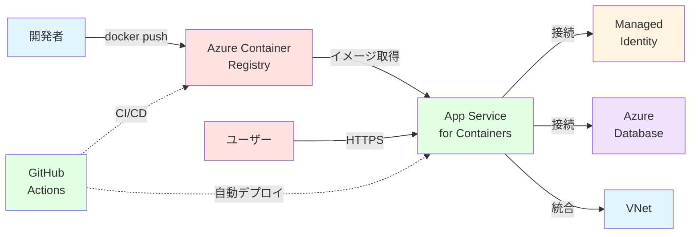

## Azure App Service for Containers<br>ハンズオン

Docker コンテナの PaaS 運用を実践的に学ぶ

<div class="pt-12">
  <span @click="$slidev.nav.next" class="px-2 py-1 rounded cursor-pointer" hover="bg-white bg-opacity-10">
    Press Space for next page <carbon:arrow-right class="inline"/>
  </span>
</div>

---

## 本日のアジェンダ

Azure App Service for Containers を使って、Docker コンテナを PaaS 環境で運用する実践的なスキルを習得します。

<div class="grid grid-cols-2 gap-x-6 text-sm">
<div>

### 基礎知識

- 📦 **App Service for Containers とは**
- 📋 **前提条件と準備**
- 🏗️ **アーキテクチャ概要**

### ハンズオン

- ⚡ **① 環境準備**
  - リソースグループ作成
  - ACR（Container Registry）準備
  - サンプルアプリのビルド・プッシュ
- 🚀 **② App Service デプロイ**
  - App Service Plan 作成
  - コンテナ設定とデプロイ
- ⚙️ **③ コンテナ詳細設定**
  - 環境変数とポート設定
  - スタートアップコマンド

</div>
<div>

- 📈 **④ スケーリング設定**
  - スケールアップ/アウト
  - Always On 設定
- 🔐 **⑤ セキュリティ構成**
  - HTTPS とカスタムドメイン
  - Managed Identity 連携
- 📊 **⑥ 運用・監視**
  - ログストリーム
  - Application Insights 連携
- 🔄 **⑦ CI/CD 自動化**
  - GitHub Actions 統合

### まとめ

- 📚 学んだこと・次のステップ

</div>
</div>

---
layout: center
---

# App Service for Containers とは？

**Docker コンテナを簡単に動かせる<br>フルマネージド PaaS サービス**

---

## App Service for Containers の魅力

Azure App Service for Containers は、カスタム Docker イメージを使用して Web アプリケーションをホストできる PaaS サービスです。
インフラ管理不要で、コンテナ化されたアプリケーションを簡単にデプロイ・運用できます。

<div class="grid grid-cols-2 gap-x-8 gap-y-4 pt-6">

<div class="bg-gray-500/10 p-4 rounded">

#### 📦 どんなコンテナでも動く

独自の言語・フレームワーク・ライブラリを含む Docker イメージをそのままデプロイできます。

</div>

<div class="bg-gray-500/10 p-4 rounded">

#### 🚀 インフラ管理不要

OS パッチ、スケーリング、負荷分散などを Azure が自動で管理します。

</div>

<div class="bg-gray-500/10 p-4 rounded">

#### 🔄 簡単なデプロイ

Docker Hub、ACR、プライベートレジストリから直接デプロイ可能です。

</div>

<div class="bg-gray-500/10 p-4 rounded">

#### 🛡️ エンタープライズ対応

VNet 統合、Managed Identity、カスタムドメイン、SSL 証明書など、本番環境に必要な機能を提供します。

</div>

</div>

---

## App Service for Containers の主要な機能

<div class="grid grid-cols-3 gap-4 pt-6 text-xs">

<div class="bg-blue-500/10 p-3 rounded">

#### 📦 マルチコンテナ対応

<div class="mt-2">
<strong>用途：</strong>Web + API、サイドカーパターン<br>
<strong>特徴：</strong>Docker Compose、複数コンテナ連携
</div>
</div>

<div class="bg-green-500/10 p-3 rounded">

#### 📈 自動スケーリング

<div class="mt-2">
<strong>用途：</strong>トラフィック変動に対応<br>
<strong>特徴：</strong>スケールアップ/アウト、オートスケール
</div>
</div>

<div class="bg-purple-500/10 p-3 rounded">

#### 🔄 CI/CD 統合

<div class="mt-2">
<strong>用途：</strong>自動デプロイ<br>
<strong>特徴：</strong>GitHub Actions、Webhook、スロット
</div>
</div>

<div class="bg-orange-500/10 p-3 rounded">

#### 🔐 セキュリティ

<div class="mt-2">
<strong>用途：</strong>安全な運用<br>
<strong>特徴：</strong>Managed Identity、Key Vault、VNet統合
</div>
  </div>

<div class="bg-cyan-500/10 p-3 rounded">

#### 📊 監視・診断

<div class="mt-2">
<strong>用途：</strong>パフォーマンス監視<br>
<strong>特徴：</strong>Application Insights、ログストリーム
  </div>
</div>

<div class="bg-pink-500/10 p-3 rounded">

#### 💰 コスト最適化

<div class="mt-2">
<strong>用途：</strong>効率的な運用<br>
<strong>特徴：</strong>App Service Plan共有、スケーリング制御
</div>
</div>

</div>

---

## 今回構築するアーキテクチャ

コンテナ化されたアプリケーションを App Service で運用する全体構成です。



**フロー:**

1. 開発者がアプリケーションをコンテナ化し、ACR にプッシュ
2. App Service が ACR からコンテナイメージを取得・デプロイ
3. Managed Identity でセキュアにデータベースへ接続
4. VNet 統合によりプライベートネットワーク通信
5. GitHub Actions で CI/CD パイプラインを自動化

---

## App Service for Containers の位置づけ

Azure でコンテナを動かす選択肢は複数あります。それぞれの特徴を理解して適切なサービスを選びましょう。

<div class="grid grid-cols-1 gap-4 pt-4 text-sm">

| サービス                            | 特徴                                        | 適したケース                          | 管理の複雑さ |
| ----------------------------------- | ------------------------------------------- | ------------------------------------- | ------------ |
| **App Service for Containers**      | PaaS、シンプル、単一コンテナ中心            | Web アプリ、API、既存 Docker イメージ | ⭐           |
| **Azure Container Apps**            | イベント駆動、Kubernetes ベース             | マイクロサービス、バッチ処理          | ⭐⭐         |
| **Azure Kubernetes Service (AKS)**  | フル Kubernetes、高度なオーケストレーション | 複雑なマイクロサービス、本格的な運用  | ⭐⭐⭐⭐     |
| **Azure Container Instances (ACI)** | 軽量、短期間実行                            | バッチジョブ、CI/CD エージェント      | ⭐           |

</div>

<div class="mt-4 bg-blue-500/10 p-3 rounded text-sm">
💡 <strong>今回のハンズオンでは:</strong> App Service for Containers を使用します。最もシンプルで、既存の Web アプリケーションをコンテナ化して運用する場合に最適です。
</div>

---

## 前提条件

このハンズオンを進めるために必要な環境とツールを確認します。

<div class="grid grid-cols-2 gap-6 pt-4">

<div>

### Azure アカウント

- ✅ **Azure サブスクリプション**
- ✅ **リソースグループ作成権限**

### 必要なツール

- ✅ **Azure Portal アクセス**
  - [https://portal.azure.com](https://portal.azure.com)
- ✅ **Azure CLI（推奨）**
  - バージョン 2.40 以降
- ✅ **Docker Desktop**
  - ローカルでのイメージビルド用
- ✅ **Git（任意）**

  - サンプルアプリのクローン用

</div>
<div>

### 開発環境

- ✅ **テキストエディタ**
  - VS Code 推奨
  - Docker 拡張機能
  - Azure 拡張機能
- ✅ **基本的なコマンドライン操作**
  - ターミナル/PowerShell の使用経験

### 知識要件

- ✅ **Docker の基礎**
  - イメージのビルド経験
  - Dockerfile の基本的な理解
- ✅ **Azure の基礎**
  - リソースグループの概念
  - 基本的なポータル操作

</div>

</div>

---

## 料金について

このハンズオンで発生する料金の概算です。

<div class="grid grid-cols-2 gap-6 text-sm">

<div class="bg-blue-500/10 p-4 rounded">

#### 💰 推定料金

**ハンズオン全体：約 ¥2,000 / 月**

- Azure Container Registry（Basic）：約 ¥500/月
  - 10 GB ストレージ、無制限の Webhook
- App Service Plan（B1）：約 ¥1,400/月
  - 1.75 GB RAM、100 GB ストレージ
- App Service：無料（Plan に含まれる）
- Application Insights（任意）：約 ¥100/月

<div class="mt-4 text-xs opacity-75">
※ 料金は 2025 年 10 月時点の東日本リージョン価格
</div>

</div>

<div class="bg-yellow-500/10 p-4 rounded">

#### 💡 コスト削減のヒント

1. **ハンズオン終了後は削除**
   - リソースグループごと削除が簡単
   - 不要なリソースを残さない
2. **Free/Shared tier の活用**
   - F1（Free）tier でも基本的な動作確認は可能
   - ただし機能制限あり（Always On 不可など）
3. **開発環境は停止**
   - 使わないときは App Service を停止
   - ただし Plan の料金は発生し続ける
4. **モニタリング**
   - Azure Cost Management でコスト確認
   - 予算アラートの設定

<div class="mt-4 text-xs opacity-75">
※ 本格的な学習には B1 以上を推奨
</div>
</div>
</div>

---

## リソース命名規則

適切なリソース名を付けることで、管理しやすくなります。

<div class="text-sm pt-4">

### 推奨パターン

```bash
rg-container-handson         # リソースグループ
acr-handson-<name>           # ACR（グローバルに一意）
plan-container-<name>        # App Service Plan
app-container-<name>         # App Service
```

### グローバルに一意な名前が必要なリソース

以下のリソースは、Azure 全体で一意の名前である必要があります：

- **App Service**: `https://<app-name>.azurewebsites.net`
- **Container Registry**: `<registry-name>.azurecr.io`

名前が既に使用されている場合は、日付や数字を追加してください（例: `app-container-20251022`）。

</div>

---
src: ./pages/01-overview.md
---
---
src: ./pages/02-preparation.md
---
---
src: ./pages/03-deployment.md
---
---
src: ./pages/04-container-config.md
---
---
src: ./pages/05-scaling.md
---
---
src: ./pages/06-security.md
---
---
src: ./pages/07-monitoring.md
---
---
src: ./pages/08-cicd.md
---
---
src: ./pages/99-summary.md
---
