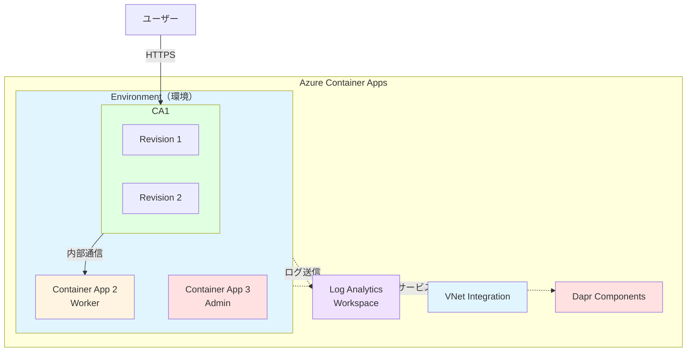
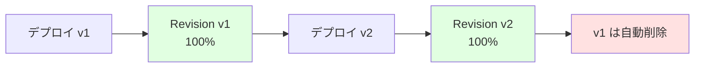
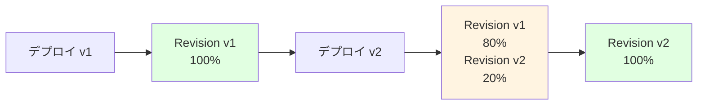

# 📦 深掘り

Container Apps の基本概念と他サービスとの比較

---

## このセクションの概要

Azure Container Apps の基本的なアーキテクチャと、他の Azure コンテナサービスとの違いを理解します。

<div class="pt-6">

### 🎯 学習目標

- Container Apps のアーキテクチャを理解する
- AKS との違いを把握する
- App Service for Containers との使い分けを学ぶ
- Environment、Revision、Dapr の基本概念を理解する

### 📋 学習内容

1. **Container Apps のアーキテクチャ**
2. **AKS との比較**
3. **App Service for Containers との比較**
4. **主要コンポーネントの詳細**

</div>

---

## Container Apps とは

Azure Container Apps は、Kubernetes の複雑さを抽象化した、サーバーレスコンテナプラットフォームです。

<div class="grid grid-cols-2 gap-6 pt-4 text-sm">

<div>

### 特徴

- **Kubernetes ベース**

  - 内部的には AKS を利用
  - Kubernetes の知識は不要
  - マネージドで運用負荷が低い

- **イベント駆動スケーリング**

  - KEDA による自動スケーリング
  - HTTP、キュー、カスタムメトリクス対応
  - 0 へのスケールダウンが可能

- **マイクロサービス向け**
  - 複数のコンテナアプリを連携
  - Dapr による簡単な通信
  - 内部/外部アクセス制御

</div>

<div>

### ユースケース

✅ **適している**

- Web API のホスティング
- マイクロサービスアーキテクチャ
- イベント駆動の処理
- バックグラウンドワーカー
- バッチジョブ

❌ **適していない**

- ステートフルなアプリケーション
  （永続ストレージが必要な場合）
- 高度な Kubernetes 機能が必要
- 長時間実行されるプロセス
  （24 時間以上の連続実行）

</div>

</div>

---

## Container Apps のアーキテクチャ

Container Apps は複数のレイヤーで構成されています。



<div class="text-xs mt-4">

- **Environment**: 複数の Container Apps が共有する実行環境
- **Container App**: 個別のコンテナアプリケーション
- **Revision**: Container App のデプロイ単位（バージョン）

</div>

---

## Environment（環境）の詳細

Environment は、複数の Container Apps が共有するリソースです。

<div class="grid grid-cols-2 gap-6 text-sm">

<div>

### Environment が提供するもの

- **Log Analytics Workspace**

  - すべてのアプリのログを一元管理
  - クエリによる横断的な分析

- **VNet 統合**

  - Environment 単位で VNet に接続
  - プライベート通信が可能

- **Dapr コンポーネント**

  - Pub/Sub、State Store などを共有
  - サービス間通信を簡素化

- **内部 DNS**
  - 同じ Environment 内での名前解決
  - `<app-name>.internal.<env-unique-id>.japaneast.azurecontainerapps.io`

</div>

<div>

### Environment の設計パターン

**1. 単一 Environment**

```
Environment: prod
├─ web-api
├─ worker
└─ admin
```

- シンプルで管理しやすい
- すべてのアプリが相互通信可能

**2. 環境別 Environment**

```
Environment: dev
├─ web-api-dev
└─ worker-dev

Environment: prod
├─ web-api
└─ worker
```

- 環境ごとに分離
- 本番環境の安全性向上

</div>

</div>

---

## Revision（リビジョン）の詳細

Revision は Container App のデプロイ単位です。

<div class="grid grid-cols-2 gap-6 text-sm">

<div>

### Revision の特徴

- **イミュータブル（不変）**

  - 一度作成されたら変更不可
  - 設定変更 = 新しい Revision 作成

- **複数 Revision の並行稼働**

  - 古いバージョンと新しいバージョンを同時稼働
  - トラフィックを分割可能

- **リビジョンモード**
  - **Single**: 常に最新の Revision のみ稼働
  - **Multiple**: 複数 Revision を並行稼働

</div>

<div>

### トラフィック分割の例

**Blue/Green デプロイ**

```
Revision v1 (Blue):  100% トラフィック
Revision v2 (Green):   0% トラフィック

↓ 検証後

Revision v1 (Blue):    0% トラフィック
Revision v2 (Green): 100% トラフィック
```

**Canary リリース**

```
Revision v1: 80% トラフィック
Revision v2: 20% トラフィック

↓ 段階的に移行

Revision v1:  0% トラフィック
Revision v2: 100% トラフィック
```

</div>

</div>

---

## Dapr の基本概念

Dapr（Distributed Application Runtime）は、マイクロサービス構築を簡素化するランタイムです。

<div class="grid grid-cols-3 gap-4 text-xs">

<div class="bg-blue-500/10 p-3 rounded">

#### 🔗 Service-to-Service 通信

アプリ間の HTTP/gRPC 通信を簡素化

```bash
# アプリAからアプリBを呼び出し
curl http://localhost:3500/v1.0/invoke/app-b/method/api/data

# Daprが自動でルーティング
# - サービスディスカバリ
# - リトライ
# - タイムアウト
```

</div>

<div class="bg-green-500/10 p-3 rounded">

#### 📮 Pub/Sub

非同期メッセージング

```bash
# メッセージの発行
curl -X POST \
  http://localhost:3500/v1.0/publish/pubsub/orders \
  -d '{"orderId": 123}'

# メッセージの購読
# アプリ側でエンドポイントを実装
POST /orders
```

</div>

<div class="bg-purple-500/10 p-3 rounded">

#### 💾 State Store

状態管理

```bash
# 状態の保存
curl -X POST \
  http://localhost:3500/v1.0/state/statestore \
  -d '[{"key":"user1","value":"John"}]'

# 状態の取得
curl http://localhost:3500/v1.0/state/statestore/user1
```

</div>

</div>

<div class="mt-4 bg-blue-500/10 p-3 rounded text-sm">
💡 <strong>Container Apps での Dapr:</strong> Dapr はコンテナのサイドカーとして自動デプロイされます。アプリケーションコードに変更は不要で、HTTP API 経由で利用できます。
</div>

---

## AKS との比較

Container Apps と Azure Kubernetes Service (AKS) の違いを理解します。

<div class="text-xs">

| 項目                | Container Apps                        | Azure Kubernetes Service (AKS)             |
| ------------------- | ------------------------------------- | ------------------------------------------ |
| **管理レベル**      | フルマネージド                        | セミマネージド（Control Plane のみ）       |
| **Kubernetes 管理** | 不要（完全に抽象化）                  | 必要（kubectl、Helm など）                 |
| **スケーリング**    | KEDA による自動スケール（0 まで可能） | HPA/VPA（手動設定、0 は不可）              |
| **料金モデル**      | 使用リソース分のみ課金                | ノード（VM）の常時課金                     |
| **起動時間**        | 数秒でコールドスタート                | Pod の起動時間（数秒〜数十秒）             |
| **ネットワーク**    | 自動 Ingress、内部 DNS                | Ingress Controller の設定が必要            |
| **Dapr**            | ネイティブサポート                    | 手動インストール                           |
| **リビジョン管理**  | ビルトイン（トラフィック分割）        | Service Mesh（Istio など）が必要           |
| **運用負荷**        | 低（Azure が管理）                    | 高（ノード、アップグレード、セキュリティ） |
| **柔軟性**          | 制限あり（Container Apps の機能のみ） | 高（Kubernetes エコシステム全体）          |
| **適したケース**    | Web API、マイクロサービス、バッチ     | 複雑な Kubernetes ワークロード、長期実行   |

</div>

---

## AKS と Container Apps の使い分け

<div class="grid grid-cols-2 gap-6 text-sm">

<div class="bg-blue-500/10 p-4 rounded">

### Container Apps を選ぶべき場合

✅ **Kubernetes の知識が限定的**

- インフラよりアプリに集中したい
- 運用負荷を最小化したい

✅ **イベント駆動のワークロード**

- HTTP リクエスト、キュー、スケジュール
- 0 へのスケールダウンが必要

✅ **マイクロサービスの構築**

- 複数サービスの連携
- Dapr による簡単な通信

✅ **コスト最適化**

- 使用時のみ課金
- 開発/テスト環境

</div>

<div class="bg-orange-500/10 p-4 rounded">

### AKS を選ぶべき場合

✅ **高度な Kubernetes 機能が必要**

- カスタム CRD、Operator
- StatefulSet、DaemonSet

✅ **既存の Kubernetes 資産**

- Helm Charts の利用
- 既存のマニフェストファイル

✅ **長時間実行のワークロード**

- 24 時間以上の連続実行
- ステートフルなアプリケーション

✅ **完全なコントロール**

- ネットワークポリシー
- カスタムスケジューラー

</div>

</div>

---

## App Service for Containers との比較

Container Apps と App Service for Containers の違いを理解します。

<div class="text-xs">

| 項目                 | Container Apps                         | App Service for Containers                       |
| -------------------- | -------------------------------------- | ------------------------------------------------ |
| **実行環境**         | Kubernetes ベース（マネージド）        | App Service Plan（専用 VM）                      |
| **スケーリング**     | イベント駆動（KEDA）、0 まで可能       | CPU/メモリベース、最小 1 インスタンス            |
| **料金モデル**       | 使用リソース分のみ課金                 | App Service Plan の常時課金                      |
| **リビジョン管理**   | あり（複数バージョン並行稼働）         | なし（デプロイスロットで代替）                   |
| **マイクロサービス** | ネイティブサポート（Dapr、内部通信）   | 限定的（VNet 統合が必要）                        |
| **Dapr**             | ビルトイン                             | 非対応                                           |
| **VNet 統合**        | Environment 単位                       | App 単位                                         |
| **起動時間**         | 数秒（コールドスタート含む）           | 常時稼働（Always On で即座に応答）               |
| **適したケース**     | マイクロサービス、イベント駆動、バッチ | 単一 Web アプリ、API、既存 Docker イメージの移行 |
| **CI/CD**            | GitHub Actions、Azure DevOps           | 同様＋デプロイスロット                           |

</div>

---

## App Service for Containers と Container Apps の使い分け

<div class="grid grid-cols-2 gap-6 text-sm">

<div class="bg-blue-500/10 p-4 rounded">

### Container Apps を選ぶべき場合

✅ **マイクロサービス構成**

- 複数のコンテナアプリを連携
- サービス間通信が必要

✅ **イベント駆動のスケーリング**

- トラフィックに応じて 0 までスケール
- キューやスケジュールベースの起動

✅ **コスト最適化**

- 使用時のみ課金
- 開発/テスト環境で大幅削減

✅ **Dapr の活用**

- Pub/Sub、State Store
- サービス間の疎結合

</div>

<div class="bg-green-500/10 p-4 rounded">

### App Service for Containers を選ぶべき場合

✅ **単一の Web アプリケーション**

- シンプルな構成
- マイクロサービスは不要

✅ **常時稼働が前提**

- 高速なレスポンスタイム
- Always On が必須

✅ **既存の App Service 環境**

- 他の App Service と統合
- App Service Plan を共有

✅ **デプロイスロット**

- ステージング環境
- スワップによる無停止デプロイ

</div>

</div>

---

## Container Apps の制限事項

Container Apps を使用する際の注意点です。

<div class="grid grid-cols-2 gap-6 text-sm">

<div>

### 技術的な制限

- **実行時間制限**

  - HTTP リクエスト: 最大 240 秒
  - バックグラウンド: 制限なし（推奨は 24 時間以内）

- **リソース制限**

  - 最大 CPU: 4 vCPU / コンテナ
  - 最大メモリ: 8 GB / コンテナ
  - 最大レプリカ: 300 / アプリ

- **ストレージ**

  - 一時ストレージのみ
  - 永続ボリュームは Azure Files で対応

- **ネットワーク**
  - IPv4 のみ（IPv6 非対応）
  - VNet 統合は Environment 単位

</div>

<div>

### 運用上の注意点

- **コールドスタート**

  - 0 からのスケールアップ時に数秒かかる
  - 常時稼働が必要なら `min-replicas 1` を設定

- **State の管理**

  - コンテナは一時的
  - 状態は外部（DB、Redis など）に保存

- **デバッグ**

  - SSH 接続は不可
  - ログとメトリクスで診断

- **Kubernetes 互換性**
  - Kubernetes API は使用不可
  - Helm Charts は使用不可

</div>

</div>

<div class="mt-4 bg-yellow-500/10 p-3 rounded text-xs">
⚠️ <strong>重要:</strong> Container Apps は Kubernetes ベースですが、Kubernetes API へのアクセスはできません。あくまで抽象化されたコンテナプラットフォームとして使用します。
</div>

---

## Container Apps のデプロイモデル

Container Apps は複数のデプロイモデルをサポートしています。

<div class="grid grid-cols-2 gap-6 text-xs">

<div>

### 1. Single Revision モード

常に最新の Revision のみが稼働



**適したケース:**

- シンプルなアプリ
- 常に最新版を使用
- トラフィック分割不要

</div>

<div>

### 2. Multiple Revision モード

複数の Revision を並行稼働



**適したケース:**

- Blue/Green デプロイ
- Canary リリース
- A/B テスト

</div>

</div>

---

## Ingress の設定パターン

Container Apps の公開方法を理解します。

<div class="grid grid-cols-3 gap-4 text-xs">

<div class="bg-blue-500/10 p-3 rounded">

#### External Ingress

外部からアクセス可能

```bash
az containerapp create \
  --ingress external \
  --target-port 80

# 結果
https://my-app.<unique>.japaneast.azurecontainerapps.io
```

**用途:**

- Web アプリケーション
- パブリック API
- ユーザー向けサービス

</div>

<div class="bg-green-500/10 p-3 rounded">

#### Internal Ingress

Environment 内のみアクセス可能

```bash
az containerapp create \
  --ingress internal \
  --target-port 80

# 結果
https://my-app.internal.<unique>.japaneast.azurecontainerapps.io
```

**用途:**

- バックエンド API
- Worker サービス
- 内部通信のみ

</div>

<div class="bg-purple-500/10 p-3 rounded">

#### Ingress なし

HTTP アクセス不可

```bash
az containerapp create \
  --ingress none

# HTTP アクセス不可
# Dapr または内部通信のみ
```

**用途:**

- バックグラウンドジョブ
- メッセージ処理
- Dapr Pub/Sub のみ

</div>

</div>

---

## まとめ

Container Apps の基本概念を理解しました。

<div class="grid grid-cols-2 gap-6 text-sm">

<div>

### 理解したこと

✅ **Container Apps のアーキテクチャ**

- Environment、Revision、Dapr

✅ **AKS との違い**

- 管理レベル、スケーリング、料金モデル

✅ **App Service との違い**

- マイクロサービス向け vs Web アプリ向け

✅ **デプロイモデル**

- Single/Multiple Revision
- トラフィック分割

</div>

<div>

### 次のステップ

次のハンズオンでは、実際に Container Apps をデプロイして動作を確認します。

1. **シンプル Web アプリのデプロイ**
2. **パブリックアクセスの確認**
3. **ログの確認**
4. **スケーリング動作の確認**

</div>

</div>

<div class="mt-4 bg-green-500/10 p-3 rounded text-sm">
✅ <strong>基本概念の学習完了!</strong> 次のハンズオンで実践していきます。
</div>
