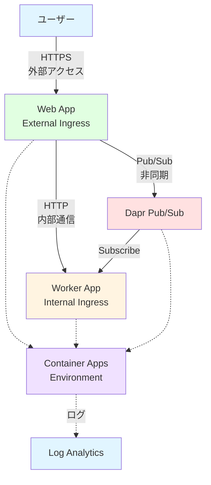
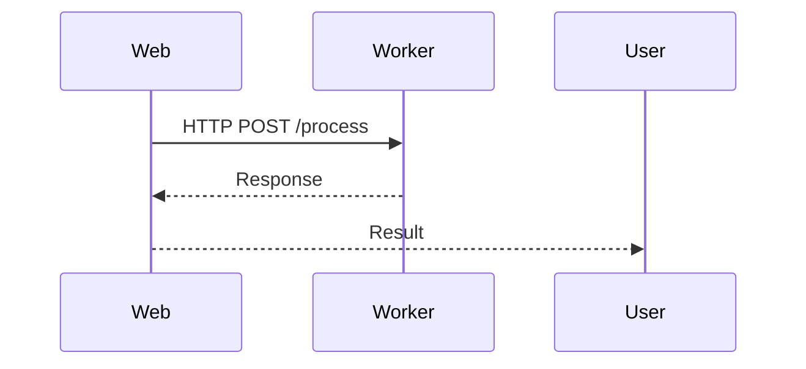
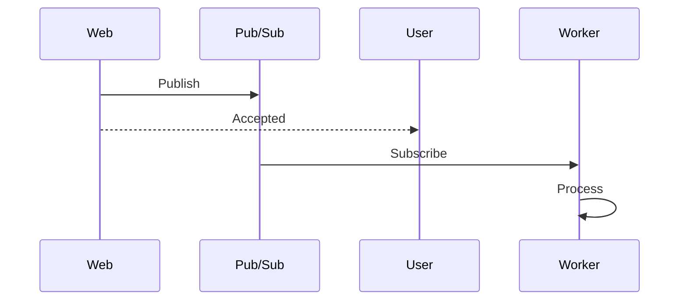
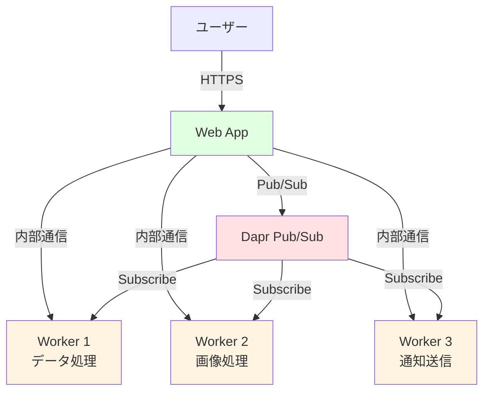

# 🔗 ハンズオン ⑤

Container Apps 同士の連携

---

## ハンズオン ⑤ の概要

このハンズオンでは、複数の Container Apps を連携させるマイクロサービス構成を学びます。

<div class="pt-6">

### 🎯 学習目標

- 内部通信（Service-to-Service）を理解する
- Dapr による Pub/Sub を実装する
- 外部/内部アクセス制御を学ぶ
- マイクロサービスアーキテクチャを体験する

### 📋 実施内容

1. **Worker アプリの作成** - 内部通信専用アプリ
2. **Service-to-Service 通信** - FQDN を使った HTTP 呼び出し
3. **Dapr Pub/Sub** - 非同期メッセージング
4. **アクセス制御** - 外部/内部アクセスの使い分け

</div>

---

## マイクロサービス構成の概要

今回構築するアーキテクチャです。



---

## STEP 5-1: Worker アプリの作成

内部通信専用の Worker アプリを作成します。

<div class="grid grid-cols-2 gap-6 text-sm">

<div>

### worker.js の作成

```javascript
const express = require("express");
const app = express();
const port = process.env.PORT || 3000;

app.use(express.json());

// ヘルスチェック
app.get("/health", (req, res) => {
  res.json({ status: "healthy", service: "worker" });
});

// データ処理エンドポイント
app.post("/process", (req, res) => {
  const { data, taskId } = req.body;

  console.log(`Processing task: ${taskId}`);

  // 模擬処理
  const result = {
    taskId,
    processed: data.toUpperCase(),
    timestamp: new Date().toISOString(),
    worker: process.env.HOSTNAME,
  };

  res.json(result);
});

// Dapr Pub/Sub サブスクリプション
app.get("/dapr/subscribe", (req, res) => {
  res.json([
    {
      pubsubname: "pubsub",
      topic: "tasks",
      route: "/tasks",
    },
  ]);
});

// タスク受信エンドポイント
app.post("/tasks", (req, res) => {
  console.log("Received task via Pub/Sub:", req.body);
  res.sendStatus(200);
});

app.listen(port, () => {
  console.log(`Worker running on port ${port}`);
});
```

</div>

<div>

### Dockerfile と package.json

**Dockerfile**（既存と同じ）

```dockerfile
FROM node:18-alpine
WORKDIR /app
COPY package*.json ./
RUN npm install --production
COPY . .
EXPOSE 3000
CMD ["npm", "start"]
```

**package.json**

```json
{
  "name": "worker-app",
  "version": "1.0.0",
  "main": "worker.js",
  "dependencies": {
    "express": "^4.18.0"
  },
  "scripts": {
    "start": "node worker.js"
  }
}
```

</div>

</div>

---

## STEP 5-2: Worker アプリのビルドとプッシュ

Worker アプリをコンテナ化します。

```bash
# ビルド
docker buildx build --platform linux/amd64 -t worker-app:v1 -f Dockerfile.worker .

# タグ付け
docker tag worker-app:v1 ${ACR_NAME}.azurecr.io/worker-app:v1

# プッシュ
docker push ${ACR_NAME}.azurecr.io/worker-app:v1

# 確認
az acr repository show-tags \
  --name $ACR_NAME \
  --repository worker-app \
  --output table

# 期待される出力
# Result
# ------
# v1
```

---

## STEP 5-3: Worker Container App の作成

内部通信のみの Container App を作成します。

```bash
# Worker アプリの作成
export WORKER_APP_NAME="ca-worker"

az containerapp create \
  --name $WORKER_APP_NAME \
  --resource-group $RESOURCE_GROUP \
  --environment $CONTAINERAPPS_ENVIRONMENT \
  --image ${ACR_NAME}.azurecr.io/worker-app:v1 \
  --target-port 3000 \
  --ingress internal \
  --registry-server ${ACR_NAME}.azurecr.io \
  --registry-username $ACR_NAME \
  --registry-password $(az acr credential show --name $ACR_NAME --query "passwords[0].value" -o tsv) \
  --cpu 0.25 \
  --memory 0.5Gi \
  --min-replicas 0 \
  --max-replicas 5

# デプロイには2〜3分かかります
```

<div class="mt-4 bg-blue-500/10 p-3 rounded text-sm">
💡 <strong>--ingress internal:</strong> 外部からはアクセスできず、同じ Environment 内の Container Apps からのみアクセス可能です。
</div>

---

## STEP 5-4: Worker アプリの確認

Worker アプリが正常にデプロイされたか確認します。

```bash
# Worker アプリの詳細を表示
az containerapp show \
  --name $WORKER_APP_NAME \
  --resource-group $RESOURCE_GROUP \
  --query "{Name:name, FQDN:properties.configuration.ingress.fqdn, IngressType:properties.configuration.ingress.external}" \
  --output table

# 期待される出力
# Name        FQDN                                                              IngressType
# ----------  ----------------------------------------------------------------  -------------
# ca-worker  ca-worker.internal.<unique-id>.japaneast.azurecontainerapps.io    False

# Internal FQDN を取得
export WORKER_FQDN=$(az containerapp show \
  --name $WORKER_APP_NAME \
  --resource-group $RESOURCE_GROUP \
  --query properties.configuration.ingress.fqdn \
  --output tsv)

echo "Worker FQDN: $WORKER_FQDN"
```

<div class="mt-4 bg-yellow-500/10 p-3 rounded text-sm">
⚠️ <strong>注意:</strong> Internal Ingress のため、ローカルマシンからは直接アクセスできません。同じ Environment 内の Container Apps からのみアクセス可能です。
</div>

---

## STEP 5-5: Web アプリから Worker を呼び出す

Web アプリを更新して、Worker アプリを呼び出します。

<div class="text-sm">

### app.js の更新

```javascript
const express = require("express");
const axios = require("axios"); // 追加
const app = express();
const port = process.env.PORT || 3000;

app.use(express.json());

// Worker への内部通信エンドポイント
app.post("/api/task", async (req, res) => {
  try {
    const { data } = req.body;
    const taskId = Date.now().toString();

    // Worker アプリを呼び出す
    const workerUrl = `https://${process.env.WORKER_FQDN}/process`;

    console.log(`Calling worker: ${workerUrl}`);

    const response = await axios.post(workerUrl, {
      data,
      taskId,
    });

    res.json({
      message: "Task processed",
      result: response.data,
    });
  } catch (error) {
    console.error("Error calling worker:", error.message);
    res.status(500).json({ error: error.message });
  }
});

// ... 既存のコード ...
```

### package.json に axios を追加

```json
{
  "dependencies": {
    "express": "^4.18.0",
    "axios": "^1.6.0"
  }
}
```

</div>

---

## STEP 5-6: Web アプリの更新とデプロイ

更新した Web アプリをデプロイします。

```bash
# イメージをビルド
docker buildx build --platform linux/amd64 -t todo-containerapp:v4 .

# タグ付けとプッシュ
docker tag todo-containerapp:v4 ${ACR_NAME}.azurecr.io/todo-containerapp:v4
docker push ${ACR_NAME}.azurecr.io/todo-containerapp:v4

# Web アプリを更新（環境変数に Worker FQDN を追加）
az containerapp update \
  --name $APP_NAME \
  --resource-group $RESOURCE_GROUP \
  --image ${ACR_NAME}.azurecr.io/todo-containerapp:v4 \
  --set-env-vars WORKER_FQDN=$WORKER_FQDN

# デプロイには1〜2分かかります
```

---

## STEP 5-7: Service-to-Service 通信の確認

Web アプリから Worker アプリを呼び出して確認します。

```bash
# Web アプリ経由で Worker を呼び出し
curl -X POST https://${APP_URL}/api/task \
  -H "Content-Type: application/json" \
  -d '{"data":"hello world"}'

# 期待される出力
# {
#   "message": "Task processed",
#   "result": {
#     "taskId": "1729594800000",
#     "processed": "HELLO WORLD",
#     "timestamp": "2025-10-22T12:00:00.000Z",
#     "worker": "ca-worker--xxx-111"
#   }
# }
```

<div class="mt-4 bg-green-500/10 p-3 rounded text-sm">
✅ <strong>内部通信成功!</strong> Web アプリから Worker アプリへの内部通信が正常に動作しています。
</div>

---

## STEP 5-8: Dapr の有効化

Dapr を使用して Pub/Sub を実装します。

```bash
# Web アプリで Dapr を有効化
az containerapp dapr enable \
  --name $APP_NAME \
  --resource-group $RESOURCE_GROUP \
  --dapr-app-id web-app \
  --dapr-app-port 3000 \
  --dapr-app-protocol http

# Worker アプリで Dapr を有効化
az containerapp dapr enable \
  --name $WORKER_APP_NAME \
  --resource-group $RESOURCE_GROUP \
  --dapr-app-id worker-app \
  --dapr-app-port 3000 \
  --dapr-app-protocol http

# 確認
az containerapp show \
  --name $APP_NAME \
  --resource-group $RESOURCE_GROUP \
  --query "properties.configuration.dapr" \
  --output yaml

# 期待される出力
# appId: web-app
# appPort: 3000
# enabled: true
```

---

## STEP 5-9: Dapr Pub/Sub コンポーネントの作成

Dapr の Pub/Sub コンポーネントを Environment に追加します。

<div class="text-sm">

### pubsub.yaml の作成

```yaml
componentType: pubsub.in-memory
version: v1
metadata:
  - name: consumerID
    value: "worker"
scopes:
  - web-app
  - worker-app
```

### コンポーネントの作成

```bash
# Pub/Sub コンポーネントを作成
az containerapp env dapr-component set \
  --name $CONTAINERAPPS_ENVIRONMENT \
  --resource-group $RESOURCE_GROUP \
  --dapr-component-name pubsub \
  --yaml pubsub.yaml

# 確認
az containerapp env dapr-component list \
  --name $CONTAINERAPPS_ENVIRONMENT \
  --resource-group $RESOURCE_GROUP \
  --output table

# 期待される出力
# Name     Type
# -------  ---------------
# pubsub   pubsub.in-memory
```

</div>

<div class="mt-4 bg-blue-500/10 p-3 rounded text-sm">
💡 <strong>in-memory Pub/Sub:</strong> 開発用の簡易的な Pub/Sub です。本番環境では Azure Service Bus や Azure Storage Queue を使用します。
</div>

---

## STEP 5-10: Web アプリから Pub/Sub でメッセージ送信

Web アプリを更新して、Pub/Sub でメッセージを送信します。

<div class="text-sm">

### app.js の更新

```javascript
// Pub/Sub でタスクを送信
app.post("/api/task/async", async (req, res) => {
  try {
    const { data } = req.body;
    const taskId = Date.now().toString();

    // Dapr Pub/Sub API 経由でメッセージを発行
    const daprUrl = `http://localhost:3500/v1.0/publish/pubsub/tasks`;

    await axios.post(daprUrl, {
      data,
      taskId,
    });

    res.json({
      message: "Task submitted",
      taskId,
    });
  } catch (error) {
    console.error("Error publishing message:", error.message);
    res.status(500).json({ error: error.message });
  }
});
```

### デプロイ

```bash
# イメージをビルドしてプッシュ
docker buildx build --platform linux/amd64 -t todo-containerapp:v5 .
docker tag todo-containerapp:v5 ${ACR_NAME}.azurecr.io/todo-containerapp:v5
docker push ${ACR_NAME}.azurecr.io/todo-containerapp:v5

# Web アプリを更新
az containerapp update \
  --name $APP_NAME \
  --resource-group $RESOURCE_GROUP \
  --image ${ACR_NAME}.azurecr.io/todo-containerapp:v5
```

</div>

---

## STEP 5-11: Pub/Sub の動作確認

非同期メッセージングを確認します。

```bash
# 非同期タスクを送信
curl -X POST https://${APP_URL}/api/task/async \
  -H "Content-Type: application/json" \
  -d '{"data":"async message"}'

# 期待される出力
# {
#   "message": "Task submitted",
#   "taskId": "1729594900000"
# }

# Worker のログを確認
az containerapp logs show \
  --name $WORKER_APP_NAME \
  --resource-group $RESOURCE_GROUP \
  --follow

# 期待される出力
# Received task via Pub/Sub: { data: 'async message', taskId: '1729594900000' }
```

<div class="mt-4 bg-green-500/10 p-3 rounded text-sm">
✅ <strong>Pub/Sub 成功!</strong> Web アプリから Worker アプリへ非同期メッセージが送信されました。
</div>

---

## 内部通信 vs Pub/Sub の比較

2 つの通信パターンを比較します。

<div class="grid grid-cols-2 gap-6 text-xs">

<div class="bg-blue-500/10 p-3 rounded">

### Service-to-Service（同期）



**特徴:**

- 同期的な処理
- 即座にレスポンスが必要
- リクエスト/レスポンス型

**用途:**

- データの検証
- 即座の結果が必要
- トランザクション処理

**例:**

- ユーザー情報の取得
- 価格計算
- 在庫確認

</div>

<div class="bg-green-500/10 p-3 rounded">

### Pub/Sub（非同期）



**特徴:**

- 非同期的な処理
- 疎結合
- イベント駆動

**用途:**

- バックグラウンド処理
- 時間のかかる処理
- 複数サービスへの通知

**例:**

- メール送信
- レポート生成
- データ分析

</div>

</div>

---

## STEP 5-12: 本番環境向け Pub/Sub の設定

Azure Service Bus を使用した本番環境向けの設定です。

<div class="text-sm">

### Service Bus の作成

```bash
# Service Bus Namespace の作成
export SERVICEBUS_NAME="sb-containerapps-${RANDOM}"

az servicebus namespace create \
  --name $SERVICEBUS_NAME \
  --resource-group $RESOURCE_GROUP \
  --location $LOCATION \
  --sku Standard

# トピックの作成
az servicebus topic create \
  --name tasks \
  --namespace-name $SERVICEBUS_NAME \
  --resource-group $RESOURCE_GROUP

# サブスクリプションの作成
az servicebus topic subscription create \
  --name worker-subscription \
  --topic-name tasks \
  --namespace-name $SERVICEBUS_NAME \
  --resource-group $RESOURCE_GROUP
```

</div>

---

## Service Bus Pub/Sub コンポーネント

Service Bus を使用する Dapr コンポーネントを作成します。

<div class="text-sm">

### servicebus-pubsub.yaml

```yaml
componentType: pubsub.azure.servicebus.topics
version: v1
metadata:
  - name: connectionString
    secretRef: servicebus-connection
scopes:
  - web-app
  - worker-app
```

### コンポーネントの作成

```bash
# 接続文字列の取得
export SERVICEBUS_CONNECTION=$(az servicebus namespace authorization-rule keys list \
  --namespace-name $SERVICEBUS_NAME \
  --resource-group $RESOURCE_GROUP \
  --name RootManageSharedAccessKey \
  --query primaryConnectionString \
  --output tsv)

# Environment にシークレットを追加
az containerapp env dapr-component set \
  --name $CONTAINERAPPS_ENVIRONMENT \
  --resource-group $RESOURCE_GROUP \
  --dapr-component-name pubsub \
  --yaml servicebus-pubsub.yaml \
  --secret servicebus-connection="$SERVICEBUS_CONNECTION"
```

</div>

---

## STEP 5-13: Dapr による Service Invocation

Dapr の Service Invocation API を使用した通信です。

<div class="grid grid-cols-2 gap-6 text-sm">

<div>

### Web アプリの更新

```javascript
// Dapr Service Invocation API を使用
app.post("/api/task/dapr", async (req, res) => {
  try {
    const { data } = req.body;
    const taskId = Date.now().toString();

    // Dapr Service Invocation API
    const daprUrl = `http://localhost:3500/v1.0/invoke/worker-app/method/process`;

    const response = await axios.post(daprUrl, {
      data,
      taskId,
    });

    res.json({
      message: "Task processed via Dapr",
      result: response.data,
    });
  } catch (error) {
    console.error("Error invoking service:", error.message);
    res.status(500).json({ error: error.message });
  }
});
```

</div>

<div>

### メリット

✅ **サービスディスカバリ**

- アプリ ID で呼び出し
- FQDN を知る必要なし

✅ **リトライとタイムアウト**

- 自動リトライ
- タイムアウト設定

✅ **トレーシング**

- 分散トレーシング
- オブザーバビリティ

✅ **セキュリティ**

- mTLS による暗号化
- アクセス制御

</div>

</div>

---

## STEP 5-14: アクセス制御の確認

外部/内部アクセスを確認します。

<div class="grid grid-cols-2 gap-6 text-sm">

<div>

### Web アプリ（External）

```bash
# 外部からアクセス可能
curl https://${APP_URL}/

# 成功（200 OK）
```

</div>

<div>

### Worker アプリ（Internal）

```bash
# 外部からはアクセス不可
curl https://${WORKER_FQDN}/health

# エラー（DNS解決失敗 or 接続拒否）

# ただし、Web アプリからは可能
curl -X POST https://${APP_URL}/api/task \
  -H "Content-Type: application/json" \
  -d '{"data":"test"}'

# 成功（Worker が呼び出される）
```

</div>

</div>

---

## 複数 Worker パターン

複数の Worker を使用するパターンです。

<div class="text-sm">



### 実装例

```bash
# Worker 2 の作成（画像処理）
az containerapp create \
  --name ca-worker-image \
  --resource-group $RESOURCE_GROUP \
  --environment $CONTAINERAPPS_ENVIRONMENT \
  --image ${ACR_NAME}.azurecr.io/worker-image:v1 \
  --ingress internal \
  --dapr-app-id worker-image

# Worker 3 の作成（通知送信）
az containerapp create \
  --name ca-worker-notification \
  --resource-group $RESOURCE_GROUP \
  --environment $CONTAINERAPPS_ENVIRONMENT \
  --image ${ACR_NAME}.azurecr.io/worker-notification:v1 \
  --ingress internal \
  --dapr-app-id worker-notification
```

</div>

---

## ベストプラクティス

マイクロサービス構成のベストプラクティスです。

<div class="grid grid-cols-2 gap-6 text-xs">

<div>

### ✅ すべきこと

1. **適切な Ingress 設定**

   - 外部公開: Web/API のみ
   - 内部通信: Worker/Backend

2. **Dapr の活用**

   - Service Invocation で疎結合
   - Pub/Sub で非同期処理
   - State Store で状態管理

3. **エラーハンドリング**

   - リトライ機構
   - タイムアウト設定
   - フォールバック処理

4. **監視とログ**

   - 分散トレーシング
   - ログの集約
   - メトリクス監視

5. **セキュリティ**
   - Managed Identity 使用
   - シークレット管理
   - mTLS 有効化

</div>

<div>

### ❌ してはいけないこと

1. **すべてを External Ingress に**

   ```bash
   # ❌ 悪い例
   --ingress external  # すべてのアプリ

   # ✅ 良い例
   --ingress external  # Web/API のみ
   --ingress internal  # Worker/Backend
   ```

2. **ハードコードされた URL**

   ```javascript
   // ❌ 悪い例
   const url = "https://ca-worker.internal...";

   // ✅ 良い例
   const url = `https://${process.env.WORKER_FQDN}`;
   // または Dapr Service Invocation
   ```

3. **同期処理の乱用**

   - 長時間処理は Pub/Sub で非同期化
   - タイムアウトを適切に設定

4. **循環依存**
   - A → B → A のような循環参照を避ける
   - 明確な依存関係を設計

</div>

</div>

---

## トラブルシューティング

サービス連携に関する問題と解決方法です。

<div class="text-xs">

| 問題                          | 原因                      | 解決方法                                               |
| ----------------------------- | ------------------------- | ------------------------------------------------------ |
| Worker にアクセスできない     | External からアクセス     | Internal Ingress は Environment 内からのみアクセス可能 |
| Dapr API が動作しない         | Dapr が有効化されていない | `az containerapp dapr enable` で有効化                 |
| Pub/Sub メッセージが届かない  | サブスクリプション未設定  | `/dapr/subscribe` エンドポイントを実装                 |
| Service Invocation が失敗     | アプリ ID が間違っている  | `dapr-app-id` を確認                                   |
| タイムアウトエラー            | Worker の処理が遅い       | タイムアウト設定を延長、または非同期化                 |
| 環境変数 WORKER_FQDN が未設定 | 設定忘れ                  | `az containerapp update --set-env-vars` で設定         |

### デバッグコマンド

```bash
# Dapr 設定の確認
az containerapp show \
  --name $APP_NAME \
  --resource-group $RESOURCE_GROUP \
  --query "properties.configuration.dapr"

# Dapr コンポーネントの確認
az containerapp env dapr-component list \
  --name $CONTAINERAPPS_ENVIRONMENT \
  --resource-group $RESOURCE_GROUP

# ログの確認
az containerapp logs show \
  --name $WORKER_APP_NAME \
  --resource-group $RESOURCE_GROUP \
  --follow
```

</div>

---

## まとめ

Container Apps 同士の連携を学びました。

<div class="grid grid-cols-2 gap-6 text-sm">

<div>

### 実施したこと

✅ **Worker アプリの作成**

- Internal Ingress の設定
- 内部通信専用アプリ

✅ **Service-to-Service 通信**

- FQDN を使った HTTP 呼び出し
- 同期的な処理

✅ **Dapr Pub/Sub**

- 非同期メッセージング
- Service Bus 連携

✅ **アクセス制御**

- External vs Internal Ingress
- セキュアな設計

</div>

<div>

### 次のステップ

次のハンズオンでは、VNet 連携とセキュリティを学びます。

1. **VNet 統合**
2. **Private Endpoint**
3. **セキュリティ強化**
4. **Azure リソース連携**

</div>

</div>

<div class="mt-4 bg-green-500/10 p-3 rounded text-sm">
✅ <strong>サービス連携完了!</strong> 次のハンズオンで VNet とセキュリティを学びます。
</div>
