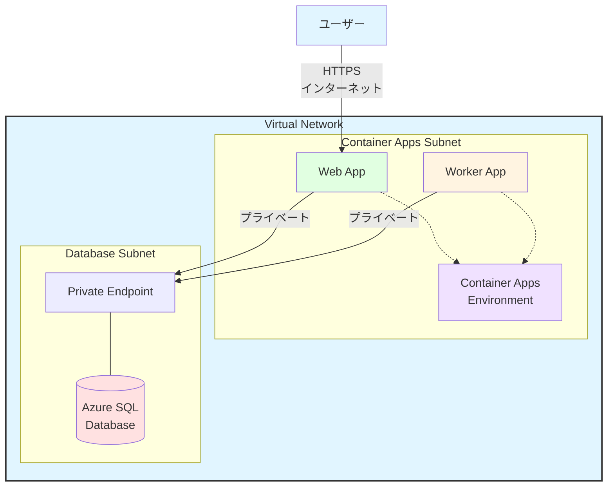
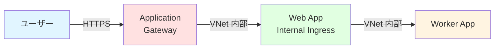

# 🔐 ハンズオン ⑥

VNet 連携とセキュリティ

---

## ハンズオン ⑥ の概要

このハンズオンでは、Container Apps のネットワークとセキュリティを学びます。

<div class="pt-6">

### 🎯 学習目標

- VNet 統合の設定方法を理解する
- Private Endpoint での DB アクセスを学ぶ
- 外部からのアクセス制御を実装する
- セキュリティのベストプラクティスを習得する

### 📋 実施内容

1. **VNet の作成** - 仮想ネットワークの構築
2. **Container Apps の VNet 統合** - Environment の VNet 接続
3. **Private Endpoint** - Azure SQL Database へのプライベート接続
4. **セキュリティ設定** - Managed Identity、Key Vault 連携

</div>

---

## VNet 統合のアーキテクチャ

Container Apps を VNet に統合した構成です。



---

## STEP 6-1: VNet の作成

Container Apps 用の VNet を作成します。

```bash
# VNet の作成
export VNET_NAME="vnet-containerapps"

az network vnet create \
  --name $VNET_NAME \
  --resource-group $RESOURCE_GROUP \
  --location $LOCATION \
  --address-prefix 10.0.0.0/16

# Container Apps 用サブネットの作成
az network vnet subnet create \
  --name containerapps-subnet \
  --resource-group $RESOURCE_GROUP \
  --vnet-name $VNET_NAME \
  --address-prefix 10.0.0.0/23

# Database 用サブネットの作成
az network vnet subnet create \
  --name database-subnet \
  --resource-group $RESOURCE_GROUP \
  --vnet-name $VNET_NAME \
  --address-prefix 10.0.2.0/24 \
  --disable-private-endpoint-network-policies true

# 確認
az network vnet show \
  --name $VNET_NAME \
  --resource-group $RESOURCE_GROUP \
  --query "{Name:name, AddressSpace:addressSpace.addressPrefixes}" \
  --output table
```

---

## サブネットの要件

Container Apps 用サブネットには特定の要件があります。

<div class="grid grid-cols-2 gap-6 text-sm">

<div>

### サブネットサイズ

**推奨サイズ:**

- **最小**: /27（32 アドレス）
- **推奨**: /23（512 アドレス）
- **本番**: /21（2048 アドレス）

**計算例:**

```
/23 = 512 アドレス
- Azure 予約: 5
- Container Apps インフラ: ~20
- 利用可能: ~487

レプリカ1つあたり: 1-2 アドレス
最大レプリカ数: 200-400
```

</div>

<div>

### サブネットの制限

✅ **可能なこと**

- 複数の Environment を配置
- NSG の適用
- Route Table の適用

❌ **できないこと**

- 他のリソースとの共有
  （Container Apps 専用）
- サブネットの変更
  （Environment 作成後）
- /27 より小さいサイズ

</div>

</div>

---

## STEP 6-2: VNet 統合された Environment の作成

既存の Environment を VNet に統合するか、新しい Environment を作成します。

<div class="text-sm">

### 新しい Environment の作成（VNet 統合）

```bash
# サブネット ID の取得
export SUBNET_ID=$(az network vnet subnet show \
  --name containerapps-subnet \
  --resource-group $RESOURCE_GROUP \
  --vnet-name $VNET_NAME \
  --query id \
  --output tsv)

# VNet 統合された Environment の作成
export VNET_ENVIRONMENT="env-containerapps-vnet"

az containerapp env create \
  --name $VNET_ENVIRONMENT \
  --resource-group $RESOURCE_GROUP \
  --location $LOCATION \
  --logs-workspace-id $LOG_ANALYTICS_WORKSPACE_ID \
  --logs-workspace-key $LOG_ANALYTICS_WORKSPACE_KEY \
  --internal-only false \
  --infrastructure-subnet-resource-id $SUBNET_ID

# 作成には10〜15分かかります
```

<div class="mt-4 bg-blue-500/10 p-3 rounded text-xs">
💡 <strong>--internal-only false:</strong> 外部からのアクセスを許可。`true` にすると完全にプライベートになります。
</div>

</div>

---

## STEP 6-3: Azure SQL Database の作成

Private Endpoint でアクセスする DB を作成します。

```bash
# SQL Server の作成
export SQL_SERVER_NAME="sql-containerapps-${RANDOM}"
export SQL_ADMIN_USER="sqladmin"
export SQL_ADMIN_PASSWORD="P@ssw0rd$(date +%s)"

az sql server create \
  --name $SQL_SERVER_NAME \
  --resource-group $RESOURCE_GROUP \
  --location $LOCATION \
  --admin-user $SQL_ADMIN_USER \
  --admin-password $SQL_ADMIN_PASSWORD \
  --enable-public-network false

# SQL Database の作成
az sql db create \
  --name appdb \
  --server $SQL_SERVER_NAME \
  --resource-group $RESOURCE_GROUP \
  --service-objective Basic

# 確認
az sql server show \
  --name $SQL_SERVER_NAME \
  --resource-group $RESOURCE_GROUP \
  --query "{Name:name, PublicNetworkAccess:publicNetworkAccess}" \
  --output table
```

<div class="mt-4 bg-yellow-500/10 p-3 rounded text-sm">
⚠️ <strong>--enable-public-network false:</strong> パブリックアクセスを無効化し、Private Endpoint 経由のみでアクセス可能にします。
</div>

---

## STEP 6-4: Private Endpoint の作成

SQL Database への Private Endpoint を作成します。

```bash
# Private Endpoint の作成
export PRIVATE_ENDPOINT_NAME="pe-sql"

az network private-endpoint create \
  --name $PRIVATE_ENDPOINT_NAME \
  --resource-group $RESOURCE_GROUP \
  --vnet-name $VNET_NAME \
  --subnet database-subnet \
  --private-connection-resource-id $(az sql server show \
    --name $SQL_SERVER_NAME \
    --resource-group $RESOURCE_GROUP \
    --query id -o tsv) \
  --group-id sqlServer \
  --connection-name sql-connection

# Private DNS Zone の作成
az network private-dns zone create \
  --name "privatelink.database.windows.net" \
  --resource-group $RESOURCE_GROUP

# VNet にリンク
az network private-dns link vnet create \
  --name sql-dns-link \
  --resource-group $RESOURCE_GROUP \
  --zone-name "privatelink.database.windows.net" \
  --virtual-network $VNET_NAME \
  --registration-enabled false

# DNS レコードの作成
az network private-endpoint dns-zone-group create \
  --name sql-dns-zone-group \
  --resource-group $RESOURCE_GROUP \
  --endpoint-name $PRIVATE_ENDPOINT_NAME \
  --private-dns-zone "privatelink.database.windows.net" \
  --zone-name sql
```

---

## STEP 6-5: Managed Identity の設定

Container App に Managed Identity を割り当てて、SQL にアクセスします。

```bash
# Web アプリの Managed Identity を取得
export WEB_PRINCIPAL_ID=$(az containerapp identity show \
  --name $APP_NAME \
  --resource-group $RESOURCE_GROUP \
  --query principalId \
  --output tsv)

# SQL Server に Azure AD 管理者を設定
az sql server ad-admin create \
  --server $SQL_SERVER_NAME \
  --resource-group $RESOURCE_GROUP \
  --display-name "Container App" \
  --object-id $WEB_PRINCIPAL_ID

# SQL Database にユーザーを作成（SQL スクリプトで実行）
# CREATE USER [ca-todo-web] FROM EXTERNAL PROVIDER;
# ALTER ROLE db_datareader ADD MEMBER [ca-todo-web];
# ALTER ROLE db_datawriter ADD MEMBER [ca-todo-web];
```

<div class="mt-4 bg-blue-500/10 p-3 rounded text-sm">
💡 <strong>Managed Identity:</strong> パスワード不要で Azure リソースにアクセスできます。セキュリティが向上し、管理が簡単になります。
</div>

---

## STEP 6-6: アプリケーションでの DB 接続

Managed Identity を使用して SQL に接続します。

<div class="text-sm">

### package.json に依存関係を追加

```json
{
  "dependencies": {
    "express": "^4.18.0",
    "mssql": "^10.0.0",
    "@azure/identity": "^4.0.0"
  }
}
```

### app.js の更新

```javascript
const sql = require("mssql");
const { DefaultAzureCredential } = require("@azure/identity");

// SQL 接続設定
const config = {
  server: process.env.SQL_SERVER,
  database: process.env.SQL_DATABASE,
  authentication: {
    type: "azure-active-directory-default",
    options: {
      credential: new DefaultAzureCredential(),
    },
  },
  options: {
    encrypt: true,
    trustServerCertificate: false,
  },
};

// データベース接続テスト
app.get("/api/db/test", async (req, res) => {
  try {
    await sql.connect(config);
    const result = await sql.query("SELECT @@VERSION AS version");
    res.json({
      success: true,
      version: result.recordset[0].version,
    });
  } catch (error) {
    console.error("Database error:", error);
    res.status(500).json({ error: error.message });
  }
});
```

</div>

---

## STEP 6-7: Web アプリの更新とデプロイ

DB 接続機能を含めてデプロイします。

```bash
# イメージをビルド
docker buildx build --platform linux/amd64 -t todo-containerapp:v6 .

# タグ付けとプッシュ
docker tag todo-containerapp:v6 ${ACR_NAME}.azurecr.io/todo-containerapp:v6
docker push ${ACR_NAME}.azurecr.io/todo-containerapp:v6

# 環境変数を設定してデプロイ
az containerapp update \
  --name $APP_NAME \
  --resource-group $RESOURCE_GROUP \
  --image ${ACR_NAME}.azurecr.io/todo-containerapp:v6 \
  --set-env-vars \
    SQL_SERVER="${SQL_SERVER_NAME}.database.windows.net" \
    SQL_DATABASE="appdb"

# 動作確認
curl https://${APP_URL}/api/db/test

# 期待される出力
# {
#   "success": true,
#   "version": "Microsoft SQL Azure..."
# }
```

---

## STEP 6-8: Network Security Group (NSG) の適用

サブネットに NSG を適用してトラフィックを制御します。

```bash
# NSG の作成
export NSG_NAME="nsg-containerapps"

az network nsg create \
  --name $NSG_NAME \
  --resource-group $RESOURCE_GROUP \
  --location $LOCATION

# インバウンドルール: HTTPS を許可
az network nsg rule create \
  --name AllowHTTPS \
  --nsg-name $NSG_NAME \
  --resource-group $RESOURCE_GROUP \
  --priority 100 \
  --direction Inbound \
  --access Allow \
  --protocol Tcp \
  --destination-port-ranges 443 \
  --source-address-prefixes Internet \
  --destination-address-prefixes '*'

# アウトバウンドルール: すべて許可（デフォルト）

# NSG をサブネットに適用
az network vnet subnet update \
  --name containerapps-subnet \
  --resource-group $RESOURCE_GROUP \
  --vnet-name $VNET_NAME \
  --network-security-group $NSG_NAME
```

---

## STEP 6-9: Internal-Only Environment

完全にプライベートな Environment を作成します。

<div class="text-sm">

### Internal-Only Environment の作成

```bash
# 新しいサブネットの作成
az network vnet subnet create \
  --name containerapps-internal-subnet \
  --resource-group $RESOURCE_GROUP \
  --vnet-name $VNET_NAME \
  --address-prefix 10.0.4.0/23

# サブネット ID の取得
export INTERNAL_SUBNET_ID=$(az network vnet subnet show \
  --name containerapps-internal-subnet \
  --resource-group $RESOURCE_GROUP \
  --vnet-name $VNET_NAME \
  --query id \
  --output tsv)

# Internal-Only Environment の作成
export INTERNAL_ENVIRONMENT="env-containerapps-internal"

az containerapp env create \
  --name $INTERNAL_ENVIRONMENT \
  --resource-group $RESOURCE_GROUP \
  --location $LOCATION \
  --logs-workspace-id $LOG_ANALYTICS_WORKSPACE_ID \
  --logs-workspace-key $LOG_ANALYTICS_WORKSPACE_KEY \
  --internal-only true \
  --infrastructure-subnet-resource-id $INTERNAL_SUBNET_ID
```

<div class="mt-4 bg-yellow-500/10 p-3 rounded text-xs">
⚠️ <strong>Internal-Only:</strong> インターネットから完全に隔離されます。アクセスには VPN や Azure Bastion が必要です。
</div>

</div>

---

## セキュリティのベストプラクティス

Container Apps のセキュリティ強化です。

<div class="grid grid-cols-2 gap-6 text-xs">

<div>

### ✅ ネットワークセキュリティ

1. **VNet 統合**

   - 本番環境は必ず VNet 統合
   - 適切なサブネットサイズを選択

2. **Private Endpoint**

   - データベースへのアクセスをプライベート化
   - パブリックアクセスを無効化

3. **NSG の適用**

   - 必要最小限のポート開放
   - ソース IP の制限

4. **Internal-Only**
   - 機密アプリは Internal-Only に
   - VPN 経由でアクセス

</div>

<div>

### ✅ アプリケーションセキュリティ

1. **Managed Identity**

   - パスワードレス認証
   - Azure リソースへの安全なアクセス

2. **Key Vault 連携**

   - シークレットの一元管理
   - 自動ローテーション

3. **HTTPS 強制**

   - すべての通信を暗号化
   - カスタムドメインと証明書

4. **認証/認可**
   - Azure AD 認証
   - API キー管理

</div>

</div>

---

## STEP 6-10: Application Gateway との統合

Application Gateway でさらに高度なルーティングを実現します。

<div class="text-sm">



### Application Gateway の作成

```bash
# Application Gateway 用サブネットの作成
az network vnet subnet create \
  --name appgw-subnet \
  --resource-group $RESOURCE_GROUP \
  --vnet-name $VNET_NAME \
  --address-prefix 10.0.6.0/24

# パブリック IP の作成
az network public-ip create \
  --name pip-appgw \
  --resource-group $RESOURCE_GROUP \
  --location $LOCATION \
  --sku Standard

# Application Gateway の作成（簡略版）
# 詳細は Azure Portal で設定推奨
```

</div>

---

## トラブルシューティング

VNet とセキュリティに関する問題です。

<div class="text-xs">

| 問題                                   | 原因                         | 解決方法                             |
| -------------------------------------- | ---------------------------- | ------------------------------------ |
| Environment の作成が失敗               | サブネットサイズが小さい     | /23 以上のサブネットを使用           |
| Private Endpoint 経由で接続できない    | DNS 設定が間違っている       | Private DNS Zone の設定を確認        |
| Managed Identity で SQL にアクセス不可 | アクセス権限が不足           | SQL Server で Azure AD 管理者を設定  |
| NSG で通信がブロックされる             | ルールが不適切               | NSG ルールを確認、必要なポートを開放 |
| VNet 統合後にアクセスできない          | Internal-Only になっている   | `--internal-only false` で作成       |
| サブネットの変更ができない             | Environment 作成後は変更不可 | 新しい Environment を作成            |

### デバッグコマンド

```bash
# VNet 統合の確認
az containerapp env show \
  --name $VNET_ENVIRONMENT \
  --resource-group $RESOURCE_GROUP \
  --query "properties.vnetConfiguration"

# NSG の確認
az network nsg show \
  --name $NSG_NAME \
  --resource-group $RESOURCE_GROUP

# Private Endpoint の確認
az network private-endpoint show \
  --name $PRIVATE_ENDPOINT_NAME \
  --resource-group $RESOURCE_GROUP
```

</div>

---

## まとめ

VNet 連携とセキュリティを学びました。

<div class="grid grid-cols-2 gap-6 text-sm">

<div>

### 実施したこと

✅ **VNet 統合**

- VNet とサブネットの作成
- Environment の VNet 接続

✅ **Private Endpoint**

- Azure SQL Database の作成
- Private Endpoint での接続

✅ **セキュリティ設定**

- Managed Identity の使用
- NSG によるアクセス制御

✅ **Internal-Only**

- 完全プライベートな Environment

</div>

<div>

### 次のステップ

次のハンズオンでは、モニタリングとログ管理を学びます。

1. **Log Analytics での分析**
2. **Application Insights 連携**
3. **アラート設定**
4. **トラブルシューティング**

</div>

</div>

<div class="mt-4 bg-green-500/10 p-3 rounded text-sm">
✅ <strong>VNet とセキュリティ完了!</strong> 次のハンズオンでモニタリングを学びます。
</div>
