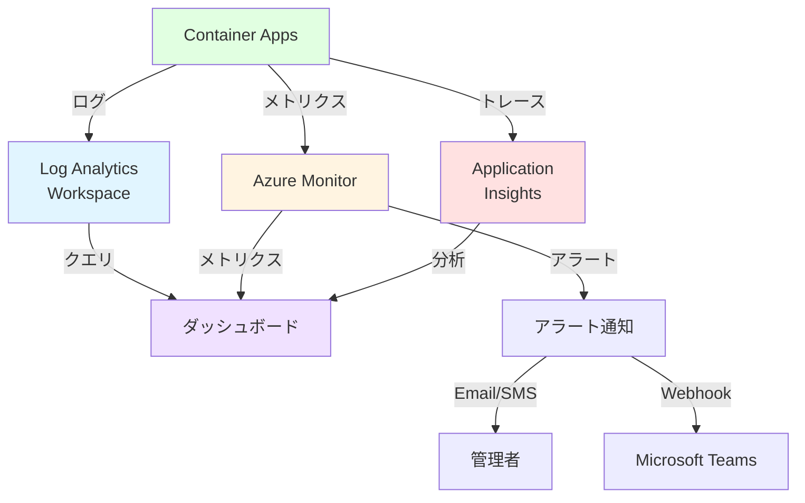
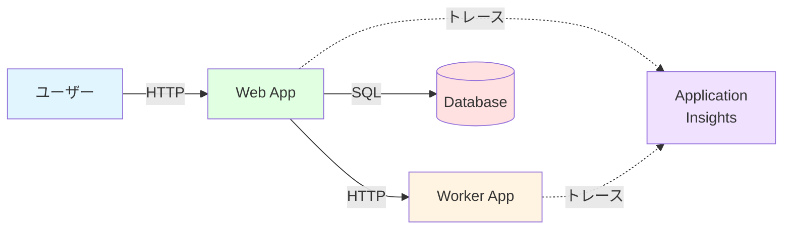

# 📊 ハンズオン ⑦

モニタリングとログ管理

---

## ハンズオン ⑦ の概要

このハンズオンでは、Container Apps の監視とログ管理を学びます。

<div class="pt-6">

### 🎯 学習目標

- Log Analytics でのログ分析を理解する
- Application Insights の連携方法を学ぶ
- アラートの設定方法を習得する
- トラブルシューティングの手法を身につける

### 📋 実施内容

1. **Log Analytics でのログ確認** - Kusto クエリでの分析
2. **Application Insights 連携** - パフォーマンス監視
3. **メトリクスの確認** - CPU、メモリ、リクエスト数
4. **アラート設定** - 異常検知と通知

</div>

---

## Container Apps の監視アーキテクチャ

Container Apps の監視構成です。



---

## STEP 7-1: Log Analytics でのログ確認

Log Analytics でコンテナのログを確認します。

<div class="text-sm">

### Azure Portal での確認

1. **Log Analytics Workspace を開く**

   - `log-containerapps` を選択
   - 左メニューの「ログ」をクリック

2. **基本的なクエリ**

```kusto
// すべてのコンソールログ
ContainerAppConsoleLogs_CL
| where ContainerAppName_s == "ca-todo-web"
| project TimeGenerated, Log_s
| order by TimeGenerated desc
| take 100
```

3. **システムログの確認**

```kusto
// システムログ
ContainerAppSystemLogs_CL
| where ContainerAppName_s == "ca-todo-web"
| project TimeGenerated, Type_s, Reason_s, Message_s
| order by TimeGenerated desc
```

</div>

---

## よく使う Kusto クエリ

Container Apps の分析に便利なクエリ集です。

<div class="grid grid-cols-2 gap-4 text-xs">

<div class="bg-blue-500/10 p-3 rounded">

#### エラーログの抽出

```kusto
ContainerAppConsoleLogs_CL
| where ContainerAppName_s == "ca-todo-web"
| where Log_s contains "error" or Log_s contains "ERROR"
| project TimeGenerated, Log_s
| order by TimeGenerated desc
| take 50
```

</div>

<div class="bg-green-500/10 p-3 rounded">

#### レプリカごとのログ

```kusto
ContainerAppConsoleLogs_CL
| where ContainerAppName_s == "ca-todo-web"
| summarize LogCount = count() by RevisionName_s, ReplicaName_s
| order by LogCount desc
```

</div>

<div class="bg-purple-500/10 p-3 rounded">

#### 時間帯別のログ数

```kusto
ContainerAppConsoleLogs_CL
| where ContainerAppName_s == "ca-todo-web"
| where TimeGenerated > ago(24h)
| summarize LogCount = count() by bin(TimeGenerated, 1h)
| render timechart
```

</div>

<div class="bg-orange-500/10 p-3 rounded">

#### Revision の起動/停止イベント

```kusto
ContainerAppSystemLogs_CL
| where ContainerAppName_s == "ca-todo-web"
| where Type_s == "Normal" and Reason_s in ("Started", "Stopped")
| project TimeGenerated, Reason_s, Message_s, RevisionName_s
| order by TimeGenerated desc
```

</div>

</div>

---

## STEP 7-2: Application Insights の作成

Application Insights でアプリケーション監視を行います。

```bash
# Application Insights の作成
export APPINSIGHTS_NAME="ai-containerapps"

az monitor app-insights component create \
  --app $APPINSIGHTS_NAME \
  --resource-group $RESOURCE_GROUP \
  --location $LOCATION \
  --workspace $(az monitor log-analytics workspace show \
    --resource-group $RESOURCE_GROUP \
    --workspace-name $LOG_ANALYTICS_WORKSPACE \
    --query id -o tsv)

# Instrumentation Key の取得
export APPINSIGHTS_KEY=$(az monitor app-insights component show \
  --app $APPINSIGHTS_NAME \
  --resource-group $RESOURCE_GROUP \
  --query instrumentationKey \
  --output tsv)

# Connection String の取得
export APPINSIGHTS_CONNECTION=$(az monitor app-insights component show \
  --app $APPINSIGHTS_NAME \
  --resource-group $RESOURCE_GROUP \
  --query connectionString \
  --output tsv)

echo "Connection String: $APPINSIGHTS_CONNECTION"
```

---

## STEP 7-3: アプリケーションに Application Insights を統合

Node.js アプリに Application Insights SDK を追加します。

<div class="text-sm">

### package.json に依存関係を追加

```json
{
  "dependencies": {
    "express": "^4.18.0",
    "applicationinsights": "^2.9.0"
  }
}
```

### app.js の更新

```javascript
const appInsights = require("applicationinsights");

// Application Insights の初期化
appInsights
  .setup(process.env.APPLICATIONINSIGHTS_CONNECTION_STRING)
  .setAutoCollectRequests(true)
  .setAutoCollectPerformance(true)
  .setAutoCollectExceptions(true)
  .setAutoCollectDependencies(true)
  .setAutoCollectConsole(true)
  .start();

const express = require("express");
const app = express();

// カスタムメトリクスの送信例
app.get("/api/custom-metric", (req, res) => {
  const client = appInsights.defaultClient;
  client.trackMetric({ name: "CustomCounter", value: 1 });
  client.trackEvent({ name: "CustomEvent", properties: { user: "test" } });

  res.json({ message: "Metric sent" });
});

// ... 既存のコード ...
```

</div>

---

## STEP 7-4: Application Insights を有効化してデプロイ

Container App に Application Insights を設定します。

```bash
# イメージをビルド
docker buildx build --platform linux/amd64 -t todo-containerapp:v7 .

# タグ付けとプッシュ
docker tag todo-containerapp:v7 ${ACR_NAME}.azurecr.io/todo-containerapp:v7
docker push ${ACR_NAME}.azurecr.io/todo-containerapp:v7

# Container App を更新
az containerapp update \
  --name $APP_NAME \
  --resource-group $RESOURCE_GROUP \
  --image ${ACR_NAME}.azurecr.io/todo-containerapp:v7 \
  --set-env-vars APPLICATIONINSIGHTS_CONNECTION_STRING="$APPINSIGHTS_CONNECTION"

# 数分待ってから負荷をかける
for i in {1..100}; do
  curl https://${APP_URL}/ > /dev/null 2>&1
done
```

---

## STEP 7-5: Application Insights での分析

Application Insights でパフォーマンスを分析します。

<div class="text-sm">

### Azure Portal での確認

1. **Application Insights を開く**

   - `ai-containerapps` を選択

2. **パフォーマンス**

   - 左メニューの「パフォーマンス」を選択
   - リクエストの平均応答時間を確認
   - 遅いリクエストを特定

3. **障害**

   - 左メニューの「障害」を選択
   - エラー率と例外を確認

4. **ライブ メトリック**

   - 左メニューの「ライブ メトリック」を選択
   - リアルタイムのメトリクスを監視

</div>

---

## Application Insights のクエリ

Kusto クエリで詳細分析を行います。

<div class="grid grid-cols-2 gap-4 text-xs">

<div class="bg-blue-500/10 p-3 rounded">

#### リクエスト分析

```kusto
requests
| where timestamp > ago(1h)
| summarize
    RequestCount = count(),
    AvgDuration = avg(duration),
    P95Duration = percentile(duration, 95)
  by name
| order by RequestCount desc
```

</div>

<div class="bg-green-500/10 p-3 rounded">

#### 失敗したリクエスト

```kusto
requests
| where success == false
| where timestamp > ago(24h)
| project timestamp, name, resultCode, duration
| order by timestamp desc
```

</div>

<div class="bg-purple-500/10 p-3 rounded">

#### 依存関係の分析

```kusto
dependencies
| where timestamp > ago(1h)
| summarize
    CallCount = count(),
    AvgDuration = avg(duration)
  by name, type
| order by CallCount desc
```

</div>

<div class="bg-orange-500/10 p-3 rounded">

#### 例外の確認

```kusto
exceptions
| where timestamp > ago(24h)
| project timestamp, type, outerMessage, innermostMessage
| order by timestamp desc
| take 50
```

</div>

</div>

---

## STEP 7-6: メトリクスの確認

Azure Monitor でメトリクスを確認します。

<div class="text-sm">

### Portal でのメトリクス確認

1. **Container App を開く**
2. **左メニューの「メトリクス」を選択**
3. **メトリクスを追加**

**主要なメトリクス:**

- **Requests**: リクエスト数
- **CPU Usage**: CPU 使用率
- **Memory Working Set**: メモリ使用量
- **Replica Count**: レプリカ数
- **Response Time**: レスポンス時間
- **Restarts**: 再起動回数

### CLI でのメトリクス取得

```bash
# レプリカ数のメトリクス
az monitor metrics list \
  --resource $(az containerapp show \
    --name $APP_NAME \
    --resource-group $RESOURCE_GROUP \
    --query id -o tsv) \
  --metric "Replicas" \
  --start-time $(date -u -d '1 hour ago' +%Y-%m-%dT%H:%M:%SZ) \
  --interval PT1M \
  --output table
```

</div>

---

## STEP 7-7: アラートの作成

異常を検知して通知します。

```bash
# アクショングループの作成（メール通知）
export ACTION_GROUP="ag-containerapps"

az monitor action-group create \
  --name $ACTION_GROUP \
  --resource-group $RESOURCE_GROUP \
  --short-name "ca-alert" \
  --email-receiver \
    name="admin" \
    email="admin@example.com"

# CPU 使用率のアラート作成
az monitor metrics alert create \
  --name "High CPU Usage" \
  --resource-group $RESOURCE_GROUP \
  --scopes $(az containerapp show \
    --name $APP_NAME \
    --resource-group $RESOURCE_GROUP \
    --query id -o tsv) \
  --condition "avg UsageNanoCores > 800000000" \
  --window-size 5m \
  --evaluation-frequency 1m \
  --action $ACTION_GROUP \
  --description "CPU usage is above 80%"
```

---

## アラートのタイプ

様々なアラートを設定できます。

<div class="grid grid-cols-2 gap-4 text-xs">

<div class="bg-blue-500/10 p-3 rounded">

#### CPU 使用率

```bash
az monitor metrics alert create \
  --name "High CPU" \
  --condition "avg UsageNanoCores > 800000000" \
  --window-size 5m \
  --evaluation-frequency 1m
```

**閾値:** 80% 以上

</div>

<div class="bg-green-500/10 p-3 rounded">

#### メモリ使用率

```bash
az monitor metrics alert create \
  --name "High Memory" \
  --condition "avg WorkingSetBytes > 400000000" \
  --window-size 5m \
  --evaluation-frequency 1m
```

**閾値:** 400MB 以上

</div>

<div class="bg-purple-500/10 p-3 rounded">

#### エラー率

```kusto
// Log Analytics アラート
requests
| where timestamp > ago(5m)
| where success == false
| summarize ErrorRate = count() * 100.0 / toscalar(requests | count())
| where ErrorRate > 5
```

**閾値:** 5% 以上

</div>

<div class="bg-orange-500/10 p-3 rounded">

#### レスポンス時間

```bash
az monitor metrics alert create \
  --name "Slow Response" \
  --condition "avg ResponseTime > 3000" \
  --window-size 5m \
  --evaluation-frequency 1m
```

**閾値:** 3 秒 以上

</div>

</div>

---

## STEP 7-8: ダッシュボードの作成

Azure Portal でカスタムダッシュボードを作成します。

<div class="text-sm">

### ダッシュボードの構成例

1. **パフォーマンス**

   - CPU 使用率
   - メモリ使用率
   - レスポンス時間

2. **トラフィック**

   - リクエスト数
   - レプリカ数
   - エラー率

3. **ログ**
   - 最新のエラーログ
   - システムイベント

### Workbook の作成

1. **Application Insights を開く**
2. **左メニューの「ブック」を選択**
3. **「+ 新規」をクリック**
4. **クエリとビジュアライゼーションを追加**

</div>

---

## STEP 7-9: 分散トレーシング

複数サービス間のトレーシングを確認します。

<div class="text-sm">

### Application Insights のアプリケーション マップ

1. **Application Insights を開く**
2. **左メニューの「アプリケーション マップ」を選択**
3. **サービス間の依存関係を可視化**



### エンドツーエンドのトランザクション

- **トランザクションの検索** で特定のリクエストを追跡
- Web → Worker → Database の呼び出しを可視化
- ボトルネックを特定

</div>

---

## トラブルシューティングの手法

問題発生時の調査方法です。

<div class="grid grid-cols-2 gap-6 text-xs">

<div>

### 1. ログの確認

```bash
# リアルタイムログ
az containerapp logs show \
  --name $APP_NAME \
  --resource-group $RESOURCE_GROUP \
  --follow

# 特定のエラーを検索
az containerapp logs show \
  --name $APP_NAME \
  --resource-group $RESOURCE_GROUP \
  --tail 1000 | grep -i error
```

### 2. メトリクスの確認

```bash
# レプリカの状態
az containerapp replica list \
  --name $APP_NAME \
  --resource-group $RESOURCE_GROUP

# Revision の状態
az containerapp revision list \
  --name $APP_NAME \
  --resource-group $RESOURCE_GROUP
```

</div>

<div>

### 3. システムログの確認

```kusto
// Container の再起動を確認
ContainerAppSystemLogs_CL
| where ContainerAppName_s == "ca-todo-web"
| where Reason_s == "BackOff" or Reason_s == "Error"
| project TimeGenerated, Reason_s, Message_s
| order by TimeGenerated desc
```

### 4. Application Insights での診断

- **パフォーマンス**: 遅いリクエストを特定
- **障害**: エラーの詳細を確認
- **依存関係**: 外部サービスの問題を特定
- **ライブ メトリック**: リアルタイムの状態を監視

</div>

</div>

---

## よくある問題のパターン

典型的な問題とその対処法です。

<div class="text-xs">

| 問題                       | 症状                         | 調査方法                                     | 解決方法                                 |
| -------------------------- | ---------------------------- | -------------------------------------------- | ---------------------------------------- |
| **高 CPU 使用率**          | レスポンス遅延、タイムアウト | Application Insights でボトルネック特定      | コードの最適化、レプリカ数増加           |
| **メモリリーク**           | メモリ使用量が増加し続ける   | メトリクスでメモリ増加を確認、ログで原因特定 | コードの修正、定期的な再起動             |
| **頻繁な再起動**           | 断続的なエラー               | システムログで再起動理由を確認               | ヘルスチェックの調整、リソース増加       |
| **低スループット**         | リクエストが遅い             | Application Insights でレスポンス時間を分析  | スケーリング設定の調整、最適化           |
| **依存関係のタイムアウト** | 特定の API 呼び出しでエラー  | Application Insights の依存関係マップを確認  | タイムアウト設定の調整、リトライ機構追加 |
| **ログが表示されない**     | Log Analytics にログがない   | Container App のログ設定確認                 | stdout/stderr への出力を確認             |

</div>

---

## ベストプラクティス

監視とログ管理のベストプラクティスです。

<div class="grid grid-cols-2 gap-6 text-xs">

<div>

### ✅ 監視

1. **適切なメトリクス**

   - CPU、メモリ、リクエスト数を監視
   - カスタムメトリクスを追加

2. **アラートの設定**

   - 重要な指標にアラートを設定
   - 適切な閾値を選択
   - アクショングループで通知

3. **ダッシュボード**

   - 主要メトリクスを一覧表示
   - チーム全体で共有

4. **分散トレーシング**
   - Application Insights を統合
   - サービス間の依存関係を可視化

</div>

<div>

### ✅ ログ管理

1. **構造化ログ**

   ```javascript
   // JSON 形式でログ出力
   console.log(
     JSON.stringify({
       level: "info",
       message: "Request processed",
       requestId: "123",
       duration: 45,
     })
   );
   ```

2. **ログレベル**

   - DEBUG, INFO, WARN, ERROR を使い分け
   - 環境変数でレベルを制御

3. **保持期間**

   - Log Analytics の保持期間を設定
   - コスト管理

4. **クエリの保存**
   - よく使うクエリを保存
   - チームで共有

</div>

</div>

---

## まとめ

モニタリングとログ管理を学びました。

<div class="grid grid-cols-2 gap-6 text-sm">

<div>

### 実施したこと

✅ **Log Analytics**

- Kusto クエリでのログ分析
- システムログの確認

✅ **Application Insights**

- パフォーマンス監視
- 分散トレーシング

✅ **メトリクスとアラート**

- メトリクスの確認
- アラートの設定

✅ **トラブルシューティング**

- 問題の調査方法
- よくある問題への対処

</div>

<div>

### 次のステップ

次のハンズオンでは、マイクロサービス実践演習を行います。

1. **Web + Worker 構成の構築**
2. **Pub/Sub による連携**
3. **スケーリングの確認**
4. **総合的な運用**

</div>

</div>

<div class="mt-4 bg-green-500/10 p-3 rounded text-sm">
✅ <strong>モニタリング完了!</strong> 次のハンズオンでマイクロサービス実践を行います。
</div>
