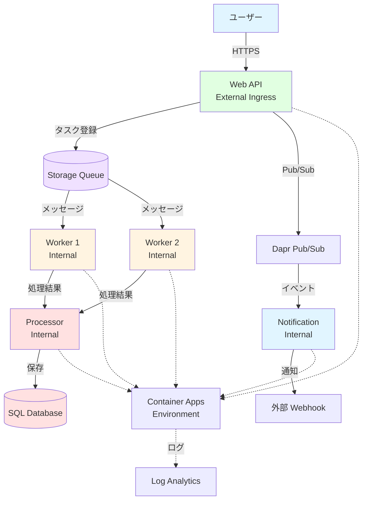

# 🎯 ハンズオン ⑧

実践演習：マイクロサービス構成

---

## ハンズオン ⑧ の概要

これまで学んだことを総合して、実践的なマイクロサービス構成を構築します。

<div class="pt-6">

### 🎯 学習目標

- マイクロサービスアーキテクチャを実装する
- 複数サービスの連携を実現する
- イベント駆動型アーキテクチャを体験する
- 本番環境に近い構成を構築する

### 📋 実施内容

1. **システム設計** - アーキテクチャの設計
2. **サービスの実装** - Web、Worker、Processor
3. **統合とデプロイ** - 全体の連携確認
4. **負荷テストと最適化** - パフォーマンスチューニング

</div>

---

## 構築するシステム

タスク処理システムを構築します。



---

## システムの役割分担

各サービスの責務です。

<div class="grid grid-cols-3 gap-4 text-xs">

<div class="bg-blue-500/10 p-3 rounded">

#### Web API

**責務:**

- タスクの受付
- 認証/認可
- レスポンス返却

**エンドポイント:**

```
POST /api/tasks
GET  /api/tasks/:id
GET  /api/tasks
DELETE /api/tasks/:id
```

**特徴:**

- External Ingress
- 高可用性（min 2 replicas）
- 負荷分散

</div>

<div class="bg-green-500/10 p-3 rounded">

#### Worker

**責務:**

- タスクの処理
- 重い計算処理
- 外部 API 呼び出し

**処理:**

```
1. Queue からタスク取得
2. データ処理
3. Processor へ送信
```

**特徴:**

- Internal Ingress
- Queue スケーリング
- 複数インスタンス

</div>

<div class="bg-purple-500/10 p-3 rounded">

#### Processor

**責務:**

- 結果の集約
- DB への保存
- ビジネスロジック

**処理:**

```
1. Worker から結果受信
2. データ検証
3. DB に保存
4. イベント発行
```

**特徴:**

- Internal Ingress
- トランザクション管理
- Dapr State Store

</div>

<div class="bg-orange-500/10 p-3 rounded">

#### Notification

**責務:**

- 通知の送信
- Webhook 呼び出し
- メール送信

**処理:**

```
1. Pub/Sub でイベント受信
2. 通知先を決定
3. 通知を送信
```

**特徴:**

- Dapr Pub/Sub
- 非同期処理
- リトライ機能

</div>

</div>

---

## STEP 8-1: Web API の実装

Web API サービスを実装します。

<div class="text-sm">

### web-api.js

```javascript
const express = require("express");
const { QueueClient } = require("@azure/storage-queue");
const { v4: uuidv4 } = require("uuid");
const app = express();

app.use(express.json());

const queueClient = new QueueClient(process.env.STORAGE_CONNECTION, "tasks");

// タスクの作成
app.post("/api/tasks", async (req, res) => {
  try {
    const { data, priority } = req.body;
    const taskId = uuidv4();

    const task = {
      taskId,
      data,
      priority: priority || "normal",
      createdAt: new Date().toISOString(),
      status: "pending",
    };

    // Queue にメッセージを送信
    await queueClient.sendMessage(
      Buffer.from(JSON.stringify(task)).toString("base64")
    );

    res.status(201).json({
      message: "Task created",
      taskId,
      status: "pending",
    });
  } catch (error) {
    console.error("Error creating task:", error);
    res.status(500).json({ error: error.message });
  }
});

// タスクの一覧取得
app.get("/api/tasks", async (req, res) => {
  // DB から取得（実装省略）
  res.json({ tasks: [] });
});

// タスクの詳細取得
app.get("/api/tasks/:id", async (req, res) => {
  // DB から取得（実装省略）
  res.json({ taskId: req.params.id, status: "completed" });
});

app.listen(3000, () => {
  console.log("Web API running on port 3000");
});
```

</div>

---

## STEP 8-2: Worker の実装

Worker サービスを実装します。

<div class="text-sm">

### worker.js

```javascript
const express = require("express");
const { QueueClient } = require("@azure/storage-queue");
const axios = require("axios");
const app = express();

app.use(express.json());

const queueClient = new QueueClient(process.env.STORAGE_CONNECTION, "tasks");

// ポーリング処理
async function processQueue() {
  try {
    const messages = await queueClient.receiveMessages({ numberOfMessages: 1 });

    for (const message of messages.receivedMessageItems) {
      const task = JSON.parse(
        Buffer.from(message.messageText, "base64").toString()
      );

      console.log(`Processing task: ${task.taskId}`);

      // タスク処理（模擬）
      await new Promise((resolve) => setTimeout(resolve, 2000));

      const result = {
        taskId: task.taskId,
        data: task.data.toUpperCase(),
        processedAt: new Date().toISOString(),
        worker: process.env.HOSTNAME,
      };

      // Processor に結果を送信
      await axios.post(`https://${process.env.PROCESSOR_FQDN}/process`, result);

      // メッセージを削除
      await queueClient.deleteMessage(message.messageId, message.popReceipt);

      console.log(`Task completed: ${task.taskId}`);
    }
  } catch (error) {
    console.error("Error processing queue:", error);
  }
}

// 定期的にキューをチェック
setInterval(processQueue, 5000);

app.get("/health", (req, res) => {
  res.json({ status: "healthy" });
});

app.listen(3000, () => {
  console.log("Worker running on port 3000");
});
```

</div>

---

## STEP 8-3: Processor の実装

Processor サービスを実装します。

<div class="text-sm">

### processor.js

```javascript
const express = require("express");
const axios = require("axios");
const app = express();

app.use(express.json());

// 結果の処理
app.post("/process", async (req, res) => {
  try {
    const { taskId, data, processedAt, worker } = req.body;

    console.log(`Received result from ${worker}: ${taskId}`);

    // DB に保存（実装省略）
    // await saveToDatabase(result);

    // Dapr Pub/Sub でイベント発行
    await axios.post(
      "http://localhost:3500/v1.0/publish/pubsub/task-completed",
      {
        taskId,
        status: "completed",
        completedAt: new Date().toISOString(),
      }
    );

    res.json({ message: "Result processed" });
  } catch (error) {
    console.error("Error processing result:", error);
    res.status(500).json({ error: error.message });
  }
});

app.listen(3000, () => {
  console.log("Processor running on port 3000");
});
```

</div>

---

## STEP 8-4: Notification の実装

Notification サービスを実装します。

<div class="text-sm">

### notification.js

```javascript
const express = require("express");
const axios = require("axios");
const app = express();

app.use(express.json());

// Dapr Pub/Sub サブスクリプション
app.get("/dapr/subscribe", (req, res) => {
  res.json([
    {
      pubsubname: "pubsub",
      topic: "task-completed",
      route: "/task-completed",
    },
  ]);
});

// タスク完了イベントの処理
app.post("/task-completed", async (req, res) => {
  try {
    const { taskId, status, completedAt } = req.body.data;

    console.log(`Task completed notification: ${taskId}`);

    // 外部 Webhook に通知
    if (process.env.WEBHOOK_URL) {
      await axios.post(process.env.WEBHOOK_URL, {
        event: "task.completed",
        taskId,
        completedAt,
      });
    }

    // メール送信（実装省略）
    // await sendEmail(taskId);

    res.sendStatus(200);
  } catch (error) {
    console.error("Error sending notification:", error);
    res.status(500).json({ error: error.message });
  }
});

app.listen(3000, () => {
  console.log("Notification service running on port 3000");
});
```

</div>

---

## STEP 8-5: すべてのサービスのデプロイ

各サービスをビルドしてデプロイします。

<div class="text-xs">

```bash
# Storage Account の作成
export STORAGE_ACCOUNT="sttasks${RANDOM}"
az storage account create --name $STORAGE_ACCOUNT --resource-group $RESOURCE_GROUP --location $LOCATION --sku Standard_LRS
az storage queue create --name tasks --account-name $STORAGE_ACCOUNT

# 接続文字列の取得
export STORAGE_CONNECTION=$(az storage account show-connection-string --name $STORAGE_ACCOUNT --query connectionString -o tsv)

# 1. Web API のデプロイ
docker buildx build --platform linux/amd64 -t web-api:v1 -f Dockerfile.web .
docker tag web-api:v1 ${ACR_NAME}.azurecr.io/web-api:v1
docker push ${ACR_NAME}.azurecr.io/web-api:v1

az containerapp create \
  --name ca-web-api \
  --resource-group $RESOURCE_GROUP \
  --environment $CONTAINERAPPS_ENVIRONMENT \
  --image ${ACR_NAME}.azurecr.io/web-api:v1 \
  --target-port 3000 \
  --ingress external \
  --registry-server ${ACR_NAME}.azurecr.io \
  --registry-username $ACR_NAME \
  --registry-password $(az acr credential show --name $ACR_NAME --query "passwords[0].value" -o tsv) \
  --secrets storage-connection="$STORAGE_CONNECTION" \
  --env-vars STORAGE_CONNECTION=secretref:storage-connection \
  --min-replicas 2 \
  --max-replicas 10

# 2. Worker のデプロイ（同様にビルド・プッシュ後）
az containerapp create \
  --name ca-worker \
  --resource-group $RESOURCE_GROUP \
  --environment $CONTAINERAPPS_ENVIRONMENT \
  --image ${ACR_NAME}.azurecr.io/worker:v1 \
  --target-port 3000 \
  --ingress internal \
  --secrets storage-connection="$STORAGE_CONNECTION" \
  --env-vars STORAGE_CONNECTION=secretref:storage-connection PROCESSOR_FQDN=$PROCESSOR_FQDN \
  --min-replicas 0 \
  --max-replicas 10 \
  --scale-rule-name queue-scale \
  --scale-rule-type azure-queue \
  --scale-rule-metadata queueName=tasks queueLength=5 connection=storage-connection

# 3. Processor のデプロイ
az containerapp create \
  --name ca-processor \
  --resource-group $RESOURCE_GROUP \
  --environment $CONTAINERAPPS_ENVIRONMENT \
  --image ${ACR_NAME}.azurecr.io/processor:v1 \
  --target-port 3000 \
  --ingress internal \
  --min-replicas 1 \
  --max-replicas 5
az containerapp dapr enable --name ca-processor --resource-group $RESOURCE_GROUP --dapr-app-id processor --dapr-app-port 3000

# 4. Notification のデプロイ
az containerapp create \
  --name ca-notification \
  --resource-group $RESOURCE_GROUP \
  --environment $CONTAINERAPPS_ENVIRONMENT \
  --image ${ACR_NAME}.azurecr.io/notification:v1 \
  --target-port 3000 \
  --ingress internal \
  --min-replicas 0 \
  --max-replicas 3
az containerapp dapr enable --name ca-notification --resource-group $RESOURCE_GROUP --dapr-app-id notification --dapr-app-port 3000
```

</div>

---

## STEP 8-6: システムの動作確認

全体の動作を確認します。

```bash
# Web API の URL を取得
export WEB_API_URL=$(az containerapp show \
  --name ca-web-api \
  --resource-group $RESOURCE_GROUP \
  --query properties.configuration.ingress.fqdn \
  --output tsv)

# タスクを作成
curl -X POST https://${WEB_API_URL}/api/tasks \
  -H "Content-Type: application/json" \
  -d '{
    "data": "hello world",
    "priority": "high"
  }'

# 期待される出力
# {
#   "message": "Task created",
#   "taskId": "xxx-xxx-xxx",
#   "status": "pending"
# }

# Worker のログを確認
az containerapp logs show \
  --name ca-worker \
  --resource-group $RESOURCE_GROUP \
  --follow

# 期待される出力
# Processing task: xxx-xxx-xxx
# Task completed: xxx-xxx-xxx

# Processor のログを確認
az containerapp logs show \
  --name ca-processor \
  --resource-group $RESOURCE_GROUP \
  --follow

# 期待される出力
# Received result from ca-worker--xxx: xxx-xxx-xxx
```

---

## STEP 8-7: 負荷テスト

システムに負荷をかけてスケーリングを確認します。

<div class="grid grid-cols-2 gap-6 text-sm">

<div>

### 大量のタスクを作成

```bash
# 100件のタスクを作成
for i in {1..100}; do
  curl -X POST https://${WEB_API_URL}/api/tasks \
    -H "Content-Type: application/json" \
    -d "{\"data\":\"task-$i\",\"priority\":\"normal\"}" \
    > /dev/null 2>&1 &
done

# キューのメッセージ数を確認
az storage message peek \
  --queue-name tasks \
  --account-name $STORAGE_ACCOUNT \
  --num-messages 32
```

</div>

<div>

### スケーリングの監視

```bash
# Worker のレプリカ数を監視
watch -n 2 'az containerapp replica list \
  --name ca-worker \
  --resource-group $RESOURCE_GROUP \
  --output table'

# queueLength=5 なので
# 100件 / 5 = 20レプリカが起動
#（max-replicas=10 の制限内）

# メトリクスの確認
az monitor metrics list \
  --resource $(az containerapp show \
    --name ca-worker \
    --resource-group $RESOURCE_GROUP \
    --query id -o tsv) \
  --metric "Replicas"
```

</div>

</div>

---

## STEP 8-8: エンドツーエンドのトレーシング

Application Insights で全体のフローを確認します。

<div class="text-sm">

### Application Insights でのトレース

1. **Application Insights を開く**
2. **左メニューの「トランザクションの検索」を選択**
3. **特定のタスク ID で検索**

**確認できる情報:**

```
User Request
  └─ Web API (/api/tasks POST)
      └─ Queue Send (Storage Queue)
          └─ Worker (Queue Receive)
              └─ Processor (/process POST)
                  └─ Database Write
                  └─ Pub/Sub Publish
                      └─ Notification (Subscribe)
                          └─ Webhook Call
```

### 各ステップの所要時間

- Web API レスポンス: ~50ms
- Queue 書き込み: ~10ms
- Worker 処理: ~2000ms
- Processor 処理: ~100ms
- Notification: ~50ms

</div>

---

## STEP 8-9: エラーハンドリングとリトライ

エラー処理を実装します。

<div class="grid grid-cols-2 gap-6 text-xs">

<div>

### Queue のデッドレターキュー

```bash
# デッドレターキューの作成
az storage queue create \
  --name tasks-poison \
  --account-name $STORAGE_ACCOUNT

# Worker でのエラー処理
# 3回失敗したらデッドレターキューへ
```

```javascript
// worker.js
const maxRetries = 3;
if (message.dequeueCount > maxRetries) {
  // デッドレターキューに移動
  await poisonQueueClient.sendMessage(message.messageText);
  await queueClient.deleteMessage(message.messageId, message.popReceipt);
}
```

</div>

<div>

### Dapr のリトライ

```yaml
# pubsub.yaml
componentType: pubsub.azure.servicebus.topics
version: v1
metadata:
  - name: connectionString
    secretRef: servicebus-connection
  - name: maxDeliveryCount
    value: "5"
  - name: lockDurationInSeconds
    value: "60"
```

**リトライポリシー:**

- 最大 5 回まで再配信
- 60 秒のロック期間
- 指数バックオフ

</div>

</div>

---

## STEP 8-10: パフォーマンスチューニング

システムを最適化します。

<div class="grid grid-cols-3 gap-4 text-xs">

<div class="bg-blue-500/10 p-3 rounded">

#### Web API

**最適化:**

- レスポンスキャッシュ
- 接続プール
- 非同期処理

```javascript
// キャッシュ
const cache = new Map();

app.get("/api/tasks/:id", (req, res) => {
  const cached = cache.get(req.params.id);
  if (cached) {
    return res.json(cached);
  }
  // DB から取得...
});
```

</div>

<div class="bg-green-500/10 p-3 rounded">

#### Worker

**最適化:**

- バッチ処理
- 並列処理
- リソース最適化

```javascript
// バッチ処理
const messages = await queueClient.receiveMessages({
  numberOfMessages: 10,
});

// 並列処理
await Promise.all(messages.map(processMessage));
```

</div>

<div class="bg-purple-500/10 p-3 rounded">

#### Processor

**最適化:**

- バルクインサート
- トランザクション
- インデックス

```sql
-- バルクインサート
INSERT INTO tasks (id, data)
VALUES
  ('id1', 'data1'),
  ('id2', 'data2'),
  ('id3', 'data3');

-- インデックス
CREATE INDEX idx_status
ON tasks(status);
```

</div>

</div>

---

## システムのベストプラクティス

実践的なベストプラクティスです。

<div class="grid grid-cols-2 gap-6 text-xs">

<div>

### ✅ アーキテクチャ

1. **疎結合**

   - サービス間はメッセージングで連携
   - 直接依存を避ける

2. **適切な責務分割**

   - 単一責任の原則
   - サービスの独立性

3. **非同期処理**

   - 重い処理は非同期化
   - レスポンス時間の短縮

4. **イベント駆動**
   - Pub/Sub で疎結合
   - スケーラビリティ向上

</div>

<div>

### ✅ 運用

1. **監視とアラート**

   - すべてのサービスを監視
   - 異常時の通知

2. **ログの一元管理**

   - 構造化ログ
   - トレース ID で追跡

3. **デプロイ戦略**

   - Blue/Green デプロイ
   - Canary リリース

4. **災害復旧**
   - バックアップ
   - リージョン冗長化

</div>

</div>

---

## トラブルシューティング

システム全体のトラブルシューティングです。

<div class="text-xs">

| 問題                       | 調査方法                                    | 解決方法                                       |
| -------------------------- | ------------------------------------------- | ---------------------------------------------- |
| タスクが処理されない       | Queue のメッセージ数確認、Worker のログ確認 | Worker のスケーリング設定確認、エラーログ確認  |
| 処理が遅い                 | Application Insights でボトルネック特定     | 並列処理、バッチ処理の導入                     |
| 通知が届かない             | Notification のログ確認、Pub/Sub の設定確認 | サブスクリプション設定、エラーハンドリング追加 |
| Worker が頻繁に再起動      | メモリ使用量確認、エラーログ確認            | リソース増加、メモリリーク修正                 |
| サービス間通信が失敗       | ネットワーク設定確認、FQDN 確認             | Internal Ingress 設定、環境変数確認            |
| デッドレターキューに溜まる | Worker のエラーログ確認、メッセージ内容確認 | エラーハンドリング改善、リトライロジック修正   |

</div>

---

## まとめ

マイクロサービス構成の実践演習を完了しました。

<div class="grid grid-cols-2 gap-6 text-sm">

<div>

### 実施したこと

✅ **システム設計**

- マイクロサービスアーキテクチャ
- 役割分担と責務定義

✅ **実装**

- Web API、Worker、Processor、Notification
- Queue、Pub/Sub による連携

✅ **デプロイと運用**

- 全サービスのデプロイ
- スケーリングの確認
- 負荷テスト

✅ **最適化**

- パフォーマンスチューニング
- エラーハンドリング

</div>

<div>

### 習得したスキル

✅ **Container Apps の総合的な理解**

- Environment、Revision、Ingress
- スケーリング、監視

✅ **マイクロサービス設計**

- サービス分割
- 非同期連携

✅ **運用スキル**

- トラブルシューティング
- パフォーマンス分析

✅ **Azure サービス連携**

- Storage Queue、SQL Database
- Application Insights

</div>

</div>

<div class="mt-4 bg-green-500/10 p-3 rounded text-sm">
✅ <strong>実践演習完了!</strong> お疲れ様でした。Container Apps の主要な機能を体験し、本番環境に近いシステムを構築できました。
</div>
