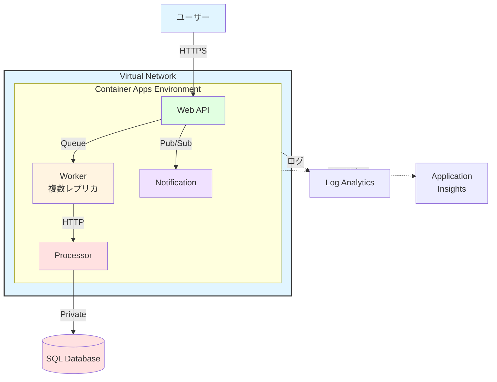

# 📚 まとめ

Container Apps ハンズオンの総括

---

## 学習内容の振り返り

このハンズオンで学んだことを振り返ります。

<div class="grid grid-cols-2 gap-6 pt-6 text-sm">

<div>

### 基礎知識

✅ **Container Apps とは**

- Kubernetes ベースのサーバーレスプラットフォーム
- イベント駆動の自動スケーリング
- マイクロサービス向けの機能

✅ **他サービスとの違い**

- AKS: フル Kubernetes vs Container Apps
- App Service: 単一アプリ vs マイクロサービス
- 使い分けの基準

✅ **主要コンポーネント**

- Environment: 共有実行環境
- Revision: デプロイ単位
- Dapr: マイクロサービス機能

</div>

<div>

### 実践スキル

✅ **デプロイと運用**

- コンテナのビルドとデプロイ
- 環境変数とシークレット管理
- Revision 管理とトラフィック分割

✅ **スケーリング**

- HTTP/Queue/CPU ベースのスケール
- 0 へのスケールダウン
- KEDA によるイベント駆動

✅ **サービス連携**

- 内部通信（Service-to-Service）
- Dapr Pub/Sub
- マイクロサービス構成

</div>

</div>

---

## ハンズオンで構築したシステム

実際に構築したアーキテクチャです。



---

## Container Apps の主要機能まとめ

学んだ機能を一覧にします。

<div class="grid grid-cols-3 gap-4 text-xs">

<div class="bg-blue-500/10 p-3 rounded">

#### デプロイ

- **コンテナイメージ**

  - ACR、Docker Hub
  - プライベートレジストリ

- **Revision 管理**

  - Single/Multiple モード
  - トラフィック分割
  - Blue/Green、Canary

- **環境変数**
  - 平文
  - シークレット
  - Key Vault 参照

</div>

<div class="bg-green-500/10 p-3 rounded">

#### スケーリング

- **イベント駆動**

  - HTTP リクエスト数
  - Queue メッセージ数
  - CPU/メモリ使用率
  - Cron スケジュール

- **0 へのスケール**

  - コスト最適化
  - コールドスタート

- **KEDA**
  - 多様なトリガー
  - カスタムメトリクス

</div>

<div class="bg-purple-500/10 p-3 rounded">

#### ネットワーク

- **Ingress**

  - External（外部公開）
  - Internal（内部のみ）

- **VNet 統合**

  - Environment 単位
  - Private Endpoint
  - NSG 適用

- **Dapr**
  - Service Invocation
  - Pub/Sub
  - State Store

</div>

<div class="bg-orange-500/10 p-3 rounded">

#### セキュリティ

- **Managed Identity**

  - パスワードレス認証
  - Azure リソースへのアクセス

- **Key Vault**

  - シークレット管理
  - 自動ローテーション

- **Private Endpoint**
  - データベース接続
  - セキュアな通信

</div>

<div class="bg-cyan-500/10 p-3 rounded">

#### 監視

- **Log Analytics**

  - Kusto クエリ
  - ログ分析

- **Application Insights**

  - パフォーマンス監視
  - 分散トレーシング

- **メトリクスとアラート**
  - リアルタイム監視
  - 異常検知

</div>

<div class="bg-pink-500/10 p-3 rounded">

#### 運用

- **デプロイ戦略**

  - Blue/Green
  - Canary リリース
  - ロールバック

- **高可用性**

  - 複数レプリカ
  - リージョン冗長化

- **コスト最適化**
  - 従量課金
  - 0 スケール
  - リソース最適化

</div>

</div>

---

## Container Apps vs 他サービスの選択基準

適切なサービスを選ぶためのガイドです。

<div class="text-xs">

| ケース                       | 推奨サービス               | 理由                                            |
| ---------------------------- | -------------------------- | ----------------------------------------------- |
| シンプルな Web アプリ        | App Service for Containers | 単一コンテナ、管理が簡単、Always On             |
| マイクロサービス             | Container Apps             | 複数サービス連携、Dapr、イベント駆動            |
| バッチジョブ                 | Container Apps             | 0 スケール、Queue トリガー、コスト効率          |
| 高度な Kubernetes 機能が必要 | AKS                        | フル Kubernetes、CRD、Operator                  |
| 短期間の軽量タスク           | Container Instances        | 最も軽量、即座起動、単純なタスク                |
| 本番環境の大規模システム     | AKS + Container Apps       | AKS でコア、Container Apps でワーカー           |
| 開発/テスト環境              | Container Apps             | 0 スケール、コスト削減、簡単なセットアップ      |
| イベント駆動のワークロード   | Container Apps             | KEDA、多様なトリガー、自動スケール              |
| 既存の Kubernetes 資産       | AKS                        | Helm Charts、既存マニフェスト                   |
| サーバーレスアーキテクチャ   | Container Apps + Functions | Container Apps で API、Functions でイベント処理 |

</div>

---

## ベストプラクティス総まとめ

実践的なベストプラクティスです。

<div class="grid grid-cols-2 gap-6 text-xs">

<div>

### ✅ 設計

1. **マイクロサービス原則**

   - 単一責任
   - 疎結合
   - 独立デプロイ

2. **スケーラビリティ**

   - ステートレス設計
   - 水平スケール
   - イベント駆動

3. **レジリエンス**

   - リトライ機構
   - サーキットブレーカー
   - タイムアウト設定

4. **セキュリティ**
   - 最小権限の原則
   - Managed Identity
   - Private Endpoint

</div>

<div>

### ✅ 運用

1. **監視**

   - すべてのメトリクスを監視
   - アラート設定
   - ダッシュボード作成

2. **ログ管理**

   - 構造化ログ
   - トレース ID
   - 一元管理

3. **デプロイ**

   - Blue/Green
   - Canary リリース
   - 自動ロールバック

4. **コスト管理**
   - 0 スケール活用
   - リソース最適化
   - コスト監視

</div>

</div>

---

## 典型的なアーキテクチャパターン

よく使われるパターン集です。

<div class="grid grid-cols-2 gap-4 text-xs">

<div class="bg-blue-500/10 p-3 rounded">

#### 1. API + Worker パターン

```
User → Web API (External)
        ↓ Queue
      Worker (Internal)
        ↓
      Database
```

**用途:**

- バックグラウンド処理
- 非同期タスク処理
- ジョブキュー

**メリット:**

- レスポンス時間短縮
- スケーラビリティ
- 疎結合

</div>

<div class="bg-green-500/10 p-3 rounded">

#### 2. イベント駆動パターン

```
Service A → Pub/Sub
              ↓
        Service B, C, D
```

**用途:**

- マイクロサービス連携
- イベント通知
- CQRS

**メリット:**

- 疎結合
- 拡張性
- 柔軟性

</div>

<div class="bg-purple-500/10 p-3 rounded">

#### 3. API Gateway パターン

```
User → API Gateway
        ↓
      Web API
        ↓
      Microservices
```

**用途:**

- BFF（Backend for Frontend）
- ルーティング
- 認証/認可

**メリット:**

- 統一エンドポイント
- セキュリティ
- ロードバランシング

</div>

<div class="bg-orange-500/10 p-3 rounded">

#### 4. CQRS パターン

```
Write API → Write DB
Read API → Read DB
        ↑ Event
    Sync Process
```

**用途:**

- 高トラフィック
- 複雑なクエリ
- パフォーマンス最適化

**メリット:**

- 読み書き分離
- スケーラビリティ
- 最適化

</div>

</div>

---

## 次のステップ

さらに学習を進めるためのリソースです。

<div class="grid grid-cols-2 gap-6 text-sm">

<div>

### 📚 学習リソース

**公式ドキュメント**

- [Azure Container Apps](https://learn.microsoft.com/azure/container-apps/)
- [Dapr](https://docs.dapr.io/)
- [KEDA](https://keda.sh/)

**Microsoft Learn**

- Container Apps クイックスタート
- マイクロサービスアーキテクチャ
- Dapr を使用したアプリ構築

**コミュニティ**

- GitHub Issues
- Stack Overflow
- Azure Tech Community

</div>

<div>

### 🚀 実践課題

**初級**

- シンプルな Web API のデプロイ
- 環境変数とシークレットの管理
- スケーリングの設定

**中級**

- マイクロサービス構成の構築
- Dapr による Pub/Sub
- VNet 統合とセキュリティ

**上級**

- 本番環境向けの構成
- CI/CD パイプラインの構築
- マルチリージョン展開
- 災害復旧計画

</div>

</div>

---

## 発展的なトピック

さらに深く学ぶためのトピックです。

<div class="grid grid-cols-3 gap-4 text-xs">

<div class="bg-blue-500/10 p-3 rounded">

#### Dapr の高度な機能

- **State Store**

  - 分散状態管理
  - トランザクション

- **Bindings**

  - 外部システム連携
  - イベントトリガー

- **Actors**

  - ステートフルサービス
  - 仮想アクター

- **Observability**
  - 分散トレーシング
  - メトリクス収集

</div>

<div class="bg-green-500/10 p-3 rounded">

#### セキュリティ

- **Zero Trust**

  - mTLS による暗号化
  - Service Mesh

- **認証/認可**

  - Azure AD 統合
  - OAuth 2.0

- **コンプライアンス**

  - GDPR 対応
  - データ保護

- **脆弱性管理**
  - イメージスキャン
  - 定期的な更新

</div>

<div class="bg-purple-500/10 p-3 rounded">

#### 高度な運用

- **GitOps**

  - Infrastructure as Code
  - Terraform/Bicep

- **カオスエンジニアリング**

  - 障害テスト
  - レジリエンス検証

- **SRE プラクティス**

  - SLI/SLO/SLA
  - エラーバジェット

- **マルチリージョン**
  - グローバル展開
  - 災害復旧

</div>

</div>

---

## よくある質問（FAQ）

Container Apps に関するよくある質問です。

<div class="text-xs">

**Q1: Container Apps と AKS、どちらを選ぶべき？**

A: Kubernetes の高度な機能が不要で、マイクロサービスを簡単に運用したい場合は Container Apps。フル Kubernetes が必要な場合は AKS。

**Q2: コールドスタートの時間は？**

A: 通常 3〜5 秒程度。イメージサイズやリソース設定により変動します。常時稼働が必要なら `min-replicas 1` 以上を設定。

**Q3: 最大レプリカ数の制限は？**

A: デフォルトは 30、最大 300 まで設定可能。クォータの引き上げが必要な場合はサポートに連絡。

**Q4: ステートフルなアプリケーションは動作する？**

A: 推奨されません。永続ストレージが必要な場合は、外部（Azure Storage、Database）に保存してください。

**Q5: 料金モデルは？**

A: vCPU とメモリの使用時間に基づく従量課金。0 スケール時は課金なし。

**Q6: 既存の Kubernetes マニフェストは使える？**

A: 使えません。Container Apps 専用の設定が必要です。

</div>

---

## リソースのクリーンアップ

ハンズオン終了後は、リソースを削除してコストを節約します。

<div class="grid grid-cols-2 gap-6 text-sm">

<div>

### リソースグループごと削除

```bash
# すべてのリソースを削除
az group delete \
  --name $RESOURCE_GROUP \
  --yes \
  --no-wait

# 削除の確認（数分後）
az group exists \
  --name $RESOURCE_GROUP

# 期待される出力: false
```

**削除されるリソース:**

- Container Apps
- Container Apps Environment
- Log Analytics Workspace
- ACR
- VNet
- SQL Database
- Storage Account

</div>

<div>

### 個別のリソース削除

```bash
# Container App のみ削除
az containerapp delete \
  --name $APP_NAME \
  --resource-group $RESOURCE_GROUP \
  --yes

# Environment のみ削除
az containerapp env delete \
  --name $CONTAINERAPPS_ENVIRONMENT \
  --resource-group $RESOURCE_GROUP \
  --yes

# 特定のリソースのみ残す場合
```

<div class="mt-4 bg-yellow-500/10 p-3 rounded text-xs">
⚠️ <strong>注意:</strong> リソースグループを削除すると、すべてのリソースが削除されます。慎重に実行してください。
</div>

</div>

</div>

---

## 最後に

Container Apps ハンズオンを完了しました！

<div class="grid grid-cols-2 gap-6 text-sm pt-6">

<div>

### 🎉 お疲れ様でした！

このハンズオンを通じて、以下を習得しました：

✅ **Container Apps の基本**

- アーキテクチャと主要機能
- 他サービスとの違い

✅ **実践的なスキル**

- デプロイと運用
- スケーリングとモニタリング

✅ **マイクロサービス**

- サービス連携
- イベント駆動アーキテクチャ

✅ **セキュリティと運用**

- VNet 統合
- 監視とトラブルシューティング

</div>

<div>

### 🚀 次のステップ

**実践してみよう**

1. **自分のアプリをデプロイ**

   - 既存アプリの Container Apps 化
   - 本番環境への適用

2. **より複雑な構成に挑戦**

   - マルチリージョン展開
   - Service Mesh 統合

3. **コミュニティに参加**

   - GitHub で Issues を報告
   - ブログ記事を書く

4. **継続的な学習**
   - 新機能のキャッチアップ
   - ベストプラクティスの更新

</div>

</div>

<div class="mt-8 bg-green-500/10 p-4 rounded text-center">

### ✨ ハンズオン完了！ ✨

**Azure Container Apps を活用して、素晴らしいアプリケーションを構築してください！**

</div>

---

## layout: center

# ありがとうございました！

質問やフィードバックをお待ちしています

<div class="pt-12 text-sm opacity-75">

**参考リンク**

- [Azure Container Apps ドキュメント](https://learn.microsoft.com/azure/container-apps/)
- [Dapr ドキュメント](https://docs.dapr.io/)
- [KEDA ドキュメント](https://keda.sh/)
- [Azure Architecture Center](https://learn.microsoft.com/azure/architecture/)

</div>
