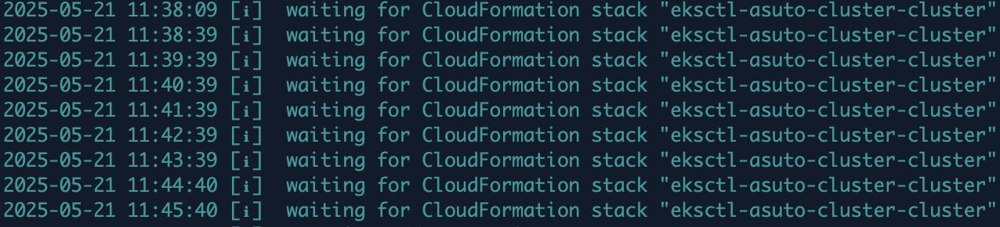
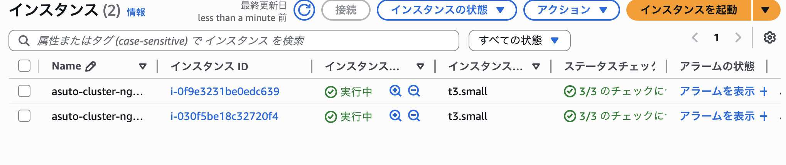
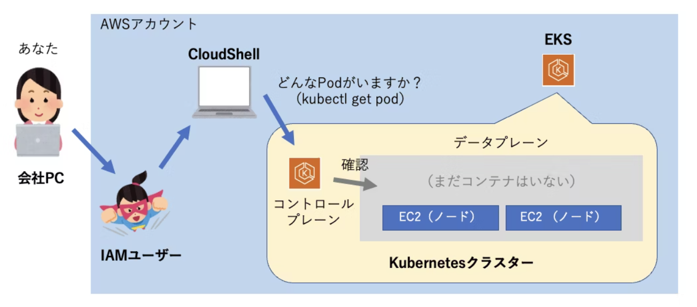
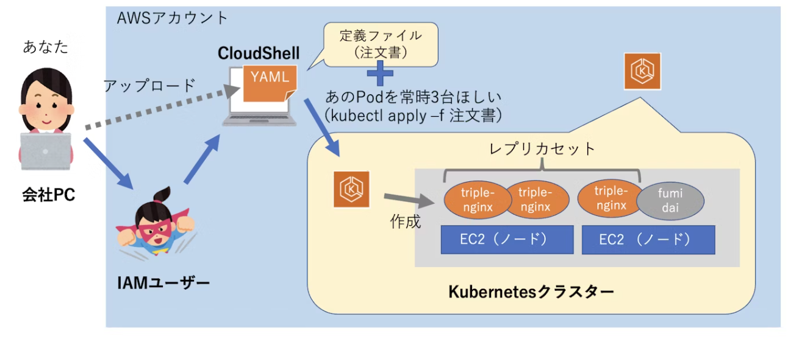
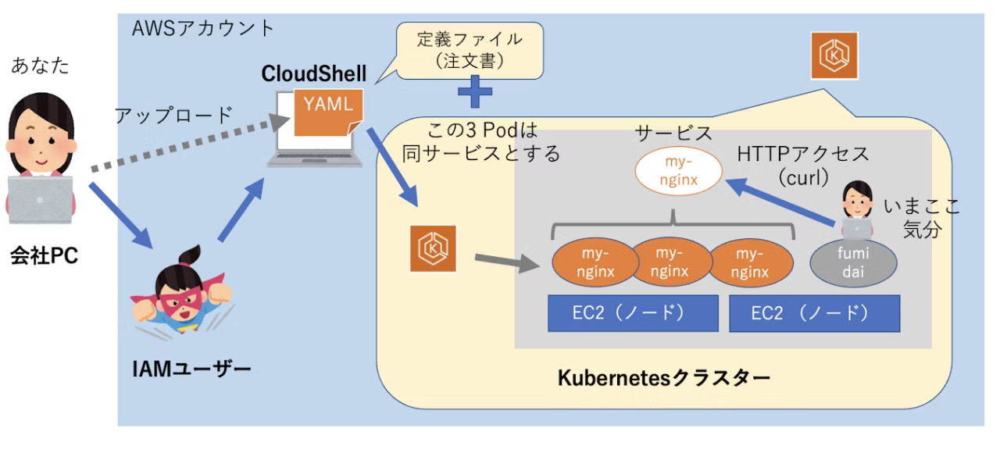

# EKS を使って k8s と触れ合ってみよう

---

## Agenda

- 環境構築
- EKS クラスター作成
- k8s を触ってみよう
  - Pod の作成
  - Replicaset を使った Pod の冗長化
  - Service を使ってロードバランシング
  - Deployment を使ったアップデート

---

### 準備

今回は**AWS CloudShell**を使用して EKS を触っていこうと思います。

```bash
# 今回使用するものをclone
git clone https://github.com/Asutin12/eks-lab.git

# cloneしたディレクトリに移動
cd eks-lab
```

- [kubectl](https://kubernetes.io/ja/docs/home/)
  - Kubernetes API サーバーと通信するためのコマンドラインツール

---

### **EKS クラスター作成**

```bash
eksctl create cluster \
  --name <CLUSTER_NAME> \
  --region ap-northeast-1 \
  --nodes 2 \
  --node-type t3.large
  --access-config authenticationMode=CONFIG_MAP
```
<p class="text-sm">
裏では CloudFormation が自動実行され、VPC や EC2 など EKS クラスターに必要なインフラがもろもろ構築されていきます。
</p>



---

CloudShell に以下のような出力が表示され、プロンプトのカーソルが点滅して操作可能状態になっていれば OK です。

```bash
2025-05-21 11:50:31 [✔]  EKS cluster "asuto-cluster" in "ap-northeast-1" region is ready
```

また、先ほどのコマンドで worker node を 2 つ作成するように指示しましたが EC2 を見るとインスタンスが 2 つ実行中になっているのがわかります。



---

### **いよいよ K8s を触ってみよう**

1. EKS のアクセス管理(複数人で実施する場合)

   👇 ここは代表者のみ対応

   ```bash
   # 認証モードの確認
   aws eks describe-cluster --name <CLUSTER_NAME> --query 'cluster.accessConfig'

   # 認証モードをCONFIG_MAPからAPI_AND_CONFIG_MAPに変更
   aws eks update-cluster-config \
         --name <CLUSTER_NAME> \
         --access-config authenticationMode=API_AND_CONFIG_MAP

   # 今回使用するnamespaceの作成
   kubectl apply -f namespaces/all-namespaces.yaml

   # namespaceが適用されたか確認
   kubectl get namespace
   ```

---

👇 **ここからは受講者に対応していただきます (1/2)**

```bash
# アクセスエントリの確認
aws eks list-access-entries --cluster-name <CLUSTER_NAME>

# アクセスエントリ作成
# https://docs.aws.amazon.com/eks/latest/APIReference/API_AccessEntry.html
aws eks create-access-entry \
   --cluster-name <CLUSTER_NAME> \
   --principal-arn <YOUR_ARN> \
   --type STANDARD

# アクセスポリシーの紐付け(クラスター全体に対して「View（閲覧）」権限を付与する)
# https://docs.aws.amazon.com/eks/latest/APIReference/API_AssociatedAccessPolicy.html
aws eks associate-access-policy \
   --cluster-name <CLUSTER_NAME> \
   --principal-arn <YOUR_ARN> \
   --access-scope type=cluster \
   --policy-arn arn:aws:eks::aws:cluster-access-policy/AmazonEKSViewPolicy
```

---

👇 **ここからは皆さんに対応していただきます (2/2)**

```bash
# アクセスポリシーの紐付け(指定した namespace に対して「Admin（管理）」権限を付与する)
# https://docs.aws.amazon.com/eks/latest/APIReference/API_AssociatedAccessPolicy.html
aws eks associate-access-policy \
   --cluster-name <CLUSTER_NAME> \
   --principal-arn <YOUR_ARN> \
   --access-scope type=namespace,namespaces=<your-name> \
   --policy-arn arn:aws:eks::aws:cluster-access-policy/AmazonEKSClusterAdminPolicy

# kubeconfig の更新（kubectl でアクセスするために必要）
aws eks update-kubeconfig --name <CLUSTER_NAME>
```

[Identity and Access Management - Amazon EKS](https://docs.aws.amazon.com/eks/latest/best-practices/identity-and-access-management.html#)

---

2. **とりあえず現状を確認**

   ```bash
   # ワーカーノードが何台いるのか確認
   kubectl get node

   # Pod（コンテナ）はまだ何も作っていないが、念の為確認
   kubectl get pod
   ```

   

---

3. **Pod をデプロイしてみる**

   Pod のみのデプロイを行いましょう。

   ```bash
   # Podを作成
   kubectl apply -f chapter-01/nginx-pod.yaml

   # Podが作成されたか確認
   #STATUSが「Running」なら、早くも起動終わって稼働中
   kubectl get pod
   # NAME    READY   STATUS    RESTARTS   AGE
   # nginx   1/1     Running   0          13

   # Podの詳細を表示
   kubectl describe pod nginx
   # Pod名やIPアドレス、イベントログなど色々出力されるのが分かります。
   ```

---

**Pod のデバッグをしてみよう**

```bash
# Podを作成
kubectl apply -f chapter-01/pod-destruction.yaml

# pod/nginx configuredと表示されればOK
# Podが作成されたか確認
kubectl get pod
```

今回は STATUS が Running になっていないですね、、、なぜでしょうか、、

```bash
NAME    READY   STATUS         RESTARTS   AGE
nginx   0/1     ???????        0          5m16s

kubectl describe pod nginx
```

答えは MTG で….

---

4. **Pod に直接ログインしてみよう**

   先ほど作成した Pod にログインしてみましょう。

   Pod 内でコマンド実行できる  `kubectl exec`  を使って bash を実行してみます。

   ```bash
   kubectl exec -it nginx -- bash

   # 本当にPod内に入れているのか怪しいので、Pod内で自分に向かってcurlコマンドを打ってみよう
   curl localhost
   ```

   **Welcome to nginx!が出力されれば OK です。**

   一旦  `exit`  コマンドで nginx Pod から抜けて、CloudShell に戻ります。

---

**Pod から別の Pod にアクセスしてみる (1/2)**

踏み台用の Linux Pod をデプロイしてみます。

こちらは Debian という種類の Linux がインストールされただけのシンプルな Pod です。

```bash
# Podを作成
kubectl apply -f chapter-01/bastion-pod.yaml

# Podが作成されたか確認
kubectl get pod
```

下記のように 2 台作成されていれば OK です。

```bash
NAME      READY   STATUS    RESTARTS        AGE
bastion   1/1     Running   0               9s
nginx     1/1     Running   1 (5m26s ago)   10m
```

---

**Pod から別の Pod にアクセスしてみる (2/2)**

どの Pod がどのノード（EC2）に乗っているかは k8s のスケジューラーによって決まります。

※nodeSelector や Affinity、Anti-affinity などを使用することでノードを指定することも可能。

Bastion Pod にログインして、そこから Nginx Pod へのアクセスを試してみたいのですが、その前に宛先となる Nginx Pod の IP アドレスを確認しておく必要があります。

Pod 一覧表示コマンドに`-o wide`オプションをつけると**IP アドレス**だけでなく**どこのノードに載っているか**も分かります。

```bash
kubectl get pod -o wide
```

---

それではまず踏み台 Pod から NGINX Pod にアクセスしてみましょう。

ただし踏み台 Pod には curl コマンドが未インストールのため、以下コマンドを実行して導入します。

```bash
# 踏み台Podにログイン
kubectl exec -it bastion -- bash

# curl インストール
apt update
apt install -y curl

# nginx Podにアクセス
curl http://<YOUR_NGINX_IP>
```

**Welcome to nginx!** ページは返ってきたでしょうか？

`exit`  コマンドで踏み台 Pod から抜けておきましょう。

---

5. **Replicaset を使用して同用途の Pod をたくさん増やして冗長化する**

   いま Nginx Pod は 1 つだけですが、もし障害が起こったら誰も「Welcome to nginx!」ページを見られなくなってしまいます。
   そこで、この Pod を常時 3 つ起動するように変更したいと思います。

   先ほどまで書いていた YAML は「**Pod**」という種類ですが、Pod を複数台セットで注文する場合は「**Replicaset**」という別の種類で作る必要があります。

   ```bash
   kubectl apply -f chapter-02/nginx-replicaset.yaml
   ```
   すでに NGINX の Pod が 1 つ存在するところに、NGINX を 3 つ動かしたいという注文書をオーダーしました。結果どうなるのか、 `kubectl get pod`  コマンドで確認してみましょう。

   ```bash
   NAME                     READY   STATUS    RESTARTS        AGE
   bastion                  1/1     Running   0               3m56s
   nginx                    1/1     Running   1 (9m13s ago)   13m
   replicaset-nginx-5wg4p   1/1     Running   0               14s
   replicaset-nginx-cgxn8   1/1     Running   0               14s
   ```
あれ、2 個しか作られていない？と思った方もいるでしょう。

---

理由としては**最初に作った Nginx Pod を 3 つの中の 1 つと認識している**からです。

なぜ既存の 1 台を同用途と認識できているかというと、最初にデプロイした「Pod」用マニフェストと今回の「Replicaset」マニフェストの両方とも、`component: nginx`というラベルを仕込んでいるからです。

Replicaset はこのラベルをもとに Pod の稼働台数を見張る仕様になっています。


---

では Nginx Pod を 1 台、わざと削除するとどうなるでしょうか。(1/2)

CloudShell を 2 分割して欲しいので「アクション」＞「列を分割」を選択してください。

```bash
# 片方で
kubectl get pod --watch

# もう片方で
kubectl delete pod nginx
```

すると、「replicaset-nginx」レプリカセットから即座に 1 台、Pod が追加生成されているのが分かります。

```bash
NAME                     READY   STATUS              RESTARTS   AGE
bastion                  1/1     Running             0          6m3s
replicaset-nginx-5wg4p   1/1     Running             0          2m21s
replicaset-nginx-cgxn8   1/1     Running             0          2m21s
replicaset-nginx-rj6zg   0/1     ContainerCreating   0          2s
```

---

6. **複数 Pod へロードバランスする (1/2)**

   せっかく同用途の Pod を 3 台に冗長化したので、ロードバランシングしつつ Pod へのアクセスも IP アドレス決め打ちではなく名前でアクセスできるようにしましょう。

   そのために「**Service**」を作成していきます。

   ```bash
   kubectl apply -f chapter-03/nginx-service.yaml
   ```

   この「サービス」も kubectl で一覧確認できます。

   `kubectl get service`  してみると、以下のようにデフォルトの「kubernetes」というサービスに加えて、いまデプロイした「nginx」サービスが動いていることが分かります。

   それでは試しに踏み台 Pod から IP アドレス直指定ではなく、「nginx」サービス宛てに curl でアクセスしてみましょう。

   ```bash
   # 踏み台Podにログイン
   kubectl exec -it bastion -- bash

   # サービスにリクエスト
   curl http://nginx
   ```

---

6. **複数 Pod へロードバランスする (2/2)**

   これで NGINX Pod を**IP 直指定ではなく**、かつ**サービス名**でロードバランスさせて裏のどれか 1 台にリクエストを返却させる、ということが可能になりました。

   

   `exit`  で踏み台 Pod から抜けておきましょう。

---

7. **外部から Pod にアクセスしてみよう (1/2)**

   現状 Pod 同士でのアクセスはできていますが、外部からのアクセスはできない状態になっています。

   今回はサービスを使用して外部からのアクセスを許可していこうと思います。

   サービスにはいくつかの Type があります。
   - ClusterIP
   - NodePort
   - LoadBalancer
   - ExternalName

---

7. **外部から Pod にアクセスしてみよう (2/2)**

   今回はハンズオンということで `NodePort` を指定し、外部（インターネット）から Pod にアクセスできるようにします。

   ```bash
   # NodePort サービスを作成
   kubectl apply -f chapter-03/nginx-nodeport-service.yaml

   # 適用されたか確認
   kubectl get service

   # 外部アクセス用のパブリックIPの確認
   kubectl get nodes -o wide
   ```

   もしかしたらセキュリティグループに設定追加する必要があるかも？

   `EXTERNAL-IP` があなたのクラスタのノード（EC2）に割り当てられた **パブリック IP** です。

   では実際にお手元のブラウザからアクセスしてみましょう。

   ```bash
   http://<EXTERNAL-IP>:30080
   ```

---

8. **複数 Pod をローリングアップデートしてみる**

   いま「replicaset-nginx」Replicaset では Pod 3 台が稼働していますが、新しい Pod へ置き換えようと思います。

   そこで、「**Deployment**」という Replicaset の上位互換的なものを使用します。

   Deployment では、コンテナイメージの指定だけを新しいものに書き換えることで、勝手に Pod を 1 台ずつ新パージョンの Pod に置き換えてくれます。

   ※StrategyType を指定することで更新方法を変更できます。

   ややこしいので「Replicaset」は削除してしまいます。

   ```bash
   # どちらでも削除可能
   kubectl delete replicaset replicaset-nginx
     or
   kubectl delete -f nginx-replicaset.yaml
   ```
---

**現新 2 バージョン用意してあるので、両方とも CloudShell にアップロードしましょう。(1/2)**

- 「nginx-deployment-v1.yaml」（現行バージョン）
- 「nginx-deployment-v2.yaml」（新バージョン）

これら 2 つを CloudShell にアップロードできたら、まずは現行バージョンのデプロイメントを使って Pod をデプロイします。

```bash
# 現行バージョン用のデプロイメントを適用
kubectl apply -f chapter-04/nginx-deployment-v1.yaml

# Podが作成されたか確認
kubectl get pod
```

Nginx の Pod が 3 台起動していることが分かると思います。

この状態で新バージョンのデプロイメントを適用するとローリングアップデートが実施されます。

しかし、普通にやると経過がよく分からないので、先ほどと同様に CloudShell の別タブで踏み台 Pod にログインしておき、「nginx」サービスへ Nginx のバージョン確認コマンドを 0.1 秒間隔で連打するよう仕込んでおきたいと思います。
---

**現新 2 バージョン用意してあるので、両方とも CloudShell にアップロードしましょう。(2/2)**

まず CloudShell 画面右上の「Action」ボタンより「New tab」をクリックします。
新しく開いたコンソールの方で、以下コマンドを実行し踏み台 Pod から確認コマンドを仕掛け、別のコンソールで新バージョン用のデプロイメントを適用してみましょう。

```bash
# 踏み台Podにログイン
kubectl exec -it bastion -- bash

# 0.1秒間隔でリクエスト
while true; do echo "-------"; date; curl -s -i nginx | grep -E 'Server'; sleep 0.1; done

# 新バージョン用のデプロイメントを適用
kubectl apply -f chapter-04/nginx-deployment-v2.yaml
```

NGINX バージョンが少しずつ  `1.21.6`  へ置き換えられていくのが分かると思います。

バージョンを戻したい場合は下記コマンドで戻せます

```bash
kubectl rollout undo deployment <deployment-name>
```

---

**Deployment のデバッグをしてみよう (1/3)**

まず、現状を確認し、さらに新しいバージョンの Deployment を適用してみましょう。

```bash
# さらに新しいバージョンのデプロイメントを適用
kubectl apply -f chapter-04/nginx-deployment-v3.yaml

# Podが作成されたか確認
kubectl get pod
```

また Status が Running ではなくなっていますね、、、

となるとサービスにリクエストを飛ばすとレスポンスが帰ってこない、、、？先ほど開いた nginx をリロードし、確認してみましょう。

---

**Deployment のデバッグをしてみよう (2/3)**

あれ、問題なくレスポンスが帰ってきている？？

- どういうことなのか詳しくみていきましょう。
  次のコマンドで Deployment の状況を確認してみましょう
  ```bash
  kubectl get deployment
  ```
  下記のような結果が帰ってくると思います。
  ```bash
  NAME           READY   UP-TO-DATE   AVAILABLE   AGE
  deployment-nginx   3/3     1            3           2m19s
  ```
  UP-TO-DATE が 1 で AVAILABLE が 3 になっています。
  ```bash
  kubectl get replicaset
  ```
つまり古いバージョンの Pod が残ってくれているおかげで問題なく疎通ができています。
では壊れている Pod を確認し、直してみましょう

```bash
kubectl describe pod <エラーが出てるPod名>
```

原因がわかったら次のコマンドでエディタを開いて直接修正してみましょう


---

**Deployment のデバッグをしてみよう (3/3)**

```bash
kubectl edit deployment deployment-nginx
# PodとReplicasetを確認して問題なければOK
kubectl get pod,replicaset
```

---

9. **お片付け (1/2)**

   下記コマンドを実行すると**`eksctl create cluster ...` で作成されたリソースを自動で一括削除**してくれます。

   ```bash
   eksctl delete cluster \
       --name 消したいクラスター名 \
       --wait
   ```

   下記コマンドが表示されれば OK です。

   ```bash
   2025-05-21 12:18:35 [✔]  all cluster resources were deleted
   ```
---
layout: center
---

## Q&A
